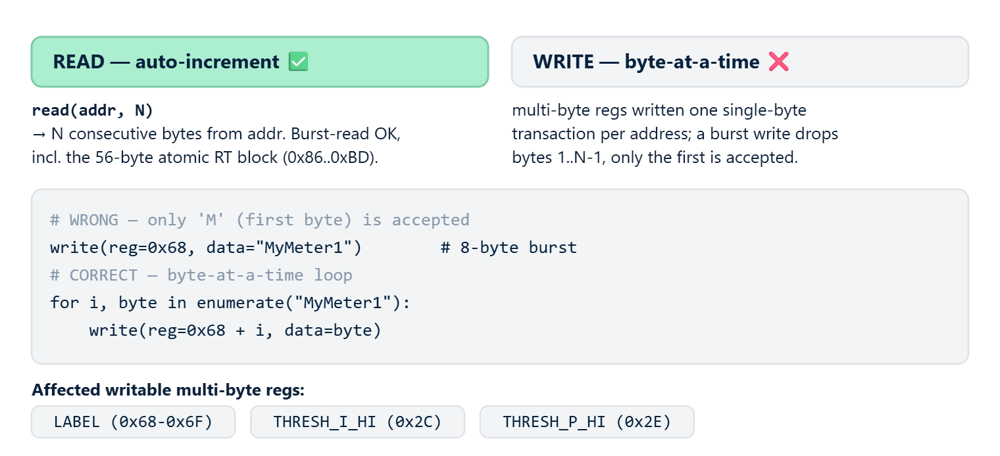

# rbAmp Wire-Protocol Reference (v1.3)

> **Audience**: 3rd-party and advanced integrators writing their own I²C drivers for the **rbAmp** module without using client libraries (Arduino / ESP-IDF / Python / ESPHome).
>
> **Scope**: canonical wire protocol of the rbAmp module at version v1.3 — register map, protocol sequences, behavioral guarantees. This is the complete wire-contract-level reference documentation.
>
> **NOT in scope**: integration with any specific library / OS / framework — read the library documentation for that.
>
> **Document status**: DRAFT, 2026-06-16. Source of truth: `registers_v2.yaml` v1.3 + canonical wire-contract + bench-validated firmware behavior.

---

## 1 · Introduction

**rbAmp** is a compact hardware module for precision measurements of AC mains parameters over an I²C interface. The module behaves as a standard I²C slave with a fixed register map (page-0, 0x00..0xFF). This document describes the **wire protocol** at the level of registers, commands, and sequences.

### 1.1 SKU lineup

| SKU | Current channels (N_I) | U channel | Power calculation |
|---|---|---|---|
| **UI1** | 1 | yes | P, PF, Q |
| **UI2** | 2 | yes | P, PF, Q per channel |
| UI3 | 3 | yes | **roadmap** — not shipping on the current MCU package |
| **I1** | 1 | no | I only (no P/PF/Q) |
| **I2** | 2 | no | I only per channel |
| **I3** | 3 | no | I only per channel |

I-variants (`I1`/`I2`/`I3`) have **no voltage hardware** — `U_RMS`, `U_PEAK`, and `P` registers return `0.0`. Frequency (`AC_FREQ`) is available on all variants (ZC-sourced).

**Calibration is factory.** The consumer master does **NOT** configure noise floor (NF), gain, phase compensation, or any other factory parameters — these are all factory calibration burned into the module (see §4.0 reserved ranges). The consumer writes only **SENSOR_CLASS + CT_MODEL** (see §6.2) — the module applies everything else automatically from the preset table.

### 1.2 Versioning

| Field | Value |
|---|---|
| `protocol_version` | `1.3` |
| `schema_version` | `2` |
| `VERSION` register (`0x03`) | `0x04` for v1.3 |
| Page-0 contract | **frozen** at v1.3 release |

---

## 2 · Bus protocol basics

### 2.0 Power & supply

| Parameter | Value |
|---|---|
| `VCC` nominal | **+5 V** |
| `VCC` range | 4.5..5.5 V |
| Typical current draw | ~15 mA |
| Peak current draw (latch + flash write) | ~25 mA |
| Boot inrush | ≤ 50 mA @ 5 ms |
| Sequencing | VCC may be applied concurrently with I²C; pull-ups (3.3 V) are permitted before VCC is applied |
| Isolation | the mains side is galvanically isolated inside the module |

> Four wires are mandatory on the LV side: `VCC`, `GND`, `SDA`, `SCL`. `DRDY` (open-drain) is optional. See §2.3 for pull-up and multi-module guidance.

### 2.1 I²C parameters

- **Default address**: `0x50` (7-bit).
- **Allowed address range**: `0x08..0x77` (standard I²C reserved boundaries).
- **Logic levels**: 3.3 V (5 V-tolerant on pull-ups to 3.3 V).
- **On-board pull-ups**: 4.7 kΩ on SDA/SCL to 3.3 V (module).
- **Clock stretching**: the module does **NOT** use SCL clock-stretching as a routine flow-control mechanism. Between transactions the master must observe an **inter-transaction gap ≥ 100 µs** (`tBUF`). Back-to-back transactions without a gap (back-to-back START without `tBUF`) are permitted but discouraged — some host stacks (ESP-IDF i2c_master) exhibit an elevated NACK rate. See §5 acceptance / EMI section separately.

### 2.2 Bus speed

| Speed | Applicability | Note |
|---|---|---|
| **50 kHz** | recommended | The ESP-IDF host-side driver shows ~20 % NACK rate at 100 kHz; 50 kHz + 3× retry gives < 0.8 % error rate. |
| **100 kHz** | workable with retry | application-level 3× retry is mandatory. |
| **400 kHz** | **not validated** | do not advertise as supported. |

### 2.3 Multi-module bus

Several rbAmp modules can share one bus:

- **Up to ~16 modules** (limited by total bus capacitance ≤ 400 pF at 100 kHz).
- **Pull-ups**: the on-board 4.7 kΩ pull-ups on every module in parallel overload the sink. **Cut the on-board pull-ups** on every module except one (or use a PCA9515/9615 I²C buffer).
- **Length**: up to 0.3 m plain → 100 kHz; 0.3–1 m twisted pair (SDA+GND and SCL+GND in **separate** pairs) → 100 kHz; > 1 m — I²C buffer; > 3 m — differential bus (PCA9615 / LTC4332).

### 2.4 Bus polling budget

At 50 kHz a single register-read transaction takes ≈ 200–400 µs. The full RT block for one channel (U + I + P + PF, 4 floats = 16 bytes burst) takes ≈ 5–8 ms per channel.

| Configuration | Bus per cycle | Max polling rate |
|---|---|---|
| 1× UI1, RT block | ~5 ms | 100+ Hz (but the module updates at 5 Hz) |
| 5× UI1, RT block | ~25 ms | 5 Hz |
| 16× I3, RT + period | ~400 ms | **cannot keep up** with the module |

**Rule of thumb**: at 50 kHz the comfortable limits are **8–10× I3** or **15–16× UI1** at 5 Hz polling.

---

## 3 · Variant model

### 3.1 `HW_VARIANT` (reg `0x55`, u8, read-only)

Authoritative SKU byte:

| Value | SKU | N_I | Voltage HW |
|---|---|---|---|
| `0x01` | UI1 | 1 | yes |
| `0x02` | UI2 | 2 | yes |
| `0x03` | UI3 | 3 | yes (roadmap, not buildable) |
| `0x04` | I1 | 1 | no |
| `0x05` | I2 | 2 | no |
| `0x06` | I3 | 3 | no |

Any other value → the device is not identified as rbAmp.

### 3.2 `CAPABILITY` (regs `0x57/0x58`, u16 LE, read-only)

12-bit feature-detection map. This is the canonical way to detect supported features — **without** numeric version comparison.

| bit | Flag | Meaning |
|---|---|---|
| 0 | EXT_ADDRESSING | extended 16-bit addressing (0xFF prefix) |
| 1 | GC_LATCH | General-Call latch is supported |
| 2 | GC_GROUP_FILTER | `GROUP_ID` filter is active |
| 3 | DIGEST | digest block (0x70..0x85) is exposed |
| 4 | EVENTS | `EVENT_FLAGS` is supported |
| 5 | UID_ARBITRATION | UID-based address arbitration |
| 6 | SEAL | UID seal verification (anti-clone) |
| 7 | TWO_PHASE_ADDR | two-phase commit address change |
| 8 | **ZC_PHASE_OFFSET = voltage-HW** | the module has a U channel |
| 9 | SAVE_USER_CONFIG | `CMD_SAVE_USER_CONFIG` is available |
| 10 | CLEAR_ERROR | `CMD_CLEAR_ERROR` is available |
| 11 | IAP | in-application programming (F4 tiers only) |

#### 3.2.1 Canonical CAPABILITY values

| Variant group | CAPABILITY value (u16 LE) |
|---|---|
| Current-only (`I1`/`I2`/`I3`) | `0x069E` |
| U-variants (`UI1`/`UI2`) | `0x079E` |

`0x079E` = `0x069E | 0x0100` (bit 8 voltage-HW added).

Decomposition of `0x069E` (binary `0000 0110 1001 1110`):
bit 1 GC_LATCH, bit 2 GC_GROUP_FILTER, bit 3 DIGEST, bit 4 EVENTS, bit 7 TWO_PHASE_ADDR, bit 9 SAVE_USER_CONFIG, bit 10 CLEAR_ERROR.

#### 3.2.2 Byte layout of CAPABILITY u16 LE

`CAPABILITY` is 2 bytes at addresses `0x57` (low byte) and `0x58` (high byte), little-endian:

```text
register layout (byte-addressed):

  0x57   0x58
  ┌──────┬──────┐
  │ LO   │ HI   │
  └──────┴──────┘
   bits   bits
   0-7    8-15

  full u16 = (read_u8(0x58) << 8) | read_u8(0x57)
```

Bit mapping:
- byte `0x57` (LO) contains bits 0..7: EXT_ADDRESSING, GC_LATCH, GC_GROUP_FILTER, DIGEST, EVENTS, UID_ARBITRATION, SEAL, TWO_PHASE_ADDR.
- byte `0x58` (HI) contains bits 8..15: ZC_PHASE_OFFSET (= voltage-HW), SAVE_USER_CONFIG, CLEAR_ERROR, IAP, bits 12-15 reserved.

#### 3.2.3 Canonical `has_voltage` recipe

```python
cap_hi = read_u8(0x58)             # high byte holds bits 8..15
has_voltage = bool(cap_hi & 0x01)  # bit 8 of the u16 = bit 0 of byte 0x58
```

### 3.3 Variant profile table — invariant

| SKU | HW_VARIANT (0x55) | N_I | voltage-HW | CAPABILITY (0x57/0x58) |
|---|---|---|---|---|
| **UI1** | 1 | 1 | yes | `0x079E` |
| **UI2** | 2 | 2 | yes | `0x079E` |
| UI3 | 3 | 3 | yes | `0x079E` (roadmap) |
| **I1** | 4 | 1 | no | `0x069E` |
| **I2** | 5 | 2 | no | `0x069E` |
| **I3** | 6 | 3 | no | `0x069E` |

**HW_VARIANT ⟷ CAPABILITY coherence**: `HW_VARIANT` 1..3 (UI*) → bit 8 set; `HW_VARIANT` 4..6 (I*) → bit 8 clear. A mismatch indicates a hardware or firmware anomaly (broken device or misflash).

### 3.4 `SENSOR_CLASS` ≠ variant discriminator

⚠ **`SENSOR_CLASS (0x25)` is NOT a variant discriminator.** It is a **user-config provisioned register** (CT sensor class selector: `Unset`/`Sct013`/`WiredCT`/`BuiltinCT`) and does not reflect the hardware variant. For variant detection use **only** `HW_VARIANT (0x55)` + `CAPABILITY (0x57/0x58)`.

### 3.5 `PRODUCT_ID` (`0x54`, u8, read-only)

Product family discriminator:

| Value | Family |
|---|---|
| `0x01` | rbAmp sensor (this document) |
| `0x02` | rbDimmer (separate register map; not covered by this document) |

The master **MUST** read `PRODUCT_ID` before interpreting any family-specific register.

### 3.6 Canonical detection algorithm

```python
if not i2c_addr_acks(addr):
    return NO_DEVICE
product = read_u8(addr, 0x54)
if product != 0x01:
    return NOT_RBAMP_SENSOR
hw = read_u8(addr, 0x55)
if 1 <= hw <= 6:
    cap_hi = read_u8(addr, 0x58)
    has_voltage = bool(cap_hi & 0x01)
    return {sku: SKU[hw], N_I: N_I_TABLE[hw], has_voltage: has_voltage}
return UNKNOWN_DEVICE
```

---

## 4 · Register map (production v1.3)


**Filter applied**: `build: production` (cal-build registers excluded). Factory-calibration registers (NF, GAIN, PHASE) are **not documented** — they belong to the factory bench, not the consumer surface.

### 4.0 Reserved ranges (internal)

The following ranges are reserved for internal/factory use and are **not described** in this document. Reads return either data that is not relevant to consumer logic or `0x00` for non-existent addresses (see §5.2). Writes to these addresses are either silently dropped or answered with `ERR_PARAM`:

- `0x04` — internal mode indicator (factory strap, not consumer-settable).
- `0x06`, `0x26` — internal calibration parameters (factory bench).
- `0x08..0x0F` — LUT debug view (factory diagnostic).
- `0x1B..0x1F` — reserved page-0 (`0x18..0x1A` are production diag, see §4.2).
- `0x36..0x45` — reserved page-0.
- `0x4F`, `0x50` — reserved (identity-block pre-reserve).
- `0xE4..0xEB`, `0xF0..0xFF` — factory calibration (NF, GAIN); develop-gated writes.

> **Note on `0xD0..0xE3`**: in the **production** build this range is occupied by the `V03 Q` block (see §4.12). In the separate **cal firmware** (not shipped to the consumer) the same range is overlaid with the calibration block (build:cal). The consumer master sees only the production overlay — the Q block.

3rd-party integrators must ignore these ranges.

### 4.1 Control block (0x00..0x07)

| Addr | Name | Size | Type | Access | Persistence | Notes |
|---|---|---|---|---|---|---|
| `0x00` | `STATUS` | 1 | u8 | r | ram | bit0=READY, bit1=ERROR (mirror of `REG_ERROR != 0`), bit2=EVENTS_PENDING (mirror of `EVENT_FLAGS != 0`) |
| `0x01` | `COMMAND` | 1 | u8 | w | ram | Write a `CMD_*` opcode (see §5.2) |
| `0x02` | `ERROR` | 1 | u8 | r | ram | last-write outcome; `0x00 = OK`; `0xFA..0xFF` error classes. Clear via `CMD_CLEAR_ERROR`. See §5.3 |
| `0x03` | `VERSION` | 1 | u8 | r | rom | Protocol version. `0x04 = v1.3` |
| `0x05` | `CT_MODEL` | 1 | u8 | rw | user_config | SCT-013 SKU code (v1.3 pure staging — see §6.2) |
| `0x07` | `V03_PERIOD_VALID` | 1 | u8 | r | ram | Set by `CMD_LATCH_PERIOD`: 1 = fresh, 0 = empty/stale. **NOT cleared-on-read**. See §6.3.3 (witness) + §7.5 (failed-latch preservation) |

### 4.2 ADC diagnostics (0x10..0x1C)

| Addr | Name | Size | Type | Access | Persistence | Notes |
|---|---|---|---|---|---|---|
| `0x10` | `ADC_MEAN_U` | 2 | u16 LE | r | ram | Raw ADC mean U channel (~2048 centered) |
| `0x12` | `ADC_MEAN_I0` | 2 | u16 LE | r | ram | Raw ADC mean I0 |
| `0x14` | `ADC_MEAN_I1` | 2 | u16 LE | r | ram | Raw ADC mean I1 (UI2/I2/I3/UI3) |
| `0x16` | `ADC_MEAN_I2` | 2 | u16 LE | r | ram | Raw ADC mean I2 (UI3/I3) |
| `0x18` | `CAPTURE_STATUS` | 1 | u8 | r | ram | Raw-sample capture: bit0=ready |
| `0x19` | `CAPTURE_PAGE` | 1 | u8 | rw | ram | Page 0..7 → 32 raw I0 samples into `CAPTURE_WINDOW` |
| `0x1A` | `CAPTURE_WINDOW` | 64 | bytes | r | ram | 32×u16 LE pre-LUT I0 codes. Burst-read 64 bytes. |

### 4.3 System (0x20..0x25)

| Addr | Name | Size | Type | Access | Persistence | Notes |
|---|---|---|---|---|---|---|
| `0x20` | `AC_FREQ` | 1 | u8 | r | ram | ZC-sourced. 50 or 60 Hz integer. ZC is active **on all variants** (including I*) |
| `0x21` | `AC_PERIOD` | 2 | u16 LE | r | ram | Mains half-period, µs |
| `0x23` | `CALIBRATION` | 1 | u8 | r | ram | Legacy calibration status byte |
| `0x24` | `TOPOLOGY` | 1 | u8 | r | rom | `1 = SINGLE`, `2 = SPLIT_PHASE`, `3 = THREE_PHASE` (= N_I) |
| `0x25` | `SENSOR_CLASS` | 1 | u8 | rw | user_config | `0 = UNSET`, `1 = SCT_013`, `2 = WIRED_CT` (resv), `3 = BUILTIN_CT` (resv). A class change resets `CT_MODEL = 0`. **Not a variant discriminator** (see §3.4) |

### 4.4 Fleet config (0x27..0x2F)

| Addr | Name | Size | Type | Access | Persistence | Notes |
|---|---|---|---|---|---|---|
| `0x27` | `FLEET_CONFIG` | 1 | u8 | rw | user_config | bit0 = `GC_ENABLE` (General-Call latch reception; effective after reset). bits 1-7 reserved |
| `0x28` | `GROUP_ID` | 1 | u8 | rw | user_config | GC latch group filter. `0` = respond to all-call. The GC frame group byte must match or be `0x00` |
| `0x29` | `DIGEST_CONFIG` | 1 | u8 | rw | ram | Digest window composition bitmask (see §4.9). Defaults to `0x00` (digest disabled) after reset; rewrite on every initialization |
| `0x2A` | `EVENT_FLAGS` | 1 | u8 | **w1c** | ram | Sticky event bits (see §5.3 error model). Defaults to `0x00` after reset (but bit5 `RESET_OCCURRED` is set at boot) |
| `0x2B` | `EVENT_MASK` | 1 | u8 | rw | ram | Which `EVENT_FLAGS` bits drive DRDY solid-LOW |
| `0x2C` | `THRESH_I_HI` | 2 | u16 LE | rw | ram | Current threshold → `EVENT_FLAGS.THRESH_I`. Units: 0.01 A. `0xFFFF` = disabled |
| `0x2E` | `THRESH_P_HI` | 2 | u16 LE | rw | ram | Power threshold → `EVENT_FLAGS.THRESH_P`. Units: W. `0xFFFF` = disabled |

### 4.5 Address (0x30..0x31)

| Addr | Name | Size | Type | Access | Persistence | Notes |
|---|---|---|---|---|---|---|
| `0x30` | `I2C_ADDRESS` | 1 | u8 | rw | user_config | **Two-phase commit**: write candidate `0x08..0x77` → RAM staging; arm `ADDR_COMMIT_MAGIC`; then `CMD_COMMIT_ADDR`; applies after reset. At boot the **active** address is read back (v1.3 Fix 4) |
| `0x31` | `ADDR_COMMIT_MAGIC` | 1 | u8 | w | ram | Write `0xA5` to arm `CMD_COMMIT_ADDR`. Consumed (cleared) on the commit attempt. Reads return `0x00` |

See §6.1 for the sequence.

### 4.6 Health / diagnostics (0x46..0x4F)

| Addr | Name | Size | Type | Access | Persistence | Notes |
|---|---|---|---|---|---|---|
| `0x46` | `UPTIME_S` | 4 | u32 LE | r | ram | Seconds since boot |
| `0x4A` | `RESET_CAUSE` | 1 | u8 | r | ram | Reset reason flags (bit0=PIN, bit1=POR/BOR, bit2=SW, bit3=IWDG, bit4=WWDG, bit5=LPWR) |
| `0x4B` | `I2C_ERR_COUNT` | 2 | u16 LE | r | ram | Bus errors (BERR+OVR) since boot, saturating |
| `0x4D` | `I2C_REINIT_COUNT` | 1 | u8 | r | ram | I²C peripheral BUSY-recovery reinit count, saturating |
| `0x4E` | `ZC_OFFSET` | 2 | u16 LE | r | ram | µs from the last GC-latch STOP edge to the next **voltage** zero-cross — used for U/I phase compensation in power computation. Firmware-gated to `0xFFFF` on I-only variants (no voltage front-end → no voltage ZC). This is **not** the mains-frequency ZC source — `AC_FREQ (0x20)` is derived from a dedicated mains-ZC pin and is available on all variants. |

### 4.7 CT model verify mirrors (0x51..0x53)

Read-only mirrors of the **applied** CT model preset per channel. The write wire protocol is unchanged (see §6.2) — this is purely a read-back for verification.

| Addr | Name | Size | Type | Access | Persistence | Notes |
|---|---|---|---|---|---|---|
| `0x51` | `CT_MODEL_CH0` | 1 | u8 | r | user_config | Applied CT model preset on ch0 (verify mirror) |
| `0x52` | `CT_MODEL_CH1` | 1 | u8 | r | user_config | Applied CT model preset on ch1 |
| `0x53` | `CT_MODEL_CH2` | 1 | u8 | r | user_config | Applied CT model preset on ch2 |

### 4.8 Identity (0x54..0x6F)

| Addr | Name | Size | Type | Access | Persistence | Notes |
|---|---|---|---|---|---|---|
| `0x54` | `PRODUCT_ID` | 1 | u8 | r | rom | Family: `0x01 = rbAmp sensor`. The master reads this **before** any family-specific register |
| `0x55` | `HW_VARIANT` | 1 | u8 | r | rom | See §3.1 |
| `0x56` | `FW_TIER` | 1 | u8 | r | rom | bits 0-1: 0=BASIC, 1=STANDARD, 2=PRO; bit 2=bidirectional; bit 3=LUT-calibrated |
| `0x57` | `CAPABILITY` | 2 | u16 LE | r | rom | See §3.2 |
| `0x59` | `GC_TICK` | 2 | u16 LE | r | ram | Master tick from the last accepted GC frame; `0xFFFF` = never received |
| `0x5C` | `UID` | 12 | bytes | r | rom | 96-bit chip UID. One burst-read. |
| `0x68` | `LABEL` | 8 | bytes | rw | user_config | User location label (ASCII, zero-padded). Empty = unset. **Write byte-at-a-time** (see §5.1) |

### 4.9 Digest window (0x70..0x85)

`DIGEST` is a compact poll window, served by a single burst-read. Its composition is selected by `DIGEST_CONFIG (0x29)`:

| `DIGEST_CONFIG` bit | Content | Format |
|---|---|---|
| bit 0 | `I_RMS[N]` | u16 per channel, 0.01 A |
| bit 1 | `U_RMS` | u16, 0.1 V (voltage-HW only) |
| bit 2 | `P_REAL[N]` | i16 per channel, 1 W (has_power only) |
| bit 3 | `PF[N]` | u8 per channel, 0..100 (has_power only) |

| Addr | Name | Size | Type | Access | Persistence | Notes |
|---|---|---|---|---|---|---|
| `0x70` | `DIGEST` | 22 | bytes | r | ram | Layout: `[STATUS_MIRROR u8][SEQ u8]` + mask-enabled fields. The maximum payload (UI3 full mask) is 19 B + 2 B header = 21 B used; 1 B tail unused (reads `0x00`). SEQ increments per RT commit, wrapping 255→0. **Atomic via read-freeze** (see §5.4). |

**Layout is dynamic per `DIGEST_CONFIG`** — each enabled bit appends its fields in a fixed order: `I_RMS[N]` → `U_RMS` → `P[N]` → `PF[N]`. Disabled bits leave **no** padding — fields slide forward. The master must parse with the same mask it wrote into `DIGEST_CONFIG`. A burst-read of 22 bytes is safe (the tail is `0x00` whenever the total payload is < 22 bytes). The single-byte tail is always `0x00` (reserved).

### 4.10 V03 real-time block (0x86..0xBD)

**All float32 LE** (IEEE 754 single precision, standard little-endian byte order). The byte-for-byte layout is frozen at v1.2. Every register is `r` access, `ram` persistence, group `v03_rt`. **Atomic via read-freeze** (see §5.4): a 56-byte burst-read (`0x86..0xBD`) is guaranteed contiguous (no torn snapshot).

| Addr | Name | Size | Type | Access | Persistence | Units | Notes |
|---|---|---|---|---|---|---|---|
| `0x86` | `V03_U_RMS` | 4 | float32 LE | r | ram | V | `0.0` on I-variants |
| `0x8A` | `V03_U_PEAK` | 4 | float32 LE | r | ram | V | |
| `0x8E` | `V03_I0_RMS` | 4 | float32 LE | r | ram | A | |
| `0x92` | `V03_I1_RMS` | 4 | float32 LE | r | ram | A | `0.0` if the variant lacks ch1 |
| `0x96` | `V03_I2_RMS` | 4 | float32 LE | r | ram | A | `0.0` if the variant lacks ch2 |
| `0x9A` | `V03_I0_PEAK` | 4 | float32 LE | r | ram | A | |
| `0x9E` | `V03_I1_PEAK` | 4 | float32 LE | r | ram | A | |
| `0xA2` | `V03_I2_PEAK` | 4 | float32 LE | r | ram | A | |
| `0xA6` | `V03_P0_REAL` | 4 | float32 LE | r | ram | W | `0.0` on I-variants (no power calc) |
| `0xAA` | `V03_P1_REAL` | 4 | float32 LE | r | ram | W | |
| `0xAE` | `V03_P2_REAL` | 4 | float32 LE | r | ram | W | |
| `0xB2` | `V03_PF0` | 4 | float32 LE | r | ram | – | range −1..+1 |
| `0xB6` | `V03_PF1` | 4 | float32 LE | r | ram | – | |
| `0xBA` | `V03_PF2` | 4 | float32 LE | r | ram | – | |

### 4.11 V03 period block (0xBE..0xCF)

A period snapshot latched on `CMD_LATCH_PERIOD`. **Ragged layout** (historical legacy from v1.2, frozen at v1.3): `avg_p` for ch1/ch2 lives here, while `avg_p` for ch0 sits in §4.12 at address `0xDC` (the legacy energy primitive was not relocated, to avoid an API break for existing integrators). Logically these three values belong to the same group.

| Addr | Name | Size | Type | Access | Persistence | Units | Notes |
|---|---|---|---|---|---|---|---|
| `0xBE` | `V03_PERIOD_COMMIT_CNT` | 4 | u32 LE | r | ram | – | RT commits in the current period (diagnostic) |
| `0xC2` | `V03_PERIOD_AVG_P_CH1` | 4 | float32 LE | r | ram | W | Latched avg P ch1 (UI2 only; UI3 — roadmap) |
| `0xC6` | `V03_PERIOD_AVG_P_CH2` | 4 | float32 LE | r | ram | W | Latched avg P ch2 (UI3 only — roadmap) |
| `0xCA` | `V03_PERIOD_MS` | 4 | u32 LE | r | ram | ms | Current period duration |
| `0xCE` | `V03_STATUS` | 1 | u8 | r | ram | – | bit 0 = valid (RT commit outcome). **NOT cleared-on-read**. The master polls `STATUS (0x00)` for ready-wait. *Alias `DATA_VALID` is sometimes used for this register in tutorial chapters — same address, same semantics.* |

### 4.12 V03 Q + period ch0 (0xD0..0xE3, production build)

| Addr | Name | Size | Type | Access | Persistence | Units | Notes |
|---|---|---|---|---|---|---|---|
| `0xD0` | `V03_Q0_REAC` | 4 | float32 LE | r | ram | VAr | Reactive power ch0 (IEEE 1459 quadrature) |
| `0xD4` | `V03_Q1_REAC` | 4 | float32 LE | r | ram | VAr | |
| `0xD8` | `V03_Q2_REAC` | 4 | float32 LE | r | ram | VAr | |
| `0xDC` | `V03_PERIOD_AVG_P` | 4 | float32 LE | r | ram | W | **PRODUCTION energy primitive**: latched avg P ch0, ≥ 0 (BASIC unidirectional clamp). Logically grouped with `V03_PERIOD_AVG_P_CH1/CH2` (§4.11); the legacy layout is preserved for compatibility |
| `0xE0` | `V03_PERIOD_MAX_P` | 4 | float32 LE | r | ram | W | Latched max P ch0 this period |

### 4.13 Diagnostic chip-side dt (0xEC)

| Addr | Name | Size | Type | Access | Persistence | Units | Notes |
|---|---|---|---|---|---|---|---|
| `0xEC` | `V03_PERIOD_LATCH_MS` | 4 | u32 LE | r | ram | ms | Chip-side dt between the two most recent latches. **DIAGNOSTIC-ONLY** — undercounts by 25–30% under load (SysTick starvation, by design). **DO NOT use for billing** — the master keeps its own wall-clock. See §7.4 |

---

## 5 · Wire protocol



### 5.1 READ / WRITE asymmetry

**Canonical by-design behavior**:

| Direction | Auto-increment | Pattern |
|---|---|---|
| **READ** (burst-read N bytes) | ✅ **YES** | `read(addr, N)` returns N consecutive bytes starting at `addr`. |
| **WRITE** (multi-byte regs) | ❌ **NO** | A multi-byte register is written **byte-at-a-time** — one separate single-byte transaction per address. A burst write drops bytes 1..N-1 and only accepts the first. |

#### Affected writable multi-byte registers (write byte-at-a-time)

- `LABEL` (0x68-0x6F, 8 bytes)
- `THRESH_I_HI` (0x2C, 2 bytes u16 LE)
- `THRESH_P_HI` (0x2E, 2 bytes u16 LE)

**Endianness for multi-byte WRITE**: the byte at the lower address is the low byte (LE). For example, to write `THRESH_I_HI = 0x1234` (4660 decimal):

```text
# CORRECT: low byte first (LE)
write(addr=0x2C, value=0x34)   # LO byte
write(addr=0x2D, value=0x12)   # HI byte
```

#### WRONG / CORRECT example (pseudocode)

```text
# WRONG — only 'M' (first byte) is accepted, the rest are dropped
write(addr=0x50, reg=0x68, data=b"MyMeter1")   # 8-byte burst

# CORRECT — byte-at-a-time loop
label = b"MyMeter1"
for i, byte in enumerate(label):
    write(addr=0x50, reg=0x68 + i, data=byte)
```

#### Exception — GC broadcast frame

The GC broadcast frame (`0x00` general-call address + 5-byte payload) is a **separate wire-protocol path**, not a register write. The read/write asymmetry from §5.1 **does not apply** to GC. See §6.3.

### 5.2 Unmapped registers behavior

**Any read from an unmapped address** returns `0x00`. The firmware **never** NACKs on register reads. This is by design (wedge fix).

**Implication for detection**: detection of a missing device must go through the **I²C address-frame ACK**, **not** through register probes.

### 5.3 Error model

**v1.3 canonical**:

- **`REG_ERROR (0x02)`** is the **last-write outcome**, **NOT sticky**. On every register write the firmware sets `reg_error = ERR_OK`; any subsequent unrelated write **clears** the prior error.
- **`EVENT_FLAGS (0x2A) bit 3`** is the durable signal (sticky W1C), asserted on any rejected write or command.

#### Error codes

| Code | Name | Severity |
|---|---|---|
| `0x00` | OK | – |
| `0xF9` | `CLONE` | error (anti-clone sentinel, **not clearable**) |
| `0xFA` | `LUT_BAD` | error |
| `0xFB` | `FLASH_PARAMS_BAD` | error (see §6.5 fresh-flash) |
| `0xFC` | `NOT_READY` | error |
| `0xFD` | `SENSOR_OVERFLOW` | error |
| `0xFE` | `PARAM` | error (rejected write — invalid arg / unknown opcode / out-of-range enum) |
| `0xFF` | `UNHANDLED` | error |

#### `EVENT_FLAGS (0x2A)` layout (sticky W1C)

| bit | Name | Notes |
|---|---|---|
| 0 | `PERIOD_READY` | latch snapshot available |
| 1 | `THRESH_I` | I_rms crossed `THRESH_I_HI` |
| 2 | `THRESH_P` | P sum crossed `THRESH_P_HI` |
| 3 | **`ERROR`** | `REG_ERROR != 0` (durable error signal) |
| 4 | `CONFIG_CHANGED` | class/model/address/label modified |
| 5 | `RESET_OCCURRED` | module rebooted (set at boot until W1C). The master must re-initialize RAM config. |

#### Canonical error patterns

**Pattern 1 — one-off post-operation capture** (outcome of exactly that operation):

```text
write target_reg(...)
err = read_u8(0x02)   # IMMEDIATELY after the operation, before the next write
```

**Pattern 2 — durable monitoring** (canonical for a long-running master):

```text
event_flags = read_u8(0x2A)
if event_flags & (1 << 3):    # ERROR bit
    last_err = read_u8(0x02)
    # handle
    write_u8(0x2A, 1 << 3)    # W1C clear bit 3
    # or CMD_CLEAR_ERROR
```

#### ⚠ bit 3 async caveat

A `write rejection` asserts `EVENT_FLAGS.bit3` **asynchronously**, ~200 ms after the operation, **not** immediately. **Do not poll bit 3 right after a write** — either wait ≥ 200 ms, or use **Pattern 1** (immediate REG_ERROR capture) for the outcome of a specific operation, and reserve bit 3 polling for long-running monitoring.

#### Anti-clone sentinel

`DEV_ERR_CLONE (0xF9)` is **not** cleared by `CMD_CLEAR_ERROR` or by W1C bit 3. Only a reboot plus a factory reset can clear it (intentional anti-clone protection).

### 5.4 Atomicity / read-freeze semantics

#### 5.4.1 Read-freeze present (atomic — NOT torn)

These blocks are protected by firmware-side read-freeze. A burst-read is atomic with respect to the RT commit:

- **V03 RMS / P / PF block** (0x86..0xBD) — the full float block.
- **Digest block** (0x70..0x85).

Burst-reads of these ranges are **safe** — there is no split sample between two consecutive commits.

#### 5.4.2 No read-freeze — `read-twice-agree` recommended

These registers are updated asynchronously without within-read freeze. Single-byte reads are tolerant, but the value can change between transactions:

- **`GC_TICK (0x59)`** — GC tick counter.
- **`I2C_ADDRESS (0x30)`** — RAM staging mirror.
- **`CT_MODEL_CH0/1/2 (0x51..0x53)`** — verify mirrors.

**Pattern for reliable reads**:

```text
val1 = read_u8(addr)
val2 = read_u8(addr)
if val1 == val2:
    return val1   # stable
else:
    retry          # value changed between reads
```

#### 5.4.3 NF-clamp semantics

`I_RMS = 0x00000000` means **"signal below noise floor"** (the firmware computes `rms_corr² = max(0, raw² − nf²)`), **NOT** "no data" / "error". It is a **valid measurement** for no-load / very-low-load scenarios.

The master code **must not** interpret `I_RMS = 0.0` as an error or missing data.

---

## 6 · Protocol sequences

### 6.0 Cold-boot timeline

After POR (power-on reset) or hard reset the module passes through the following phases:

| Time from POR | State |
|---|---|
| 0 ms | POR — all registers in reset state, SCL/SDA tri-stated |
| ~10 ms | Bus-responsive (the module ACKs its address) |
| ~50 ms | First RT commit (the RT block at 0x86+ holds valid data; `STATUS.bit0 = 1`) |
| ~60-80 ms | First valid `V03_STATUS.bit0` (RT pipeline has cycled through one full mains period) |
| ~200 ms | First `CMD_LATCH_PERIOD` may return `V03_PERIOD_VALID = 1` (latch requires ≥ 1 mains period of accumulation) |
| ~250 ms | All measurements stable (typical) |

> Holistic cold boot **to the first valid measurement** ≈ **250 ms** (typical). After a soft `CMD_RESET` the timeline is identical (the full reset state machine runs).

**Master initialization sequence**:

```text
1. wait ~50 ms after VCC stable
2. probe slave address (read PRODUCT_ID = 0x54); retry up to 300 ms on NACK
3. read identity (HW_VARIANT 0x55, CAPABILITY 0x57/0x58); validate
4. check REG_ERROR (0x02):
   - 0x00 — normal boot
   - 0xFB — fresh flash, provisioning required (§6.5)
   - other — see §6.7 error-state recovery
5. configure (SENSOR_CLASS, CT_MODEL, FLEET_CONFIG, etc.)
6. poll STATUS (0x00) until bit0 = 1 (READY) — usually immediate after step 5
```

### 6.1 Address change — two-phase commit (production-OK)

**Wire protocol** (v1.3 canonical):

```text
1. write candidate_addr (1 byte) → REG_I2C_ADDRESS (0x30)   # RAM staging, not persisted
2. write 0xA5 → REG_ADDR_COMMIT_MAGIC (0x31)                # arm commit
3. issue CMD_COMMIT_ADDR (opcode 0x30 in REG_COMMAND)        # persists into flash
4. wait ~700 ms (flash write completion; see §6.6 settle)
5. issue CMD_RESET (opcode 0x01)                             # module resets
6. wait ~300 ms boot-to-responsive
7. verify: bus-probe the new address (ACK = success)
```

> **Note**: `CMD_COMMIT_ADDR` does NOT auto-reset the module — an explicit `CMD_RESET` is required at step 5. If the master skips the explicit reset, the new address remains stored in flash, but the old address stays active until the next external reset (power cycle, hard reset pin, IWDG).

**Guarantees**:

- Address change **works in production mode** (not develop-only).
- `REG_I2C_ADDRESS (0x30)` at boot reads the **active address** (v1.3 canonical). Until reboot after staging it echoes the candidate.
- The address is **excluded** from the `CMD_SAVE_GAINS` / `CMD_SAVE_USER_CONFIG` namespace — it is persisted only through `CMD_COMMIT_ADDR`.

**Boot-window timing** for verification:
- Minimum 300 ms boot-to-responsive.
- Retry window on the new address: ~1 s total (if a NACK persists after 1-2 retries, an additional boot delay may be needed).
- Once the new address ACKs, optionally verify by reading `0x30` (which now reflects the new active address) for confirmation.

**Failure modes**:

- `ADDR_COMMIT_MAGIC` not armed → `CMD_COMMIT_ADDR` → `REG_ERROR = ERR_PARAM (0xFE)`.
- Candidate out of range (< 0x08 or > 0x77) → `ERR_PARAM`.
- 5 s timeout without commit → magic clears; the `prepare` step must be repeated.

### 6.2 CT model binding — pure staging + per-channel CMD

**v1.3 pure-staging canonical**: writing `REG_CT_MODEL (0x05)` **no longer auto-applies** the preset to ch0. Binding happens **only** through `CMD_SET_CT_MODEL_CHn`.

**Canonical per-channel wire protocol** (order-independent in v1.3):

```text
1. write REG_SENSOR_CLASS (0x25) = sct013    # if not already set
2. write REG_CT_MODEL (0x05) = model_code     # stages, applies nothing
3. issue CMD_SET_CT_MODEL_CHn (opcode 0x28/0x29/0x2A for ch0/1/2)
   # VALIDATES (class, model) + binds to channel n
4. wait 5 ms settle
5. (optional) issue CMD_SAVE_USER_CONFIG (opcode 0x32) for persistence
```

**Order-independent**: in v1.3 channels may be configured in **any order** — ch0 first, last, whatever is convenient. The "bind ch0 last" workaround from v1.2 is **no longer required**.

**Read-back verification**: after binding, read `CT_MODEL_CH0/1/2 (0x51..0x53)` — those reflect the applied state per channel.

**Failure modes** (validation of (class, model) happens at the `CMD_SET_CT_MODEL_CHn` bind step, not at the pure-staging write to 0x05):
- `SENSOR_CLASS = 0` (UNSET) when `CMD_SET_CT_MODEL_CHn` is issued → `REG_ERROR = ERR_PARAM`.
- `CT_MODEL` outside 1..7 (SCT-013-005/-010/-030/-050/-100/-020/-060) at `CMD_SET` → `ERR_PARAM`.

### 6.3 GC broadcast latch — opt-in fleet sync

**Opt-in per module** via `REG_FLEET_CONFIG.bit0` (`GC_ENABLE`). **Default OFF**. The change is effective **after reset** (soft `CMD_RESET` or hard reset).

#### 6.3.1 Enable sequence (once per module)

```text
1. write REG_FLEET_CONFIG (0x27) = 0x01    # bit0 = GC_ENABLE
2. issue CMD_SAVE_USER_CONFIG (opcode 0x32, ungated)
3. issue CMD_RESET (opcode 0x01)
4. wait ~300 ms boot
5. verify: read REG_FLEET_CONFIG → bit 0 should be 1
```

#### 6.3.2 GC frame format

```text
I²C general-call address 0x00 | A5 27 <group> <tick_lo> <tick_hi>   (5-byte payload)
```

- `A5` — frame magic.
- `27` — opcode `CMD_LATCH_PERIOD`.
- `<group>` — `0x00` = all-call; otherwise must match the device's `REG_GROUP_ID (0x28)`.
- `<tick_lo/hi>` — 16-bit master-side tick counter (for fleet-wide window numbering and per-module missed-frame detection via `GC_TICK (0x59)`).

**Latch-only**: GC frames **do not carry** destructive opcodes (`SAVE_*`, `COMMIT_ADDR`, `FACTORY_RESET`, etc.) by design.

#### 6.3.3 Failure mode detection — 2-level

**Level 1 — GC-address NACK** (immediate, at bus level):
- If GC is disabled across the **entire fleet** → the master receives a hard error (NACK on address `0x00`, or the driver-side equivalent).
- This is a **hard error, NOT a silent drop** — the master can detect and react.
- Trip: NACK on GC = "GC is not enabled on any device in the fleet."

**Level 2 — per-module witness** (after settle):
- If no NACK occurs (at least one module is listening), the master reads `REG_V03_PERIOD_VALID (0x07)` from every expected slave.
- `1` = the latch succeeded on that module.
- `0` = GC is disabled on that specific module, or the current period is empty.

**Fall back to per-device latch** if the witness reports `0`:

```text
foreach module where witness == 0:
    write_cmd(module, CMD_LATCH_PERIOD)
sleep(50 ms)
foreach module: read period snapshot with skip_latch=true
```

### 6.4 Period sync — two strategies

#### Strategy 1 — sequential latch + shared settle (any firmware)

```text
for module in modules:
    write_cmd(module, CMD_LATCH_PERIOD)
sleep(50 ms)
for module in modules:
    read_period_snapshot(module)   # skip_latch=true
```

Skew between modules: ~1 ms per module at 50 kHz. Over 16 modules relative to a 60-second period that is 0.027 %. **Negligible** for billing.

**Settle window after `CMD_LATCH_PERIOD`**:
- Minimum **50 ms** before reading `V03_PERIOD_VALID (0x07)` or the period snapshot — this covers worst-case latch latency (1 mains period @ 50 Hz = 20 ms + RT commit + I²C peripheral settling).
- Optionally the master can **poll `STATUS.bit0 (READY)`** instead of a fixed sleep: `READY=1` means the RT block is in a consistent state, so the period snapshot can be safely burst-read.
- On a brand-new module (< 200 ms after boot) a latch may return `V03_PERIOD_VALID = 0` because less than 1 mains period has accumulated — see §6.0 cold-boot timeline.

#### Strategy 2 — General-Call broadcast latch (enable required)

Skew = 0 (atomic at bus level). See §6.3.

**When to use what**:
- < 8 modules: Strategy 1 (simpler, no enable required).
- ≥ 8 modules or billing-grade synchrony: Strategy 2.

### 6.5 Provisioning — fresh-flash + SAVE

**Freshly flashed module behavior**:

- On the first boot after firmware flash: `REG_ERROR = 0xFB (FLASH_PARAMS_BAD)` + `EVENT_FLAGS.bit3` set.
- The params page is uninitialized → factory defaults are loaded.

This is **NORMAL** for a virgin module and **not fatal**. Do not abort provisioning on first-boot `0xFB`.

**Recovery**:

```text
1. configure SENSOR_CLASS + CT_MODEL (per §6.2)
2. (optional) configure FLEET_CONFIG + GROUP_ID + LABEL
3. issue CMD_SAVE_USER_CONFIG (opcode 0x32, ungated)
4. wait ~700 ms (flash write)
5. verify: REG_ERROR = 0x00, EVENT_FLAGS.bit3 cleared
```

### 6.7 Error-state recovery — decision tree

If at boot or runtime `STATUS.bit1 (ERROR)` = 1 or the durable signal `EVENT_FLAGS.bit3 (ERROR)` is set, the master reads `REG_ERROR (0x02)` and decides based on the code:

```text
read REG_ERROR (0x02):

  0x00  → no error (false signal — clear stale EVENT bit3 via W1C)
         action: write 1<<3 → EVENT_FLAGS (W1C clear)

  0xF9  → CLONE (anti-clone sentinel)
         action: device unusable; measurement pipeline halted. Only
                 STATUS/ERROR are readable. NOT clearable through software.
                 Resolution — factory recovery (out of scope for this doc).

  0xFA  → LUT_BAD (calibration LUT corrupted)
         action: device unusable for measurement. Factory recovery required.

  0xFB  → FLASH_PARAMS_BAD (params page uninitialized — virgin module)
         action: NORMAL for a freshly flashed module. Provision per §6.5
                 (configure SENSOR_CLASS/CT_MODEL/...; issue CMD_SAVE_USER_CONFIG).
                 Cleared after a successful SAVE.

  0xFC  → NOT_READY (transient; module still booting)
         action: wait 50 ms, retry. If persistent > 300 ms — power cycle.

  0xFD  → SENSOR_OVERFLOW (transient; signal saturated)
         action: physical overload detected. The chosen CT clamp has
                 insufficient range for the measured current, or a real overload.
                 Issue CMD_CLEAR_ERROR (0x31) after the cause is removed.

  0xFE  → PARAM (last operation rejected — invalid argument / unknown opcode)
         action: master-side bug — review the last write. Issue CMD_CLEAR_ERROR
                 after fixing the master logic.

  0xFF  → UNHANDLED (firmware-side anomaly)
         action: open an issue with the vendor; CMD_CLEAR_ERROR attempts to clear.
                 If persistent after CMD_RESET — the device is suspect.
```

**General recovery flow for transient errors (0xFC/0xFD/0xFE)**:

```text
1. capture context (what was the last write? master state?)
2. issue CMD_CLEAR_ERROR (opcode 0x31)
3. wait 5 ms
4. re-read STATUS / REG_ERROR — verify cleared
```

**For persistent errors** — issue `CMD_RESET` and walk through the cold-boot timeline (§6.0). If the error persists after reset and is not 0xFB (fresh-flash) — contact vendor support.

### 6.6 Commands reference

#### Core opcodes (write to `REG_COMMAND (0x01)`)

| Opcode | Name | Settle | Gated | Notes |
|---|---|---|---|---|
| `0x01` | `RESET` | ~300 ms | – | Soft reset (HAL_NVIC_SystemReset) |
| `0x27` | `LATCH_PERIOD` | 50 ms | – | Latch RT counters into the period snapshot |
| `0x28` | `SET_CT_MODEL_CH0` | 5 ms | – | Bind staged `REG_CT_MODEL` to ch0 |
| `0x29` | `SET_CT_MODEL_CH1` | 5 ms | – | Bind staged `REG_CT_MODEL` to ch1 |
| `0x2A` | `SET_CT_MODEL_CH2` | 5 ms | – | Bind staged `REG_CT_MODEL` to ch2 |
| `0x30` | `COMMIT_ADDR` | 700 ms | – | Persist `I2C_ADDRESS` (see §6.1) |
| `0x31` | `CLEAR_ERROR` | 0 | – | Clear `REG_ERROR` (transient classes only; `CLONE` is not clearable) |
| `0x32` | `SAVE_USER_CONFIG` | 700 ms | – | Persist the user_config group (production-OK) |

> Opcodes outside the public range (factory / develop) are **not documented** in this reference. A consumer master does not send them in normal operation; an unsupported opcode → `REG_ERROR = ERR_PARAM (0xFE)`.

---

## 7 · Semantics

### 7.0 Flash endurance + reset behavior

**Flash endurance**: ~**10 000 cycles per page** (typical, vendor spec). Every `CMD_SAVE_USER_CONFIG` or `CMD_COMMIT_ADDR` is **one erase+write cycle** on the params page.

> ⚠ **Do not loop SAVE/COMMIT in a runtime loop.** At 1 SAVE/s a module burns out in about 3 hours. Provisioning is done **once** at install time; no runtime setting updates are required (a consumer master rarely changes them).

**Retention**: typically 10+ years at typical operating temperature.

**Reset behavior comparison**:

| Reset type | Preserved | Cleared |
|---|---|---|
| `CMD_RESET (0x01)` | flash (config, address, label, gains, NF) | RAM (UPTIME, ZC_OFFSET, EVENT_FLAGS — except `RESET_OCCURRED` bit 5 set at boot; THRESH_*; DIGEST_CONFIG) |
| Power cycle / hard reset pin | flash | same as CMD_RESET plus any external RAM held on the host side |
| `CMD_FACTORY_RESET (0xAA)` (develop only) | nothing | **everything** — wipes flash + RAM (full factory reset) |

**`RESET_OCCURRED` bit pattern** (canonical):
- After a reset, on boot: `EVENT_FLAGS.bit5 = 1`.
- The master sees bit 5 → knows the module rebooted → must re-initialize the RAM-only fields (DIGEST_CONFIG, THRESH_*, EVENT_MASK).
- The master clears bit 5 via W1C: `write 1<<5 → EVENT_FLAGS`.

### 7.1 Persistence model

| Command | Production | Persists |
|---|---|---|
| `CMD_SAVE_USER_CONFIG` (0x32) | ✅ **OK** | `i2c_address` (via two-phase), `ct_model`, `sensor_class`, `fleet_config`, `group_id`, `label` |
| `CMD_COMMIT_ADDR` (0x30) | ✅ **OK** (magic-armed) | `i2c_address` |
| `CMD_RESET` (0x01) | ✅ OK | — (soft reset) |
| `CMD_LATCH_PERIOD` (0x27) | ✅ OK | — (latches the period snapshot) |
| `CMD_CLEAR_ERROR` (0x31) | ✅ OK | — (clears `REG_ERROR`) |
| `CMD_SAVE_GAINS` (0x26) | ❌ **BLOCKED** in production (silent reject; `REG_ERROR = 0xFE`; reboot reverts) | factory calibration |
| `CMD_FACTORY_RESET` (0xAA) | ❌ **BLOCKED** in production | — |

### 7.2 Read-back ≠ persistence

⚠ **The production guard accepts the write into RAM** (a subsequent read returns the written value), **but the flash save may be rejected**. After reboot the value **reverts** to its pre-write state.

**The only valid way to confirm persistence** is `CMD_RESET` + boot-wait + re-read:

```text
1. write target_reg(...)
2. issue CMD_RESET (0x01)
3. wait ~300 ms boot
4. re-read target_reg
5. assert read == written     # only now is persistence confirmed
```

**Address is an exception** (v1.3 canonical): `REG_I2C_ADDRESS (0x30)` at boot reads the **active** address. After staging it echoes the candidate; after reboot it shows the actual persisted value.

### 7.3 Single voltage reference caveat

The module uses **one** U channel to compute `P` on **all** I channels. If a CT clamp hangs on a wire of **another** phase (multi-phase distribution panel) — the `P` readings for that channel will be **wrong** (arbitrary U/I phase offset). `I_RMS` remains correct.

Multi-phase measurement (L1/L2/L3 simultaneously) is a **separate SKU** with its own specification.

### 7.4 Master energy integration — wall-clock canon

⚠ **`V03_PERIOD_LATCH_MS (0xEC)` is a diagnostic-only chip-side software timer (SysTick-based). It undercounts by 25–30%** under normal ISR load (SysTick starvation, by design). **DO NOT use for billing.**

**Canonical master energy integration**:

```text
# CORRECT — master wall-clock
t_now = master_clock()
dt_s = (t_now - t_prev_latch) / time_unit
energy_wh[ch] += avg_p[ch] * dt_s / 3600
t_prev_latch = t_now

# WRONG — chip software timer undercounts by 25-30%
dt_chip_s = read_u32(0xEC) / 1000.0
energy_wh[ch] += avg_p[ch] * dt_chip_s / 3600    # systematically under-reported
```

### 7.5 Failed-latch period preservation

The firmware **PRESERVES** the period accumulator on an empty latch. When `g_period_count == 0` (a latch with no readable period):
- `REG_V03_PERIOD_VALID = 0` (signal stale).
- `period_start_ms` is preserved → the next successful latch covers the **full master-intended interval**.

**Implication**: the master does **not** lose data on a stale latch. Pattern for master integration:

```text
issue latch
if PERIOD_VALID == 1:
    integrate(avg_p, master_dt)
    reset_master_clock
# else: skip integration (FW will automatically recover on the next success)
```

### 7.6 Clock-drift tolerance

**Canon**: chip-timebase drift up to **30 %** under load is **normal** (SysTick starvation, by design on this MCU/ISR profile). Hardware-measured under production ISR load.

**Acceptance**: the chip is OK at drift ≤ 30 %.

⚠ **The legacy 3 % threshold is WRONG.** That threshold would mass-reject healthy chips.

### 7.7 EMI / switch-transient resilience

Reads **during active relay switching (5 A EMI)** fail ~67 % of the time (HW-measured). Steady-state reads are reliable. The bus self-recovers, **no wedge occurs**, no modules are lost.

**Master pattern — application-level retry** (mandatory when switching inductive loads):

```text
for attempt in range(5):
    result = read_register(...)
    if result is OK:
        return result
    sleep(20 ms)
raise IOError("read failed after retries")
```

**Master-side bus_reset alone is not enough** when an EMI glitch overlaps the driver's retry window.

---

### 7.8 Known limitations summary

Consolidated list of known characteristics the master must account for:

| Topic | Behavior | See |
|---|---|---|
| Chip-side timer drift | Up to 30 % undercount under ISR load (SysTick starvation) | §7.4, §7.6 |
| EMI relay switching | ~67 % read fail rate during commutation; bus self-recovers | §7.7 |
| `EVENT.bit3` async latency | ~200 ms delay from write rejection to bit 3 assert | §5.3 |
| `V03_PERIOD_LATCH_MS (0xEC)` | Diagnostic-only; undercounts by 25–30%; master uses its own wall-clock | §4.13, §7.4 |
| `REG_ERROR (0x02)` semantics | Last-write outcome (not sticky); EVENT bit 3 = durable signal | §5.3 |
| `I_RMS = 0.0` | Below noise floor (valid measurement), NOT "no data" | §5.4.3 |
| `U_RMS`/`U_PEAK`/`P` on I-variants | Read as `0.0` (valid only if CAPABILITY bit 8 = 1) | §4.10, §7.3 |
| Multi-byte WRITE | Not auto-increment; byte-at-a-time loop required | §5.1 |
| Address-change verification | Via bus scan on the new address; `0x30` is also truthful after reboot | §6.1 |
| Fresh-flash boot | `REG_ERROR = 0xFB` is normal; SAVE clears it | §6.5 |
| GC default | OFF (opt-in per module); NACK on GC = "not enabled" | §6.3 |
| Flash endurance | ~10 000 cycles/page; don't loop SAVE | §7.0 |

## 8 · Wire-trace examples

### 8.1 Detection — read PRODUCT_ID + HW_VARIANT + CAPABILITY

```text
# I²C operations on default slave addr 0x50
S 0xA0 W 0x54 Sr 0xA1 R [PRODUCT_ID]  P     # read 0x54
S 0xA0 W 0x55 Sr 0xA1 R [HW_VARIANT]  P     # read 0x55
S 0xA0 W 0x57 Sr 0xA1 R [CAP_lo][CAP_hi] P  # burst-read 0x57..0x58 (auto-increment)
```

Where `S`=start, `Sr`=repeated start, `P`=stop, `W`=write bit, `R`=read bit, `0xA0`=slave addr 0x50 << 1.

### 8.2 Burst-read RT block (UI variant, all channels)

```text
# Read all of V03 RMS + P + PF (0x86..0xBD) — 56 bytes, atomic via read-freeze
S 0xA0 W 0x86 Sr 0xA1 R [56 bytes] P
```

### 8.3 Multi-byte WRITE — `LABEL` byte-at-a-time

```text
# WRONG: burst-write — only 'M' is accepted
S 0xA0 W 0x68 'M' 'y' 'M' 'e' 't' 'e' 'r' '1' P

# CORRECT: byte-at-a-time loop
S 0xA0 W 0x68 'M' P
S 0xA0 W 0x69 'y' P
S 0xA0 W 0x6A 'M' P
S 0xA0 W 0x6B 'e' P
S 0xA0 W 0x6C 't' P
S 0xA0 W 0x6D 'e' P
S 0xA0 W 0x6E 'r' P
S 0xA0 W 0x6F '1' P
```

### 8.4 GC broadcast latch + witness fallback

```text
# Send GC frame: A5 27 <group=0 all-call> <tick=42>
S 0x00 W 0xA5 0x27 0x00 0x2A 0x00 P

# Wait 50 ms settle

# Witness check for every expected module
foreach module in [0x50, 0x51, 0x52]:
    S (module<<1)|W 0x07 Sr (module<<1)|R [VALID] P
    if VALID != 1:
        # Fall back to per-device latch
        S (module<<1)|W 0x01 0x27 P    # CMD_LATCH_PERIOD
```

### 8.5 Address change 5-step

```text
# 1. Stage candidate addr (0x51) → REG_I2C_ADDRESS
S 0xA0 W 0x30 0x51 P

# 2. Arm magic → ADDR_COMMIT_MAGIC
S 0xA0 W 0x31 0xA5 P

# 3. Issue CMD_COMMIT_ADDR (opcode 0x30) → REG_COMMAND
S 0xA0 W 0x01 0x30 P

# 4. Wait 700 ms flash write

# 5. Issue CMD_RESET (opcode 0x01) → REG_COMMAND
S 0xA0 W 0x01 0x01 P

# Wait ~300 ms boot

# Verify: probe the new addr
S 0xA2 W 0x55 Sr 0xA3 R [HW_VARIANT] P   # 0xA2 = 0x51 << 1
```

### 8.6 Fresh-flash provisioning

```text
# 1. Check fresh-flash state
S 0xA0 W 0x02 Sr 0xA1 R [0xFB] P   # ERR_FLASH_PARAMS_BAD — normal

# 2. Configure sensor_class
S 0xA0 W 0x25 0x01 P    # SCT_013

# 3. Stage CT model + bind ch0
S 0xA0 W 0x05 0x03 P    # SCT-013-030
S 0xA0 W 0x01 0x28 P    # CMD_SET_CT_MODEL_CH0
# Wait 5 ms

# 4. Save user_config
S 0xA0 W 0x01 0x32 P    # CMD_SAVE_USER_CONFIG
# Wait 700 ms

# 5. Verify: REG_ERROR should be 0x00 (read IMMEDIATELY before the next write)
S 0xA0 W 0x02 Sr 0xA1 R [0x00] P
```

### 8.7 DIGEST round-trip — configure + read

```text
# 1. Configure digest mask: I_RMS + U_RMS + P_REAL (bits 0+1+2 = 0x07)
S 0xA0 W 0x29 0x07 P

# 2. Wait one RT-commit cycle (~200 ms; or poll STATUS.bit0)

# 3. Burst-read the digest window (22 bytes)
S 0xA0 W 0x70 Sr 0xA1 R [22 bytes] P

# Parse the layout per DIGEST_CONFIG = 0x07 on UI1 (N_I = 1):
#   byte[0]   = STATUS_MIRROR
#   byte[1]   = SEQ
#   byte[2..3]  = I_RMS[0] u16 (0.01 A units)
#   byte[4..5]  = U_RMS u16 (0.1 V units)
#   byte[6..7]  = P[0] i16 (1 W units)
#   byte[8..21] = unused (0x00)
```

### 8.8 Threshold event flow — write threshold → trigger → W1C clear

```text
# 1. Write current threshold = 30 A (0x0BB8 in 0.01 A units → 2 bytes LE)
S 0xA0 W 0x2C 0xB8 P    # LO byte
S 0xA0 W 0x2D 0x0B P    # HI byte

# 2. Unmask THRESH_I event (bit 1) → DRDY solid-LOW on trip
S 0xA0 W 0x2B 0x02 P    # EVENT_MASK = bit 1 only

# 3. (runtime) The master polls EVENT_FLAGS
S 0xA0 W 0x2A Sr 0xA1 R [event_flags] P
# event_flags == 0x02 → threshold tripped

# 4. (optional) Read context — REG_ERROR, RT block, etc.

# 5. Clear EVENT_FLAGS.bit1 via W1C
S 0xA0 W 0x2A 0x02 P
```

### 8.9 Raw-capture diagnostic burst (`CAPTURE_*`)

```text
# 1. Arm raw-capture
S 0xA0 W 0x01 0x38 P     # CMD_CAPTURE_RAW (opcode 0x38)
# Wait ~80 ms (3 DMA-TC cycles)

# 2. Check ready
S 0xA0 W 0x18 Sr 0xA1 R [status & 0x01] P   # bit 0 = ready

# 3. Select page 0 (32 raw I0 samples → CAPTURE_WINDOW)
S 0xA0 W 0x19 0x00 P

# 4. Burst-read CAPTURE_WINDOW (64 bytes = 32×u16 LE samples)
S 0xA0 W 0x1A Sr 0xA1 R [64 bytes] P

# Repeat steps 3-4 for pages 1..7 (256 samples total ≈ 1.3 mains periods)
```

### 8.10 CT model verify-mirror read-back (post-binding sanity)

```text
# After the §6.2 sequence — verify the applied state per channel via 0x51..0x53 (burst):
S 0xA0 W 0x51 Sr 0xA1 R [model_ch0][model_ch1][model_ch2] P

# Expected on UI2 mixed-CT (e.g. ch0=SCT-013-005, ch1=SCT-013-030):
#   byte[0] = 0x01   # SCT-013-005 applied on ch0
#   byte[1] = 0x03   # SCT-013-030 applied on ch1
#   byte[2] = 0x00   # unused (UI2 N_I=2)
```

---

## 9 · Acceptance / tolerance

| Parameter | Threshold | Source |
|---|---|---|
| Chip clock-drift vs master wall-clock | ≤ 30 % | bench-validated |
| EMI relay-switching read failure rate | up to ~67 % during commutation | bench-validated |
| Bus NACK rate (Linux/ESP I²C @ 100 kHz without retry) | up to ~20 % | host-side characteristic |
| Bus NACK rate @ 50 kHz + 3× retry | < 0.8 % | bench-validated |
| Fresh-flash boot `REG_ERROR` value | `0xFB` (FLASH_PARAMS_BAD) | NORMAL on a virgin module |
| Cold start to first valid measurement | ~250 ms | typical |

---

## 10 · Changelog

### 1.3.0 (2026-06-15) — Initial public release.

Reference firmware: `protocol_version = 1.3`, `schema_version = 2`. Page-0 contract frozen.

### Major v1.3 changes vs prior internal versions

- **CT_MODEL pure-staging**: `REG_CT_MODEL (0x05)` no longer auto-applies to ch0 on write. Binding happens **only** via `CMD_SET_CT_MODEL_CHn` (order-independent).
- **Address two-phase commit** (production-OK): `I2C_ADDRESS` is persisted via `ADDR_COMMIT_MAGIC` + `CMD_COMMIT_ADDR`. `REG_I2C_ADDRESS` reads the **active** address on boot.
- **REG_ERROR = last-write outcome** (not sticky). `EVENT_FLAGS.bit3` is the durable signal (sticky W1C; ~200 ms async after write rejection).
- **Unknown opcodes / out-of-range enums** → `ERR_PARAM (0xFE)` + `EVENT.bit3` (previously a silent no-op).
- **Fresh-flash provisioning**: `ERR_FLASH_PARAMS_BAD (0xFB)` on a virgin module → cleared via `CMD_SAVE_USER_CONFIG`.
- **GC broadcast latch — opt-in per module** via `FLEET_CONFIG.bit0` (default OFF; effective after reset). NACK-on-disabled = hard error, not silent.
- **Variant family**: UI3 (HW_VARIANT=3) marked **roadmap** (not buildable on the current MCU package).
- **Read/write asymmetry by design**: READ auto-increment ✅; WRITE byte-at-a-time required ❌ (HW-confirmed).
- **CAPABILITY register** (0x57/0x58 u16 LE): 12-bit feature map. Canonical values `0x069E` (current-only) / `0x079E` (U-variants).
- **Atomicity**: V03 RMS block + Digest have read-freeze (atomic burst-read); GC_TICK / I2C_ADDRESS / CT_MODEL_CHn mirrors are read-twice-agree.
- **NF-clamp** semantics: `I_RMS = 0.0` means "below noise floor", a valid measurement.
- **AC_FREQ ZC-sourced** on all variants (including I-only).
- **Master energy integration** must use its own wall-clock, not `V03_PERIOD_LATCH_MS (0xEC)` (chip software timer — diagnostic-only, undercounts by 25–30%).

---

> **End of document**. Source-of-truth: `registers_v2.yaml` v1.3 + canonical wire-contract + bench-validated firmware behavior. Draft 2026-06-16.
