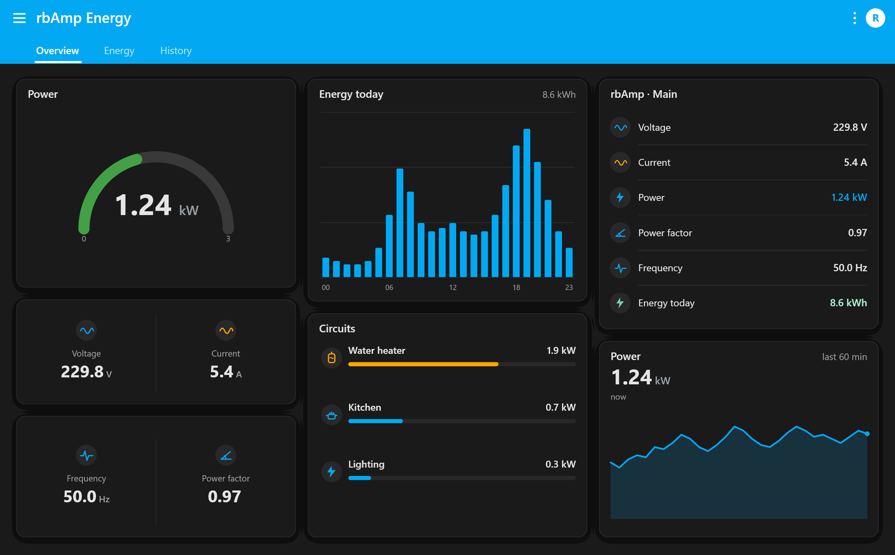

# 10 · Arduino Examples

This chapter collects complete, working Arduino sketches for typical rbAmp scenarios. All examples rely on the helpers introduced in [02_initialization.md](initialization.md).

> **These examples talk to rbAmp directly through the raw I2C register API.** They are intended for native, embedded, or otherwise resource-constrained integrations where direct control is required and every byte on the bus matters.
>
> **For a more convenient, structured interface — use the `rbamp` Arduino library** (see [chapter 17 · Arduino Library](https://rbamp.com/docs/modules-basic-standard-library-arduino-overview)). The library wraps the register-level details behind a high-level `RbAmp` class with named methods (`readVoltage()`, `latchPeriod()`, `readPeriodSnapshot()`, etc.), an automatic per-channel Wh accumulator, SPEC §B.5 retry+sanity discipline for ESP32 targets, and multi-module helpers. Most user-facing projects should start from the library and fall back to the raw API only when needed.

## Examples table of contents

| # | Title | Difficulty | Display / Output | MQTT | DRDY | Multi-module | Bidirectional | Use case |
|:---:|---|:---:|:---:|:---:|:---:|:---:|:---:|---|
| 1 | [Quick read](#example-1--quick-read-minimal) | minimal | Serial | — | — | — | — | Smoke test |
| 2 | [60-second energy meter on OLED](#example-2--60-second-energy-meter-on-oled) | low | OLED | — | — | — | — | Boxed Wh counter |
| 3 | [Multi-module monitor](#example-3--multi-module-monitor) | low | Serial | — | — | yes (3) | — | Whole-home monitoring |
| 4 | [Per-appliance energy tracker (UI3)](#example-4--per-appliance-energy-tracker-ui3) | medium | — | yes | — | — | — | Sub-metering in HA |
| 5 | [Master-side bidirectional accounting on a BASIC module](#example-5--master-side-bidirectional-accounting-on-a-basic-module) | medium | Serial | — | yes | — | yes (master) | Solar home on BASIC tier |
| 6 | [Home energy balance](#example-6--home-energy-balance) | high | — | yes | — | yes (3) | yes | Full home balance |
| 7 | [Power-event detection](#example-7--power-event-detection) | medium | Serial + SD | — | yes | — | — | Appliance event log |
| 8 | [MQTT publisher with HA Auto-discovery](#example-8--mqtt-publisher-with-home-assistant-auto-discovery) | medium | — | yes (+disco) | — | — | optional | Drop-in HA integration |
| 9 | [Battery-powered remote logger with deep sleep](#example-9--battery-powered-remote-logger-with-deep-sleep) | medium | — | yes | — | — | — | Off-grid / outdoor meter |
| 10 | [Time-of-use (TOU) tariff with NTP wall-clock](#example-10--time-of-use-tou-tariff-with-ntp-wall-clock) | medium | Serial | yes | — | — | optional | Peak / off-peak tariff metering |

## Common header for all examples

Each example assumes the following helper definitions are present in the file. To save space, the block is not repeated in each sketch below — assume it is included.

```cpp
#include <Wire.h>

/**
 * @brief  Read one byte from a register of an rbAmp slave.
 * @param  addr 7-bit I2C slave address.
 * @param  reg  Register address inside the slave.
 * @return Register value.
 */
uint8_t rb_read_u8(uint8_t addr, uint8_t reg) {
  Wire.beginTransmission(addr);
  Wire.write(reg);
  // Return 0 (not 0xFF) on NACK so bit-flags like DATA_VALID/PERIOD_VALID
  // are not falsely read as "valid" when the slave is unreachable.
  if (Wire.endTransmission(false) != 0) return 0;   // NACK on address/data
  if (Wire.requestFrom(addr, (uint8_t)1) != 1) return 0;
  return Wire.read();
}

/**
 * @brief  Read a little-endian float32 from four consecutive registers.
 * @details rbAmp supports READ auto-increment (burst-read is valid). The
 *          per-byte form below is shown for clarity; production code may
 *          prefer a single burst-read for atomicity (see chapter 11).
 * @param  addr 7-bit I2C slave address.
 * @param  reg  Address of the LSB of the 4-byte float.
 * @return Reconstructed IEEE-754 single-precision value.
 */
float rb_read_float_le(uint8_t addr, uint8_t reg) {
  uint8_t buf[4];
  for (int i = 0; i < 4; i++) buf[i] = rb_read_u8(addr, reg + i);
  float f;
  memcpy(&f, buf, 4);                          // host is little-endian (AVR/ESP/ARM)
  return f;
}

/**
 * @brief  Write a single byte to a register of an rbAmp slave.
 * @param  addr 7-bit I2C slave address.
 * @param  reg  Target register address.
 * @param  val  Byte to write.
 */
void rb_write_u8(uint8_t addr, uint8_t reg, uint8_t val) {
  Wire.beginTransmission(addr);
  Wire.write(reg);
  Wire.write(val);
  Wire.endTransmission();
}

/**
 * @brief  Broadcast CMD_LATCH_PERIOD to every rbAmp on the bus that has
 *         GC reception enabled (FLEET_CONFIG.bit0 = 1; opt-in, default OFF).
 * @details Canonical 5-byte general-call frame: A5 27 group tick_lo tick_hi.
 *          Slaves reject any first byte != 0xA5. See chapter 11 §6.3.2.
 * @param  tick16  Caller's 16-bit window counter — mirrored at GC_TICK
 *                 (0x59) for missed-frame detection.
 * @param  group   GROUP_ID filter (0 = all-call; otherwise must match
 *                 the module's REG_GROUP_ID = 0x28).
 * @return true on ACK (at least one slave accepted the frame).
 *         false on bus-level NACK — no module on the bus has GC enabled
 *         (or no module is in the group). Caller MUST fall back to
 *         per-module sequential CMD_LATCH_PERIOD.
 */
bool rb_broadcast_latch(uint16_t tick16, uint8_t group = 0) {
  Wire.beginTransmission(0x00);                // I2C general call
  Wire.write(0xA5);                            // frame magic
  Wire.write(0x27);                            // CMD_LATCH_PERIOD opcode
  Wire.write(group);                           // group_id
  Wire.write((uint8_t)(tick16 & 0xFF));        // tick_lo
  Wire.write((uint8_t)((tick16 >> 8) & 0xFF)); // tick_hi
  return Wire.endTransmission() == 0;
}
```

---

## Example 1 — Quick read (minimal)

**Goal**: print current U, I, P, PF to Serial every second.
**Hardware**: ESP32 / Arduino + one rbAmp UI1.

```cpp
#define RB_ADDR 0x50

void setup() {
  Serial.begin(115200);
  Wire.begin();
  Wire.setClock(50000);
  delay(300);                                  // let the module finish booting

  // Wait until the first RT window has been computed (DATA_VALID bit 0).
  while ((rb_read_u8(RB_ADDR, 0xCE) & 0x01) == 0) delay(50);
  Serial.println("rbAmp ready");
}

void loop() {
  // Real-time block at 0x86..0xBD is refreshed every ~200 ms by the module.
  float u  = rb_read_float_le(RB_ADDR, 0x86);  // RMS voltage,   V
  float i  = rb_read_float_le(RB_ADDR, 0x8E);  // RMS current,   A
  float p  = rb_read_float_le(RB_ADDR, 0xA6);  // active power,  W (signed)
  float pf = rb_read_float_le(RB_ADDR, 0xB2);  // power factor,  −1..+1 (signed)

  Serial.printf("U=%.1fV  I=%.3fA  P=%+.1fW  PF=%+.3f\n", u, i, p, pf);
  delay(1000);
}
```

Expected output:

```
rbAmp ready
U=230.1V  I=0.262A  P=+60.2W  PF=+0.998
U=229.9V  I=0.262A  P=+60.1W  PF=+0.998
...
```

---

## Example 2 — 60-second energy meter on OLED

**Goal**: Wh counter refreshed once per minute, shown on a 128×64 OLED.
**Hardware**: ESP32 + rbAmp + SSD1306 OLED on the same I2C bus.
**Accounting**: unidirectional (BASIC tier).

```cpp
#include <Adafruit_SSD1306.h>
#define RB_ADDR 0x50
#define OLED_W 128
#define OLED_H 64
Adafruit_SSD1306 oled(OLED_W, OLED_H, &Wire);

uint32_t t_prev_ms = 0;                        // wall-clock at last latch
double total_wh = 0;                           // accumulated energy, Wh

void setup() {
  Serial.begin(115200);
  Wire.begin();
  delay(300);
  oled.begin(SSD1306_SWITCHCAPVCC, 0x3C);

  // Wait DATA_VALID, then issue a primer latch (its result is discarded).
  while ((rb_read_u8(RB_ADDR, 0xCE) & 0x01) == 0) delay(50);
  rb_write_u8(RB_ADDR, 0x01, 0x27);            // CMD_LATCH_PERIOD — primer
  t_prev_ms = millis();
}

void loop() {
  delay(60000);                                // 60-second period

  // 1) Final latch — closes the period [t_prev_ms .. now].
  rb_write_u8(RB_ADDR, 0x01, 0x27);
  uint32_t t_now_ms = millis();
  delay(50);                                   // let firmware finalise the snapshot

  // 2) Verify the snapshot is fresh before using it.
  if ((rb_read_u8(RB_ADDR, 0x07) & 0x01) == 0) {
    Serial.println("WARN: stale snapshot");
    t_prev_ms = millis();
    return;
  }

  // 3) Read time-averaged power for channel 0 (PERIOD_AVG_P_W[0]).
  float avg_p = rb_read_float_le(RB_ADDR, 0xDC);

  // 4) Compute energy using the MASTER clock (authoritative).
  float dt_s = (t_now_ms - t_prev_ms) / 1000.0f;
  double e_wh = (double)avg_p * dt_s / 3600.0;
  total_wh += e_wh;
  t_prev_ms = t_now_ms;

  // 5) Update the OLED.
  oled.clearDisplay();
  oled.setTextSize(1);
  oled.setTextColor(SSD1306_WHITE);
  oled.setCursor(0, 0);
  oled.printf("P:  %6.1f W", avg_p);
  oled.setCursor(0, 16);
  oled.printf("dt: %6.1f s", dt_s);
  oled.setCursor(0, 32);
  oled.setTextSize(2);
  oled.printf("%.2f Wh", total_wh);
  oled.display();

  Serial.printf("avg_P=%.1f  E_period=%.3f  total=%.3f\n", avg_p, e_wh, total_wh);
}
```

The OLED shares the rbAmp I2C bus (typical OLED address is `0x3C`, no collision with `0x50`).

---

## Example 3 — Multi-module monitor

**Goal**: poll three modules (main feed, water heater, AC), print total power.
**Hardware**: ESP32 + 3 × rbAmp UI1 (addresses `0x50`, `0x51`, `0x52`).

```cpp
const uint8_t modules[] = {0x50, 0x51, 0x52};
const char* labels[]    = {"Mains ", "Boiler", "AC    "};
const int N = 3;

void setup() {
  Serial.begin(115200);
  Wire.begin();
  Wire.setClock(50000);
  delay(300);

  // Bus scan — confirm every module is present.
  for (int i = 0; i < N; i++) {
    Wire.beginTransmission(modules[i]);
    if (Wire.endTransmission() != 0) {
      Serial.printf("ERROR: %s at 0x%02X not found — restarting in 5 s\n",
                    labels[i], modules[i]);
      delay(5000);
      ESP.restart();                           // reboot rather than hang
    }
  }
  Serial.println("All modules OK");
}

void loop() {
  float total_p = 0;
  Serial.println("---");

  // Read each module in turn (round-robin).
  for (int i = 0; i < N; i++) {
    float u = rb_read_float_le(modules[i], 0x86);
    float p = rb_read_float_le(modules[i], 0xA6);
    Serial.printf("[%s] U=%.1f  P=%+.1f W\n", labels[i], u, p);
    total_p += p;
  }
  Serial.printf("TOTAL: %.1f W\n", total_p);
  delay(2000);
}
```

---

## Example 4 — Per-appliance energy tracker (UI3)

**Goal**: a UI3 module with three CT clamps on three different single-phase loads. Independent Wh counters per load. MQTT publishing.
**Hardware**: ESP32 + 1 × rbAmp UI3.
**Accounting**: unidirectional.

```cpp
#include <WiFi.h>
#include <PubSubClient.h>

#define RB_ADDR 0x50
const char* CH_NAMES[3] = {"main", "heatpump", "lights"};

WiFiClient espClient;
PubSubClient mqtt(espClient);

uint32_t t_prev_ms = 0;
double total_wh[3] = {0, 0, 0};                 // per-channel accumulated energy

/**
 * @brief  Publish a single channel's data to MQTT.
 * @param  ch_name   Channel name (used in the topic).
 * @param  avg_p     Time-averaged power over the latched period, W.
 * @param  e_wh      Accumulated channel energy, Wh.
 */
void mqtt_publish(const char* ch_name, float avg_p, double e_wh) {
  char topic[64], payload[64];
  snprintf(topic, sizeof(topic), "rbamp/%s/state", ch_name);
  snprintf(payload, sizeof(payload),
           "{\"power\":%.1f,\"energy\":%.4f}", avg_p, e_wh);
  mqtt.publish(topic, payload);
}

void setup() {
  Serial.begin(115200);
  WiFi.begin("ssid", "password");
  uint32_t wifi_start = millis();
  while (WiFi.status() != WL_CONNECTED) {        // bounded wait — avoid WDT
    delay(500);
    if (millis() - wifi_start > 30000) {
      Serial.println("WiFi timeout — restarting");
      ESP.restart();
    }
  }
  mqtt.setServer("192.168.1.10", 1883);
  mqtt.setKeepAlive(60);                         // 60 s keepalive (default 15 s)
  mqtt.connect("rbamp-ui3");                     // best-effort; loop() retries

  Wire.begin();
  delay(300);
  while ((rb_read_u8(RB_ADDR, 0xCE) & 0x01) == 0) delay(50);
  rb_write_u8(RB_ADDR, 0x01, 0x27);             // primer latch
  t_prev_ms = millis();
}

void loop() {
  // Service MQTT keepalive every iteration (not once per 60 s — broker would
  // drop the session after the default 15 s timeout). Reconnect with bounded
  // back-off when the broker is unreachable.
  if (!mqtt.connected()) {
    static uint32_t last_retry = 0;
    if (millis() - last_retry > 5000) {
      last_retry = millis();
      mqtt.connect("rbamp-ui3");
    }
  }
  mqtt.loop();

  // Non-blocking 60-second period — keeps mqtt.loop alive for keepalive.
  static uint32_t last_period_ms = 0;
  if (last_period_ms == 0) last_period_ms = millis();
  if (millis() - last_period_ms < 60000) {
    delay(50);
    return;
  }
  last_period_ms = millis();

  // Latch + read three per-channel period averages.
  rb_write_u8(RB_ADDR, 0x01, 0x27);
  uint32_t t_now = millis();
  delay(50);

  if ((rb_read_u8(RB_ADDR, 0x07) & 0x01) == 0) {
    t_prev_ms = millis();
    return;
  }

  // Per-channel PERIOD_AVG_P_W: I0 at 0xDC, I1 at 0xC2, I2 at 0xC6.
  float avg_p[3];
  avg_p[0] = rb_read_float_le(RB_ADDR, 0xDC);   // I0
  avg_p[1] = rb_read_float_le(RB_ADDR, 0xC2);   // I1
  avg_p[2] = rb_read_float_le(RB_ADDR, 0xC6);   // I2

  float dt_s = (t_now - t_prev_ms) / 1000.0f;
  t_prev_ms = t_now;

  for (int ch = 0; ch < 3; ch++) {
    double e = (double)avg_p[ch] * dt_s / 3600.0;
    total_wh[ch] += e;
    Serial.printf("[%s] avg_P=%+.1f W  E_total=%.3f Wh\n",
                  CH_NAMES[ch], avg_p[ch], total_wh[ch]);
    mqtt_publish(CH_NAMES[ch], avg_p[ch], total_wh[ch]);
  }
}
```

---

## Example 5 — Master-side bidirectional accounting on a BASIC module

**Goal**: implement bidirectional accounting on the master when the module's tier is BASIC (period accumulator clamps negative samples). The master reads RT `P_real` every ~200 ms and separates consumption / export itself.
**Hardware**: ESP32 + rbAmp UI1 on a load with a solar inverter.
**Applicability**: for BASIC owners who need export visibility. Slightly lower accuracy than a true STANDARD / PRO module, but works today.

```cpp
#define RB_ADDR 0x50
const int PIN_DRDY = 15;

volatile bool data_ready = false;               // set by DRDY ISR
double e_consumed_wh = 0;
double e_exported_wh = 0;
uint32_t t_last_sample_ms = 0;

/**
 * @brief  Interrupt service routine for DRDY falling edge.
 * @details Marks fresh data available. Kept tiny (no I2C calls inside ISR).
 */
void IRAM_ATTR on_drdy() { data_ready = true; }

void setup() {
  Serial.begin(115200);
  Wire.begin();
  pinMode(PIN_DRDY, INPUT_PULLUP);
  delay(300);
  // Wait for the slave to come online BEFORE arming the ISR — otherwise a
  // settling pull-up edge can fire a spurious interrupt against a not-yet-
  // initialised slave and set data_ready before the first valid window.
  while ((rb_read_u8(RB_ADDR, 0xCE) & 0x01) == 0) delay(50);
  t_last_sample_ms = millis();
  attachInterrupt(digitalPinToInterrupt(PIN_DRDY), on_drdy, FALLING);
  Serial.println("Bidirectional accumulator started");
}

void loop() {
  if (!data_ready) return;                      // sleep until next RT window
  data_ready = false;

  uint32_t t_now = millis();

  // Signed instantaneous P_real: positive = consume, negative = export.
  float p = rb_read_float_le(RB_ADDR, 0xA6);
  float dt_s = (t_now - t_last_sample_ms) / 1000.0f;
  t_last_sample_ms = t_now;

  // Split into two accumulators on the master side.
  if (p > 0) {
    e_consumed_wh += p * dt_s / 3600.0;
  } else {
    e_exported_wh += (-p) * dt_s / 3600.0;
  }

  // Print summary every 5 seconds (not on every RT window).
  static uint32_t last_print = 0;
  if (t_now - last_print >= 5000) {
    last_print = t_now;
    Serial.printf("P=%+8.1fW   consumed=%.4f Wh  exported=%.4f Wh  net=%+.4f Wh\n",
                  p, e_consumed_wh, e_exported_wh,
                  e_consumed_wh - e_exported_wh);
  }
}
```

**Notes**:

- DRDY synchronises reads with each RT window (~200 ms).
- Accuracy depends on DRDY interval stability (typically ±1 ms).
- A small error accumulates near P zero-crossings but is negligible for household loads.

---

## Example 6 — Home energy balance

**Goal**: full balance dashboard. Three modules:

- rbAmp #1 on the main feed (mains): bidirectional — measures grid in / out.
- rbAmp #2 on the solar inverter output (solar): measures generation.
- rbAmp #3 UI3 on three large loads (heat pump, AC, EV charger).

The master computes: `total_consumed = solar_self_used + grid_consumed`, `solar_generated = solar_self_used + grid_exported`.

**Hardware**: ESP32 + 3 × rbAmp + WiFi + MQTT.
**Tiers**: STANDARD or PRO product tier for the mains module (bidirectional). Solar and Loads modules can be BASIC (unidirectional by construction).

```cpp
#include <WiFi.h>
#include <PubSubClient.h>

const uint8_t ADDR_MAINS = 0x50;                // bidirectional (STANDARD/PRO)
const uint8_t ADDR_SOLAR = 0x51;                // generation only (BASIC OK)
const uint8_t ADDR_LOADS = 0x52;                // UI3, big consumers

// PERIOD_AVG_P_NEG address for the mains module — see the SKU datasheet
// of the STANDARD / PRO product. Set to 0xFF on BASIC modules.
#define REG_PERIOD_AVG_P_NEG_MAINS 0xFF

WiFiClient espClient;
PubSubClient mqtt(espClient);

uint32_t t_prev_ms = 0;

/** Accumulated energy in Wh, per category. */
struct {
  double mains_in_wh    = 0;                    // grid consumed
  double mains_out_wh   = 0;                    // grid exported
  double solar_total_wh = 0;                    // solar generated
  double loads_wh[3]    = {0, 0, 0};            // per-appliance
} totals;

void setup() {
  Serial.begin(115200);
  WiFi.begin("ssid", "password");
  while (WiFi.status() != WL_CONNECTED) delay(500);
  mqtt.setServer("192.168.1.10", 1883);
  mqtt.connect("home-balance");

  Wire.begin();
  Wire.setClock(50000);
  delay(300);

  // Wait until all three modules report DATA_VALID.
  for (uint8_t addr : {ADDR_MAINS, ADDR_SOLAR, ADDR_LOADS}) {
    while ((rb_read_u8(addr, 0xCE) & 0x01) == 0) delay(50);
  }

  static uint16_t gc_tick = 0;
  if (!rb_broadcast_latch(gc_tick++)) {
    // GC NACK — no module has GC enabled. Fall back to per-module latch.
    for (uint8_t addr : {ADDR_MAINS, ADDR_SOLAR, ADDR_LOADS}) {
      rb_write_u8(addr, 0x01, 0x27);
    }
  }
  t_prev_ms = millis();
  Serial.println("Home balance started");
}

void loop() {
  delay(60000);

  // Synchronous latch — all three modules snapshot at the same instant.
  static uint16_t gc_tick = 1;
  if (!rb_broadcast_latch(gc_tick++)) {
    // GC NACK — fall back to per-module sequential latch (skew ~1 ms/module).
    for (uint8_t addr : {ADDR_MAINS, ADDR_SOLAR, ADDR_LOADS}) {
      rb_write_u8(addr, 0x01, 0x27);
    }
  }
  uint32_t t_now = millis();
  delay(50);

  float dt_s = (t_now - t_prev_ms) / 1000.0f;
  t_prev_ms = t_now;

  // ----- MAINS (bidirectional, STANDARD/PRO tier) -----
  if (rb_read_u8(ADDR_MAINS, 0x07) & 0x01) {
    float avg_p_consume = rb_read_float_le(ADDR_MAINS, 0xDC);
    float avg_p_export  = (REG_PERIOD_AVG_P_NEG_MAINS != 0xFF)
        ? rb_read_float_le(ADDR_MAINS, REG_PERIOD_AVG_P_NEG_MAINS)
        : 0.0f;
    totals.mains_in_wh  += avg_p_consume * dt_s / 3600.0;
    totals.mains_out_wh += avg_p_export  * dt_s / 3600.0;
  }

  // ----- SOLAR (generation only) -----
  // The CT arrow points toward the home; P > 0 = inverter exporting.
  if (rb_read_u8(ADDR_SOLAR, 0x07) & 0x01) {
    float avg_p = rb_read_float_le(ADDR_SOLAR, 0xDC);
    totals.solar_total_wh += avg_p * dt_s / 3600.0;
  }

  // ----- LOADS (UI3, three channels) -----
  if (rb_read_u8(ADDR_LOADS, 0x07) & 0x01) {
    float p[3];
    p[0] = rb_read_float_le(ADDR_LOADS, 0xDC);  // I0 channel
    p[1] = rb_read_float_le(ADDR_LOADS, 0xC2);  // I1 channel
    p[2] = rb_read_float_le(ADDR_LOADS, 0xC6);  // I2 channel
    for (int i = 0; i < 3; i++) totals.loads_wh[i] += p[i] * dt_s / 3600.0;
  }

  // Derived balance figures.
  double total_consumed  = totals.mains_in_wh + totals.solar_total_wh
                         - totals.mains_out_wh;
  double solar_self_used = totals.solar_total_wh - totals.mains_out_wh;
  if (solar_self_used < 0) solar_self_used = 0;  // clamp measurement noise

  Serial.printf("MAINS  in=%.2f  out=%.2f\n", totals.mains_in_wh, totals.mains_out_wh);
  Serial.printf("SOLAR  gen=%.2f  self-used=%.2f  exported=%.2f\n",
                totals.solar_total_wh, solar_self_used, totals.mains_out_wh);
  Serial.printf("LOADS  HP=%.2f  AC=%.2f  EV=%.2f\n",
                totals.loads_wh[0], totals.loads_wh[1], totals.loads_wh[2]);
  Serial.printf("TOTAL  household consumed=%.2f Wh\n", total_consumed);

  // Publish the entire balance to a single MQTT topic (retained).
  char payload[512];
  snprintf(payload, sizeof(payload),
    "{\"mains_in\":%.3f,\"mains_out\":%.3f,\"solar\":%.3f,"
    "\"self_used\":%.3f,\"total_consumed\":%.3f,"
    "\"hp\":%.3f,\"ac\":%.3f,\"ev\":%.3f}",
    totals.mains_in_wh, totals.mains_out_wh, totals.solar_total_wh,
    solar_self_used, total_consumed,
    totals.loads_wh[0], totals.loads_wh[1], totals.loads_wh[2]);
  mqtt.publish("home/energy/balance", payload, true);
  mqtt.loop();
}
```

**Notes**:

- `rb_broadcast_latch(tick)` ensures all three modules snapshot at the same instant — critical for an accurate balance. GC reception is **opt-in** per module (`FLEET_CONFIG.bit0`, default OFF, see chapter 02). If the GC frame NACKs, the example falls back to per-module sequential `CMD_LATCH_PERIOD` (skew ~1 ms per module on 50 kHz).
- `solar_self_used = solar_total − exported_to_grid` — the energy generated and locally consumed.
- `total_consumed = mains_in + solar_self_used` — total household consumption.

---

## Example 7 — Power-event detection

**Goal**: on every RT window (200 ms), compare P against an exponentially-weighted moving average (EMA). Log significant deviations to an SD card.
**Hardware**: ESP32 + rbAmp + SD card.
**Use case**: automatic detection of large-load events (microwave, AC, kettle) turning on or off.

```cpp
#include <SD.h>
#define RB_ADDR 0x50
const int PIN_DRDY  = 15;
const int PIN_SD_CS = 5;

volatile bool data_ready = false;
float p_ema = 0;                                // exponential moving average
const float EMA_ALPHA = 0.05;                   // ~4 s time constant at 5 Hz updates
const float EVENT_THRESHOLD_W = 200.0;          // ignore steps below this

File logfile;

/** @brief  DRDY interrupt — only sets a flag. */
void IRAM_ATTR on_drdy() { data_ready = true; }

void setup() {
  Serial.begin(115200);
  Wire.begin();
  pinMode(PIN_DRDY, INPUT_PULLUP);

  // SD card setup with explicit failure check — opening a non-existent file
  // returns a falsey File object; writing to it is undefined on some cores.
  if (!SD.begin(PIN_SD_CS)) {
    Serial.println("ERROR: SD.begin() failed — restarting in 5 s");
    delay(5000);
    ESP.restart();
  }
  logfile = SD.open("/events.log", FILE_APPEND);
  if (!logfile) {
    Serial.println("ERROR: SD.open(events.log) failed — restarting in 5 s");
    delay(5000);
    ESP.restart();
  }

  delay(300);
  while ((rb_read_u8(RB_ADDR, 0xCE) & 0x01) == 0) delay(50);

  // Seed the EMA with the current power so we do not log a spurious startup event.
  p_ema = rb_read_float_le(RB_ADDR, 0xA6);
  attachInterrupt(digitalPinToInterrupt(PIN_DRDY), on_drdy, FALLING);
  Serial.println("Event detector started");
}

void loop() {
  if (!data_ready) return;
  data_ready = false;

  // Compute the deviation from the running average.
  float p = rb_read_float_le(RB_ADDR, 0xA6);
  float delta = p - p_ema;
  p_ema = (1 - EMA_ALPHA) * p_ema + EMA_ALPHA * p;

  // Log when the deviation exceeds the threshold.
  if (fabsf(delta) > EVENT_THRESHOLD_W) {       // fabsf for float (avoids double promotion)
    const char* type = (delta > 0) ? "TURN_ON" : "TURN_OFF";
    char line[128];
    snprintf(line, sizeof(line),
             "%lu  %s  delta=%+.1f W  P=%.1f W  EMA=%.1f W\n",
             millis(), type, delta, p, p_ema);
    Serial.print(line);
    logfile.print(line);
    logfile.flush();                            // ensure the line hits the card
  }
}
```

**Notes**:

- The EMA adapts to background load in ~4 s — it does not react to slow drifts.
- A 200 W threshold skips minor loads (lights, phone chargers) and catches major appliances.
- DRDY provides precise synchronisation with each P_real update.

---

## Example 8 — MQTT publisher with Home Assistant Auto-discovery



**Goal**: a drop-in HA integration. The ESP32 connects to WiFi and an MQTT broker, publishes Home Assistant auto-discovery configs (so the entities appear in HA without any YAML), and emits a JSON state every minute. No HA YAML changes are needed.
**Hardware**: ESP32 + one rbAmp UI1 + WiFi network with an MQTT broker (Mosquitto, EMQX, HA Mosquitto add-on, etc.).
**Accounting**: unidirectional. Replace the period registers with the bidirectional ones for STANDARD / PRO modules.

```cpp
#include <WiFi.h>
#include <PubSubClient.h>

#define RB_ADDR 0x50
const char* WIFI_SSID    = "ssid";
const char* WIFI_PASS    = "password";
const char* MQTT_HOST    = "192.168.1.10";
const uint16_t MQTT_PORT = 1883;
const char* MQTT_USER    = "ha";                // optional, NULL to disable
const char* MQTT_PASS    = "secret";

// Stable identifiers — the HA discovery topic must be unique per entity.
const char* DEVICE_ID    = "rbamp_main";
const char* DEVICE_NAME  = "Mains rbAmp";

WiFiClient   espClient;
PubSubClient mqtt(espClient);

uint32_t t_prev_ms = 0;
double total_wh = 0;                            // accumulated energy

/**
 * @brief  Publish a single HA discovery config for one sensor.
 * @param  key          Short key used in topic and value_template.
 * @param  friendly     Friendly name shown in HA.
 * @param  unit         Unit of measurement (e.g. "V", "W", "Wh"). NULL = none.
 * @param  device_class HA device_class string (e.g. "voltage"). NULL = none.
 * @param  state_class  HA state_class ("measurement" / "total_increasing").
 * @details The config topic is retained, so HA discovers the entity even
 *          after a restart without waiting for the next state publish.
 */
void publish_discovery_sensor(const char* key,
                              const char* friendly,
                              const char* unit,
                              const char* device_class,
                              const char* state_class) {
  char topic[128];
  char payload[512];

  snprintf(topic, sizeof(topic),
           "homeassistant/sensor/%s/%s/config", DEVICE_ID, key);

  // Build the discovery JSON. The shared "device" block ties all entities
  // to one device card in HA.
  int n = snprintf(payload, sizeof(payload),
    "{"
      "\"name\":\"%s %s\","
      "\"unique_id\":\"%s_%s\","
      "\"state_topic\":\"rbamp/%s/state\","
      "\"value_template\":\"{{ value_json.%s }}\","
      "\"state_class\":\"%s\","
      "\"device\":{"
        "\"identifiers\":[\"%s\"],"
        "\"name\":\"%s\","
        "\"manufacturer\":\"rbAmp\","
        "\"model\":\"rbAmp UI*\""
      "}",
    DEVICE_NAME, friendly,
    DEVICE_ID, key,
    DEVICE_ID,
    key,
    state_class,
    DEVICE_ID, DEVICE_NAME);

  // Append optional fields.
  if (unit && n < (int)sizeof(payload)) {
    n += snprintf(payload + n, sizeof(payload) - n,
                  ",\"unit_of_measurement\":\"%s\"", unit);
  }
  if (device_class && n < (int)sizeof(payload)) {
    n += snprintf(payload + n, sizeof(payload) - n,
                  ",\"device_class\":\"%s\"", device_class);
  }
  if (n < (int)sizeof(payload) - 1) {           // guard against overflow underflow
    snprintf(payload + n, sizeof(payload) - n, "}");
  } else {
    payload[sizeof(payload) - 2] = '}';         // forced close on truncation
    payload[sizeof(payload) - 1] = '\0';
    Serial.println("WARN: HA discovery payload truncated");
  }

  mqtt.publish(topic, payload, true);           // retained — survives broker restart
}

/**
 * @brief  Publish the full HA Auto-discovery set for one rbAmp module.
 * @details Call once on every (re)connect to the broker.
 */
void publish_discovery_all() {
  publish_discovery_sensor("voltage",      "Voltage",       "V",  "voltage",      "measurement");
  publish_discovery_sensor("current",      "Current",       "A",  "current",      "measurement");
  publish_discovery_sensor("power",        "Power",         "W",  "power",        "measurement");
  publish_discovery_sensor("energy",       "Energy",        "Wh", "energy",       "total_increasing");
  publish_discovery_sensor("frequency",    "Frequency",     "Hz", "frequency",    "measurement");
  publish_discovery_sensor("power_factor", "Power Factor",  NULL, "power_factor", "measurement");
  publish_discovery_sensor("apparent_power", "Apparent Power", "VA",  "apparent_power", "measurement");
  publish_discovery_sensor("reactive_power", "Reactive Power", "var", "reactive_power", "measurement");
}

/**
 * @brief  Try to (re)connect to the MQTT broker once.
 * @return true on success, false otherwise. Caller is responsible for retry
 *         pacing — this function NEVER blocks longer than the underlying
 *         PubSubClient.connect() timeout.
 * @details Republishes discovery configs on every successful reconnect.
 *          Replaces the previous unbounded `while (!connected) delay(2000)`
 *          loop which would trip the ESP32 task watchdog after ~5 s of broker
 *          unavailability.
 */
bool mqtt_try_connect() {
  if (mqtt.connected()) return true;
  Serial.print("MQTT connecting... ");
  bool ok = MQTT_USER
      ? mqtt.connect(DEVICE_ID, MQTT_USER, MQTT_PASS)
      : mqtt.connect(DEVICE_ID);
  if (ok) {
    Serial.println("OK");
    publish_discovery_all();
  } else {
    Serial.printf("failed rc=%d (will retry)\n", mqtt.state());
  }
  return ok;
}

void setup() {
  Serial.begin(115200);

  // 1) WiFi — bounded wait, restart on persistent failure (avoids WDT).
  WiFi.begin(WIFI_SSID, WIFI_PASS);
  uint32_t wifi_start = millis();
  while (WiFi.status() != WL_CONNECTED) {
    delay(500);
    if (millis() - wifi_start > 30000) {
      Serial.println("WiFi timeout — restarting");
      ESP.restart();
    }
  }
  Serial.printf("WiFi up, IP=%s\n", WiFi.localIP().toString().c_str());

  // 2) MQTT.
  mqtt.setServer(MQTT_HOST, MQTT_PORT);
  mqtt.setKeepAlive(60);                        // 60 s keepalive (default 15 s)
  mqtt.setBufferSize(1024);                     // big enough for one discovery payload

  // 3) rbAmp.
  Wire.begin();
  Wire.setClock(50000);
  delay(300);
  while ((rb_read_u8(RB_ADDR, 0xCE) & 0x01) == 0) delay(50);

  rb_write_u8(RB_ADDR, 0x01, 0x27);             // primer latch
  t_prev_ms = millis();

  // 4) First MQTT attempt — failure is non-fatal, loop() will retry.
  mqtt_try_connect();
}

void loop() {
  // Keep the broker session alive: service mqtt.loop() every iteration and
  // attempt reconnect with bounded back-off (no blocking 2s delay).
  if (!mqtt.connected()) {
    static uint32_t last_retry = 0;
    if (millis() - last_retry > 5000) {         // retry at most every 5 s
      last_retry = millis();
      mqtt_try_connect();
    }
  }
  mqtt.loop();

  static uint32_t last_period = 0;
  if (last_period == 0) last_period = millis(); // seed on first iteration
  if (millis() - last_period < 60000) {
    delay(50);                                  // short slice — keeps loop responsive
    return;
  }
  last_period = millis();

  // ----- Latch + read period snapshot -----
  rb_write_u8(RB_ADDR, 0x01, 0x27);
  uint32_t t_now = millis();
  delay(50);

  if ((rb_read_u8(RB_ADDR, 0x07) & 0x01) == 0) {
    Serial.println("WARN: stale snapshot, skipping publish");
    t_prev_ms = millis();
    return;
  }
  float avg_p = rb_read_float_le(RB_ADDR, 0xDC);
  float dt_s  = (t_now - t_prev_ms) / 1000.0f;
  total_wh += (double)avg_p * dt_s / 3600.0;
  t_prev_ms = t_now;

  // ----- Read live RT values -----
  float u  = rb_read_float_le(RB_ADDR, 0x86);
  float i  = rb_read_float_le(RB_ADDR, 0x8E);
  float pf = rb_read_float_le(RB_ADDR, 0xB2);
  float q  = rb_read_float_le(RB_ADDR, 0xD0);
  uint8_t freq = rb_read_u8(RB_ADDR, 0x20);

  // ----- Compose the state JSON -----
  char payload[384];
  snprintf(payload, sizeof(payload),
    "{"
      "\"voltage\":%.1f,"
      "\"current\":%.3f,"
      "\"power\":%.1f,"
      "\"energy\":%.3f,"
      "\"frequency\":%u,"
      "\"power_factor\":%.3f,"
      "\"apparent_power\":%.1f,"
      "\"reactive_power\":%.1f"
    "}",
    u, i, avg_p, total_wh,
    (unsigned)freq, pf, u * i, q);

  // Topic shape matches the value_template of every discovery config.
  char topic[64];
  snprintf(topic, sizeof(topic), "rbamp/%s/state", DEVICE_ID);
  mqtt.publish(topic, payload, false);          // state is fresh each period, not retained

  Serial.printf("Published: %s\n", payload);
}
```

**Result in Home Assistant**:

- Within seconds of the first publish, HA auto-creates a device called `Mains rbAmp` with 8 entities (Voltage, Current, Power, Energy, Frequency, Power Factor, Apparent Power, Reactive Power).
- The `Energy` entity has `state_class: total_increasing` and the right `device_class`, so HA's Energy dashboard accepts it as a consumption source.
- To remove the entity from HA, publish an empty payload to its `homeassistant/sensor/.../config` topic (retained).

**Extending**:

- For multi-channel UI2/UI3, repeat the discovery block with suffixed keys (`current_1`, `power_1`, `energy_1`, …) and add those fields to the state JSON.
- For bidirectional STANDARD / PRO modules, add `energy_exported` with `device_class: energy` and `state_class: total_increasing`.

---

## Example 9 — Battery-powered remote logger with deep sleep

**Goal**: an outdoor / off-grid energy logger that wakes every 10 minutes, latches a period, publishes the data, and goes back to deep sleep. Average current consumption a couple of mA, so a single Li-ion cell lasts many months.
**Hardware**: ESP32 (or ESP32-S3) + one rbAmp UI1 + a small Li-ion battery + WiFi. The rbAmp is also kept under a low-quiescent LDO so its ~15 mA consumption only occurs during wake.
**Accounting**: unidirectional. Energy is preserved across deep-sleep cycles via RTC slow-memory.

```cpp
#include <WiFi.h>
#include <PubSubClient.h>
#include "esp_sleep.h"

#define RB_ADDR 0x50

const char* WIFI_SSID = "ssid";
const char* WIFI_PASS = "password";
const char* MQTT_HOST = "192.168.1.10";

// Wake every 10 minutes (600 s). The interval is the master_dt for Wh.
const uint64_t SLEEP_US = 10ULL * 60ULL * 1000000ULL;

// Power for rbAmp can be gated through a MOSFET driven by a GPIO,
// or simply left always-on if the LDO quiescent is acceptable.
const int PIN_RBAMP_POWER = 4;

// Values that must survive deep sleep are placed in RTC slow memory.
// IMPORTANT: ESP32 RTC slow memory is NOT zeroed on power-on after a brown-out
// or PSU dropout — it may hold garbage that looks like valid state. Gate every
// retained variable through a magic-marker check on cold boot.
RTC_DATA_ATTR uint32_t rtc_magic         = 0;   // 0xCAFEFEED when state initialised
RTC_DATA_ATTR double   rtc_total_wh      = 0;
RTC_DATA_ATTR uint32_t rtc_wake_count    = 0;
RTC_DATA_ATTR bool     rtc_primer_done   = false;
RTC_DATA_ATTR uint64_t rtc_t_prev_us     = 0;   // boot-time wall-clock anchor

#define RTC_MAGIC 0xCAFEFEEDu

WiFiClient   espClient;
PubSubClient mqtt(espClient);

/**
 * @brief  Power rbAmp on/off via a GPIO-driven high-side switch.
 * @param  on  true = enable, false = disable.
 * @details If your hardware always-powers rbAmp, you can remove this function
 *          and skip the calls to it.
 */
void rbamp_power(bool on) {
  pinMode(PIN_RBAMP_POWER, OUTPUT);
  digitalWrite(PIN_RBAMP_POWER, on ? HIGH : LOW);
  if (on) delay(300);                           // boot time
}

/**
 * @brief  Bring up WiFi with a hard timeout, so deep-sleep is never blocked
 *         forever on a missing AP.
 * @param  timeout_ms  Maximum time to wait for an association.
 * @return true on success, false on timeout.
 */
bool wifi_connect(uint32_t timeout_ms) {
  WiFi.mode(WIFI_STA);
  WiFi.begin(WIFI_SSID, WIFI_PASS);
  uint32_t t0 = millis();
  while (WiFi.status() != WL_CONNECTED) {
    if (millis() - t0 > timeout_ms) return false;
    delay(100);
  }
  return true;
}

/**
 * @brief  Publish one measurement to MQTT.
 * @param  avg_p   Time-averaged power over the last interval, W.
 * @param  total_e Accumulated energy total, Wh.
 * @param  dt_s    Length of the elapsed interval, seconds.
 */
void publish_measurement(float avg_p, double total_e, float dt_s) {
  char payload[256];
  snprintf(payload, sizeof(payload),
    "{\"wake\":%lu,\"dt_s\":%.1f,\"avg_p\":%.1f,\"energy_wh\":%.3f}",
    (unsigned long)rtc_wake_count, dt_s, avg_p, total_e);
  mqtt.publish("rbamp/remote/state", payload, true);
  mqtt.loop();
  Serial.printf("Published: %s\n", payload);
}

void setup() {
  Serial.begin(115200);

  // --- Cold-boot detection ---
  // On any non-deep-sleep reset (power-on, brown-out, watchdog, ESP.restart),
  // RTC slow memory may contain garbage. Initialise on first boot.
  if (rtc_magic != RTC_MAGIC) {
    Serial.println("Cold boot — initialising RTC state");
    rtc_total_wh    = 0.0;
    rtc_wake_count  = 0;
    rtc_primer_done = false;
    rtc_t_prev_us   = 0;
    rtc_magic       = RTC_MAGIC;
  }
  rtc_wake_count++;

  // --- Power up rbAmp and bring up I2C ---
  rbamp_power(true);
  Wire.begin();
  Wire.setClock(50000);
  while ((rb_read_u8(RB_ADDR, 0xCE) & 0x01) == 0) delay(50);

  // First wake-up after a cold boot: do a primer latch (its result is discarded).
  if (!rtc_primer_done) {
    rb_write_u8(RB_ADDR, 0x01, 0x27);
    rtc_t_prev_us = esp_timer_get_time();
    rtc_primer_done = true;

    // Go straight back to sleep — we need at least one full period to elapse
    // before the next latch can produce a meaningful sample.
    Serial.println("Primer done — sleeping until first real period");
    rbamp_power(false);
    esp_sleep_enable_timer_wakeup(SLEEP_US);
    esp_deep_sleep_start();
  }

  // --- Subsequent wake-ups: read the period that just ended ---
  rb_write_u8(RB_ADDR, 0x01, 0x27);             // close current period
  uint64_t t_now_us = esp_timer_get_time();
  delay(50);

  if ((rb_read_u8(RB_ADDR, 0x07) & 0x01) == 0) {
    Serial.println("WARN: stale snapshot — skipping this cycle");
    rtc_t_prev_us = t_now_us;
    rbamp_power(false);
    esp_sleep_enable_timer_wakeup(SLEEP_US);
    esp_deep_sleep_start();
  }

  float avg_p = rb_read_float_le(RB_ADDR, 0xDC);
  // dt is wall-clock between latches; we measure it on the ESP32's RTC.
  // SLEEP_US is the intent; esp_timer accounts for actual sleep + on-time.
  float dt_s = (float)(t_now_us - rtc_t_prev_us) / 1000000.0f;
  rtc_t_prev_us = t_now_us;

  // Accumulate energy in RTC memory so it survives sleep.
  rtc_total_wh += (double)avg_p * dt_s / 3600.0;

  // --- Publish via WiFi/MQTT ---
  if (wifi_connect(8000)) {
    mqtt.setServer(MQTT_HOST, 1883);
    mqtt.setBufferSize(512);
    if (mqtt.connect("rbamp-remote")) {
      publish_measurement(avg_p, rtc_total_wh, dt_s);
      mqtt.disconnect();
    }
    WiFi.disconnect(true);
    WiFi.mode(WIFI_OFF);
  } else {
    Serial.println("WiFi failed — value buffered in RTC memory, will retry next wake");
  }

  // --- Sleep ---
  rbamp_power(false);                           // power-gate rbAmp
  esp_sleep_enable_timer_wakeup(SLEEP_US);
  Serial.println("Deep sleep");
  esp_deep_sleep_start();
}

void loop() {
  // setup() always ends in esp_deep_sleep_start() — loop is never reached.
}
```

**Power budget (typical, ESP32-WROOM)**:

- Awake duration per wake: ~3 s (Wi-Fi + MQTT + I2C).
- Wake current: ~80 mA average → ~0.07 mAh per wake.
- Sleep current: ~10 µA (RTC + retained domains).
- One wake every 10 min → ~10 mAh/day total → a single 2000 mAh Li-ion cell lasts ~6 months.

**Notes**:

- `rtc_total_wh` survives deep sleep via `RTC_DATA_ATTR`. It is **lost on full power loss** (battery removed). For ultimate persistence, periodically commit the value to MQTT or to NVS.
- The primer-latch step is gated by `rtc_primer_done`, so the first sample after a cold boot is correctly discarded.
- `wifi_connect()` has a hard timeout. If WiFi is unavailable, the sketch goes back to sleep — the energy total keeps accumulating internally and is published on the next successful connection.

---

## Example 10 — Time-of-use (TOU) tariff with NTP wall-clock

**Goal**: bill energy under a time-of-use schedule (different rates during peak and off-peak hours). The ESP32 keeps a real wall-clock via NTP, splits each latched period into the right tariff bucket, resets daily totals at midnight, and publishes MQTT payloads with ISO timestamps.
**Hardware**: ESP32 + one rbAmp UI1 + WiFi.
**Accounting**: unidirectional. The same bucket logic works for STANDARD / PRO tiers — just feed both the consumption and the export accumulators through it.

```cpp
#include <WiFi.h>
#include <PubSubClient.h>
#include <time.h>

#define RB_ADDR 0x50
const char* WIFI_SSID = "ssid";
const char* WIFI_PASS = "password";
const char* MQTT_HOST = "192.168.1.10";

// NTP. Use a regional pool, then fall back to a global pool.
const char* NTP_PRIMARY   = "pool.ntp.org";
const char* NTP_SECONDARY = "time.google.com";

// Local timezone in POSIX TZ format. Example: Central Europe (Berlin / Warsaw).
//   CET = standard offset +1, CEST = daylight offset +2,
//   M3.5.0/2 = last Sunday of March 02:00 → DST starts,
//   M10.5.0/3 = last Sunday of October 03:00 → DST ends.
const char* TZ_INFO = "CET-1CEST,M3.5.0/2,M10.5.0/3";

// Time-of-use schedule: peak hours [PEAK_START_HOUR .. PEAK_END_HOUR), local time.
const int PEAK_START_HOUR = 8;   // inclusive
const int PEAK_END_HOUR   = 22;  // exclusive

WiFiClient   espClient;
PubSubClient mqtt(espClient);

uint32_t t_prev_ms = 0;

/** @brief  Energy totals for the current day, split by tariff. */
struct DayTotals {
  double peak_wh     = 0;   // Wh consumed during peak hours
  double off_peak_wh = 0;   // Wh consumed during off-peak hours
  int    day_of_year = -1;  // tm_yday of the day these totals belong to
};
DayTotals today;

/** @brief  Lifetime totals, never reset by the daily roll-over. */
struct LifetimeTotals {
  double peak_wh     = 0;
  double off_peak_wh = 0;
};
LifetimeTotals lifetime;

/**
 * @brief  Connect to WiFi (blocking with progress dots on Serial).
 */
void wifi_connect() {
  WiFi.mode(WIFI_STA);
  WiFi.begin(WIFI_SSID, WIFI_PASS);
  Serial.print("WiFi");
  while (WiFi.status() != WL_CONNECTED) { delay(500); Serial.print('.'); }
  Serial.printf(" up, IP=%s\n", WiFi.localIP().toString().c_str());
}

/**
 * @brief  Synchronise the system clock with NTP and apply the local timezone.
 * @details Blocks until the first valid time is received (timeout 15 s).
 *          On timeout the function returns anyway; subsequent reads will see
 *          tm_year == (1970-1900) and the caller can detect this.
 */
void ntp_sync() {
  configTime(0, 0, NTP_PRIMARY, NTP_SECONDARY);   // raw UTC first
  setenv("TZ", TZ_INFO, 1);                       // then apply local TZ
  tzset();

  Serial.print("NTP sync");
  time_t now = 0;
  uint32_t t0 = millis();
  while (now < 1700000000 && millis() - t0 < 15000) {  // sanity: ≥ year 2023
    delay(500);
    Serial.print('.');
    time(&now);
  }
  struct tm tm_now;
  localtime_r(&now, &tm_now);
  Serial.printf(" %04d-%02d-%02d %02d:%02d:%02d %s\n",
                tm_now.tm_year + 1900, tm_now.tm_mon + 1, tm_now.tm_mday,
                tm_now.tm_hour, tm_now.tm_min, tm_now.tm_sec, tm_now.tm_zone);
}

/**
 * @brief  Decide whether a given local hour falls inside the peak tariff window.
 * @param  hour  Hour of day, 0..23 (local time).
 * @return true if peak, false if off-peak.
 * @details For schedules that span midnight (e.g. peak is 22..6),
 *          swap the test to `(hour >= PEAK_START_HOUR || hour < PEAK_END_HOUR)`.
 */
bool is_peak_hour(int hour) {
  return (hour >= PEAK_START_HOUR && hour < PEAK_END_HOUR);
}

/**
 * @brief  Format the current local time as ISO 8601 (with offset).
 * @param  out      Destination buffer.
 * @param  out_len  Buffer size.
 */
void format_iso_now(char* out, size_t out_len) {
  time_t now;
  time(&now);
  struct tm tm_now;
  localtime_r(&now, &tm_now);
  strftime(out, out_len, "%Y-%m-%dT%H:%M:%S%z", &tm_now);  // e.g. 2026-05-22T18:30:00+0200
}

/**
 * @brief  Add the latched energy of one period to the right tariff bucket,
 *         and roll the daily totals over at midnight.
 * @param  e_wh    Energy accumulated during the period, Wh.
 * @param  tm_now  Local time at the moment of the latch (NOT at period start).
 */
void accumulate_energy(double e_wh, const struct tm& tm_now) {
  // Daily roll-over: when the day changes, publish yesterday's totals
  // (if any) and reset.
  if (today.day_of_year != tm_now.tm_yday) {
    if (today.day_of_year >= 0) {
      char payload[192];
      snprintf(payload, sizeof(payload),
        "{\"yday\":%d,\"peak_wh\":%.3f,\"off_peak_wh\":%.3f,\"total_wh\":%.3f}",
        today.day_of_year,
        today.peak_wh, today.off_peak_wh,
        today.peak_wh + today.off_peak_wh);
      mqtt.publish("rbamp/tou/day_close", payload, true);
      Serial.printf("Day closed: %s\n", payload);
    }
    today = {};                                  // reset
    today.day_of_year = tm_now.tm_yday;
  }

  // Add to the right bucket. The choice is made on the latch instant —
  // accurate enough at 60 s periods (boundary error < 60 s/day).
  if (is_peak_hour(tm_now.tm_hour)) {
    today.peak_wh    += e_wh;
    lifetime.peak_wh += e_wh;
  } else {
    today.off_peak_wh    += e_wh;
    lifetime.off_peak_wh += e_wh;
  }
}

/**
 * @brief  Publish one tariff-tagged state to MQTT.
 * @param  iso     ISO 8601 timestamp of the measurement.
 * @param  avg_p   Time-averaged power over the just-closed period, W.
 * @param  e_wh    Energy added to the totals in this period, Wh.
 * @param  peak    true if the current hour is a peak hour.
 */
void publish_state(const char* iso, float avg_p, double e_wh, bool peak) {
  char payload[384];
  snprintf(payload, sizeof(payload),
    "{"
      "\"ts\":\"%s\","
      "\"tariff\":\"%s\","
      "\"avg_p\":%.1f,"
      "\"period_wh\":%.4f,"
      "\"today_peak_wh\":%.3f,"
      "\"today_off_peak_wh\":%.3f,"
      "\"life_peak_wh\":%.3f,"
      "\"life_off_peak_wh\":%.3f"
    "}",
    iso, peak ? "peak" : "off_peak",
    avg_p, e_wh,
    today.peak_wh, today.off_peak_wh,
    lifetime.peak_wh, lifetime.off_peak_wh);
  mqtt.publish("rbamp/tou/state", payload, false);
  Serial.printf("%s\n", payload);
}

void setup() {
  Serial.begin(115200);

  // 1) WiFi and NTP — get the wall clock first.
  wifi_connect();
  ntp_sync();

  // 2) MQTT.
  mqtt.setServer(MQTT_HOST, 1883);
  mqtt.setKeepAlive(60);                         // 60 s keepalive (default 15 s)
  mqtt.setBufferSize(512);
  mqtt.connect("rbamp-tou");                     // best-effort; loop() retries

  // 3) rbAmp.
  Wire.begin();
  Wire.setClock(50000);
  delay(300);
  while ((rb_read_u8(RB_ADDR, 0xCE) & 0x01) == 0) delay(50);

  rb_write_u8(RB_ADDR, 0x01, 0x27);              // primer latch
  t_prev_ms = millis();

  Serial.printf("TOU started: peak %02d:00..%02d:00 local\n",
                PEAK_START_HOUR, PEAK_END_HOUR);
}

void loop() {
  // Maintain MQTT session: reconnect with bounded back-off (no blocking).
  if (!mqtt.connected()) {
    static uint32_t last_retry = 0;
    if (millis() - last_retry > 5000) {
      last_retry = millis();
      mqtt.connect("rbamp-tou");
    }
  }
  mqtt.loop();

  static uint32_t last_period = 0;
  if (last_period == 0) last_period = millis();  // seed on first iteration
  if (millis() - last_period < 60000) {
    delay(50);                                   // short slice — keeps mqtt.loop responsive
    return;
  }
  last_period = millis();

  // ----- Latch + period read -----
  rb_write_u8(RB_ADDR, 0x01, 0x27);
  uint32_t t_now_ms = millis();
  delay(50);

  if ((rb_read_u8(RB_ADDR, 0x07) & 0x01) == 0) {
    Serial.println("WARN: stale snapshot, skipping");
    t_prev_ms = millis();
    return;
  }
  float avg_p = rb_read_float_le(RB_ADDR, 0xDC);
  float dt_s  = (t_now_ms - t_prev_ms) / 1000.0f;
  double e_wh = (double)avg_p * dt_s / 3600.0;
  t_prev_ms = t_now_ms;

  // ----- Tag with current local time, choose tariff bucket -----
  time_t now_s;
  time(&now_s);
  struct tm tm_now;
  localtime_r(&now_s, &tm_now);

  // Guard against a fresh boot with no NTP yet (year << 2023).
  if (tm_now.tm_year + 1900 < 2023) {
    Serial.println("WARN: clock not yet synced, retrying NTP");
    ntp_sync();
    return;
  }

  accumulate_energy(e_wh, tm_now);

  char iso[40];
  format_iso_now(iso, sizeof(iso));
  publish_state(iso, avg_p, e_wh, is_peak_hour(tm_now.tm_hour));
}
```

**Notes**:

- The chip never sees the wall clock. The master attaches the timestamp at the moment of the latch — that is the right moment, because that is when the measurement window closed.
- `localtime_r()` automatically applies the POSIX `TZ` rule, so DST transitions are handled correctly without any extra code.
- Boundary error: a 60 s period that crosses the 22:00 boundary is attributed entirely to off-peak (the timestamp is at the latch instant, after 22:00). For 60-second periods this is at most ~30 s of misattribution per day — negligible for residential billing. For 15-minute periods, prefer to align the latch to the schedule boundary, or split the period across both buckets.
- For STANDARD / PRO bidirectional metering, run a second `accumulate_energy()` call on the export side and publish both peak/off-peak consumption and peak/off-peak export.
- The daily roll-over publishes a retained `rbamp/tou/day_close` payload at midnight; Home Assistant or a Grafana data source can subscribe to it to record daily totals.

**Sample MQTT state payload**:

```json
{
  "ts": "2026-05-22T18:30:00+0200",
  "tariff": "peak",
  "avg_p": 850.5,
  "period_wh": 14.175,
  "today_peak_wh": 4253.7,
  "today_off_peak_wh": 1820.4,
  "life_peak_wh": 285431.2,
  "life_off_peak_wh": 178654.9
}
```

**Sample daily roll-over payload (`rbamp/tou/day_close`)**:

```json
{"yday":141,"peak_wh":4253.7,"off_peak_wh":1820.4,"total_wh":6074.1}
```

---

## Example comparison

| # | Complexity | Display | MQTT | DRDY | Multi-module | Bidirectional | Persistence | Use case |
|:---:|:---:|:---:|:---:|:---:|:---:|:---:|:---:|---|
| 1 | minimal | Serial | — | — | — | — | — | smoke test |
| 2 | low | OLED | — | — | — | — | RAM | boxed meter |
| 3 | low | Serial | — | — | yes (3) | — | — | home monitoring |
| 4 | medium | — | yes | — | — | — | RAM | per-appliance in HA |
| 5 | medium | Serial | — | yes | — | yes (master-side) | RAM | solar home on BASIC tier |
| 6 | high | — | yes | — | yes (3) | yes | RAM | full home balance |
| 7 | medium | Serial + SD | — | yes | — | — | SD card | event detection |
| 8 | medium | — | yes (+disco) | — | — | optional | RAM + MQTT | HA auto-discovery integration |
| 9 | medium | — | yes | — | — | — | RTC memory | off-grid / outdoor logger |
| 10 | medium | Serial | yes | — | — | optional | RAM + MQTT (day close) | TOU peak/off-peak metering with NTP wall-clock |

## Best practices

- Always check `DATA_VALID` after boot and `PERIOD_VALID` after `CMD_LATCH_PERIOD`.
- Use `delay(50)` after a latch before reading the snapshot.
- The **master clock is authoritative** for Wh — do not use `PERIOD_LATCH_MS` from the chip.
- DRDY helps at high polling rates (≥ 5 Hz); ordinary polling is fine at low rates (≤ 1 Hz).
- For multi-module setups, **broadcast latch via general call** delivers precise synchronisation (firmware 1.0+).
- **Master-side persistence is mandatory** for long-term accounting — rbAmp does not store Wh, only the current `avg_P`.
- When swapping an rbAmp in a running system, save the accumulated `total_wh` master-side before the swap and restore it afterwards — the new module starts its counters from zero.

## What next

Once you are comfortable with these ten examples, build the integration code for your target platform. Pre-built libraries:

- Arduino → `RbAmp` class (see [17_arduino_library.md](https://rbamp.com/docs/modules-basic-standard-library-arduino-overview))
- ESPHome → external component (full deep-dive at [`tools/esphome-rbamp/docs/en/`](https://rbamp.com/docs/modules-basic-standard-esphome-overview))
- MicroPython → `rbamp` package (see [18_micropython_library.md](https://rbamp.com/docs/modules-basic-standard-micropython-examples))
- ESP-IDF → `rbamp` component (see [19_esp_idf_library.md](https://rbamp.com/docs/modules-basic-standard-esp-idf-overview))
- Linux SBC (CPython) → `rbamp` package (see [20_python_sbc_library.md](https://rbamp.com/docs/modules-basic-standard-python-overview))
- Tasmota → Berry driver — deferred (no library shipped)

If your platform is not covered, the Arduino examples here serve as a reference: port the `rb_read_*` helpers to your platform's I2C API and the rest of the logic stays the same.
