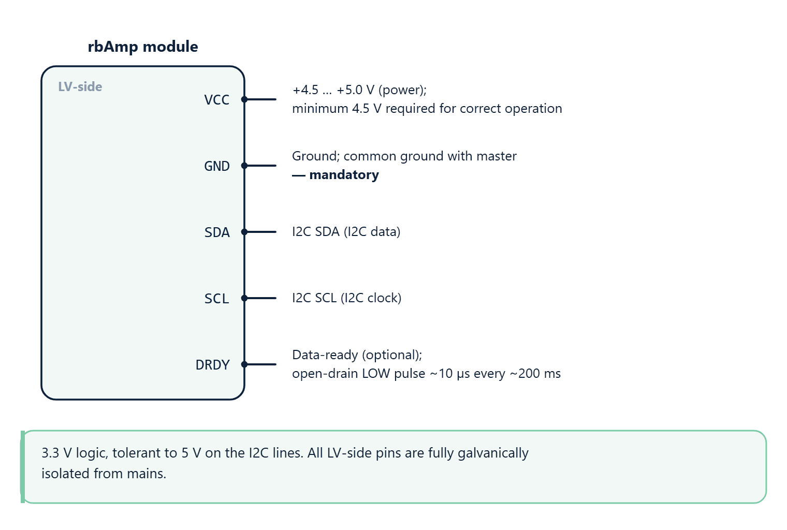
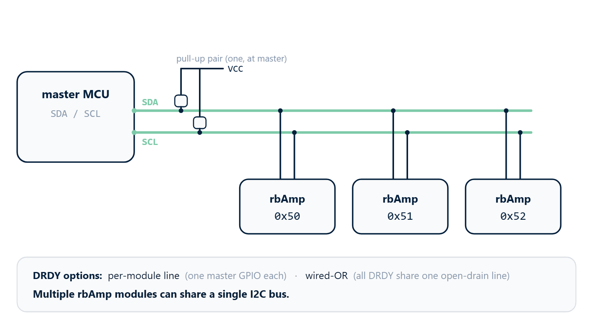
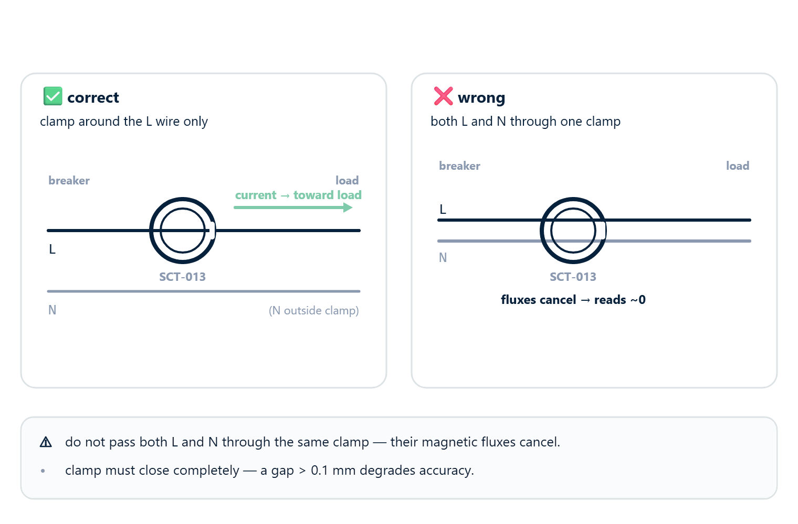
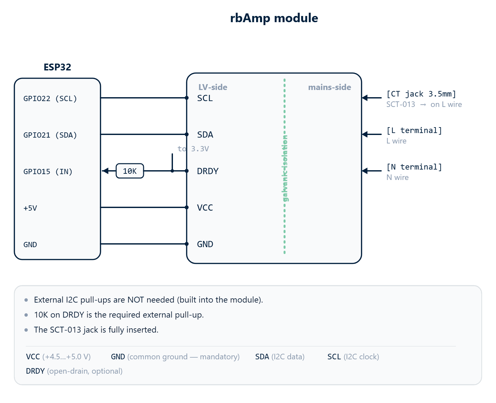

# 01 · Hardware Connection

This chapter describes the physical connection of rbAmp to a master device and the power requirements. The module arrives ready to operate: everything on its mains side is wired up and isolated inside the enclosure. The user works only with the low-voltage (LV) side — four wires for I2C, an optional DRDY line, and (for SKUs with an external CT) a 3.5 mm jack for the clamp.

## LV-side pinout



The module runs on 3.3 V logic and is tolerant to 5 V logic on the I2C lines. All LV-side pins are fully galvanically isolated from mains.

| rbAmp pin | Signal | Function |
|---|---|---|
| `VCC` | +4.5 … +5.0 V (power) | Module power; minimum 4.5 V required for correct operation |
| `GND` | Ground | Common ground with master — **mandatory** |
| `SDA` | I2C SDA | I2C data |
| `SCL` | I2C SCL | I2C clock |
| `DRDY` | Data-ready (optional) | Open-drain LOW pulse ~10 µs every ~200 ms |

## I2C pull-ups — installed on the board

**Important**: each rbAmp module has built-in 4.7 kΩ pull-up resistors on SDA and SCL to 3.3 V. For a **single-module** bus, no external pull-ups are required — connect the master directly.

### When to disable the built-in pull-ups

If several rbAmp modules (or other I2C devices with their own pull-ups) are on the bus, their parallel combination yields too low an effective resistance, which:

- Increases bus power consumption
- Can exceed the maximum sink current of the I2C-master output stage (typically ≤ 3 mA on 3.3 V logic)
- Adds capacitive load on long buses, while contributing little to noise immunity

Solution: each module has **solder-jumper cuts** on the bottom of the PCB next to the pull-up resistors. The silkscreen reads `Pull-Up`. Cut the trace with a sharp blade to disconnect the pull-up:

- Leave the pull-ups enabled on **only one** module on the bus (or relocate them to a single point near the master).
- Cut the jumpers on the remaining modules.
- If the master board already provides bus pull-ups, cut the jumpers on **all** rbAmp modules.

### Rule of thumb

| rbAmp modules on bus | Pull-ups |
|:---:|---|
| 1 | Leave alone (built-in 4.7 kΩ work) |
| 2 | Leave on one module, cut on the other |
| 3+ | Cut on all modules, install one external 2.2…4.7 kΩ pair near the master |

> **In doubt**: measure the resistance between SDA and VCC with all devices unpowered. For a single-module bus the typical value is ~4.7 kΩ (one built-in pull-up); on a multi-module bus the parallel combination drops to the **1.5–4.7 kΩ** range depending on how many built-in pull-ups remain active. Anything below ~1 kΩ means too many active pull-ups in parallel — cut the built-in pull-ups on all but one module.

## Power

### VCC parameters

- **Nominal voltage**: 5 V DC
- **Acceptable range**: 4.5 … 5.5 V
- **Current draw**: ~15 mA typical, ~25 mA peak during flash write
- **Ripple**: < 50 mV peak-to-peak (for ADC accuracy)

### I2C voltage compatibility

- SDA/SCL run on 3.3 V logic (the built-in pull-ups tie them to 3.3 V).
- The lines are **5 V-tolerant**, so a 5 V master (Arduino UNO / Nano) reads HIGH (~3.3 V) correctly and can drive the bus.
- For 5 V bus levels, disable the built-in pull-ups and add external pull-ups to +5 V on the master side.

### Power-on behavior

- Cold start: ~250 ms to the first valid measurement result.
- After RESET (software or brown-out): ~250 ms to recover.
- Before the first valid result, registers read 0 and `DATA_VALID` (`0xCE`) is 0.

### Isolation

The module contains a galvanic isolation barrier between the mains side (CT clamp, voltage divider) and the LV side (I2C). Consequently:

- The module's GND is **not** connected to mains phase or neutral.
- Connecting the LV side to a 5 V master is safe — no short-circuit risk through ground.

> Do not open the enclosure — it will void factory calibration.

## I2C bus

### Parameters

- **Default address**: `0x50` (7-bit)
- **Address range**: `0x08..0x77` (reprovisionable via two-phase commit, see [02_initialization.md](initialization.md))
- **Speed**: **50 kHz recommended** (lowest NACK rate observed across host stacks). 100 kHz workable with application-level retry. 400 kHz is **not** validated for v1.3.
- **READ auto-increment**: **YES** — burst-read supported (multi-byte registers, V03 RT block, DIGEST window).
- **WRITE auto-increment**: **NO** — every byte written needs an explicit register address, including multi-byte fields (write low byte, then high byte separately).
- **Clock-stretching**: not used by the module as a flow-control mechanism. The master should observe an inter-transaction gap (`tBUF`) of ≥ 100 µs.

### Bus length

I2C is, by default, a short bus (~30 cm). The following topologies are validated for rbAmp:

| Cable topology | Max length | Speed |
|---|---|---|
| Standard JST / 4-wire flat cable | up to 0.3 m | 100 kHz |
| Twisted pair UTP (cat-5/5e/6) — SDA+GND and SCL+GND in separate pairs | up to 1 m | 100 kHz |
| Twisted pair UTP + I2C buffer (PCA9515 / TCA9617) | up to 3 m | 100 kHz |
| Differential bus (PCA9615 / LTC4332) | up to 100 m | 100 kHz |

> For runs longer than 0.3 m, **twisted pair is required**: SDA and SCL must be in **separate** pairs, each with its own ground (for example, blue + blue-white for SDA, green + green-white for SCL). Putting SDA and SCL in the same pair causes cross-coupling that distorts edges.

### Multi-module bus



Multiple rbAmp modules can share a single I2C bus:

- **Module count**: up to ~16 (limited by total bus capacitance — ≤ 400 pF at 100 kHz)
- **Addresses**: every module has its own 7-bit address. All modules ship from the factory on `0x50`; readdress them one at a time before connecting in parallel (see [02_initialization.md → Address change](initialization.md)).
- **Pull-ups**: follow the rule above — cut the built-in pull-ups on all but one module, or relocate them to a single point.

## Sensor connections (mains side)

### Voltage sensor (UI* variants)

The PCB exposes `L` (line / phase) and `N` (neutral) terminals. **Polarity matters** for the sign of active power:

- Correct wiring (L → L, N → N): `P > 0` means **consumption** (current flowing into the load from the grid), `P < 0` means **export** to the grid (generation).
- Swapped wiring (L and N exchanged): the sign of P is inverted — consumption is reported as negative power.

Correct polarity is critical for:

- Accurate BASIC-tier accounting (BASIC counts only `max(P, 0)`; swapped polarity zeros out the energy total).
- Correct separation of consumption and generation on STANDARD and PRO tiers.

> **Quick check**: with a purely resistive load (electric kettle, heater, incandescent bulb), `P > 0` and `PF ≈ 1.0`. If P is negative while the load is consuming, swap L and N on the PCB.

### Current sensor — CT and SCT-013 (for SKUs with external CT)



External CT clamps connect to the module through a 3.5 mm jack. The connector is keyed for correct polarity out of the box; no wiring decisions are needed.

The clamp body bears an **arrow** indicating the direction of energy flow for the "normal" orientation:

```
      ┌─────────┐
      │  SCT    │  → (arrow)
      │  CLIP   │
      └─────────┘
           │
       clamps around the L wire
       with the arrow pointing
       toward the load (consumer)
```

Rules:

- Clamp the sensor around the **line (L) wire** going to the consumer.
- The arrow on the clamp must point **in the direction of current** toward the load (from breaker panel to load).
- The clamp must **close completely** — no gap between the two halves of the magnetic core. A gap > 0.1 mm sharply increases magnetic reluctance and degrades accuracy.

> ⚠️ **Warning**: do not pass both L and N through the same clamp. Their magnetic fluxes are equal and opposite, so they cancel — the sensor reads near zero current even under real load.

#### Channel markings on the PCB

Each jack on the PCB is labeled with the channel name (`I0`, `I1`, `I2`, …) and a color marker. SCT-013 cables are electrically symmetric — orientation is established by **the arrow on the clamp** and its placement on the wire, not by which end of the cable goes into the jack.

#### Polarity and the sign of P

- Arrow in the correct direction + correct L/N polarity → `P > 0` for consumption, `P < 0` for export.
- Clamp installed reversed (arrow against current direction) → the sign of P is inverted.

## DATA_READY (DRDY)

Optional pin for optimized polling. If your application is happy polling every 200 ms, you can leave DRDY disconnected.

### Electrical parameters

- **Output type**: open-drain (no active pull-up to VCC)
- **Idle level**: HIGH (requires a pull-up on the master side — either an internal MCU pull-up or an external resistor; recommended 10 kΩ to 3.3 V)
- **Ready pulse**: LOW for ~10 µs, after RT registers (`0x86..0xCF`) have been refreshed
- **Pulse frequency**: ~5 Hz (one pulse per ~200 ms RT window)

### Semantics

The falling edge of DRDY guarantees that **all RT registers are coherent and freshly published** (the firmware updates them atomically inside an ISR before lowering the pin). The master can read `0x86..0xCD` immediately on the falling edge with no risk of a split sample.

### Master-side usage

- **EXTI / GPIO interrupt** on the falling edge — wakes the master and triggers a read.
- Pull-up 10 kΩ to 3.3 V on the master side.
- Multiple module DRDYs can be combined into a wired-OR (see [03_realtime_polling.md → Multi-module DRDY](realtime-polling.md)).

### Applicability

- DRDY fires only on **RT updates** (every 200 ms).
- DRDY does **not** fire on period snapshots (period snapshots are updated by the latch command which the master triggers — so the master already knows when to read).
- For slow-polling masters (every 1 s or 60 s), DRDY can be ignored.

## Reference wiring example (ESP32, single module)



```
                                  rbAmp module
                              +----------------------+
                              |   LV-side            |  mains-side
ESP32 GPIO22 (SCL) -----------| SCL                  |◄[CT jack 3.5mm]── SCT-013 → on L wire
ESP32 GPIO21 (SDA) -----------| SDA                  |◄[L terminal]──── L wire
ESP32 GPIO15 (IN)  ◄──[10K]──┐| DRDY (open-drain)    |◄[N terminal]──── N wire
                       to 3.3V|                      |
ESP32 +5V    -----------------| VCC                  |
ESP32 GND    -----------------| GND                  |
                              +----------------------+

In this configuration:
 - External I2C pull-ups are NOT needed (built into the module).
 - 10K on DRDY is the required external pull-up.
 - The SCT-013 jack is fully inserted.
 - The clamp is fully closed on the L wire, arrow pointing toward the load.
```

## Roadmap for multi-phase models

For future SKUs (rbAmp-U2I2 US split-phase, rbAmp-U3I3 three-phase) the LV-side pinout remains **identical** (VCC / GND / SDA / SCL / DRDY). Only the mains side changes — more L terminals and more CT jacks. Existing master drivers will not need to be rewritten for the base register set; new registers are added for the additional U1/U2/U3 channels.

## Next

- [02_initialization.md](initialization.md) — first connection, smoke test, address change
- [05_troubleshooting.md → CT clamp & polarity](troubleshooting.md) — what to do if the sign of P is wrong or I_rms is unstable
