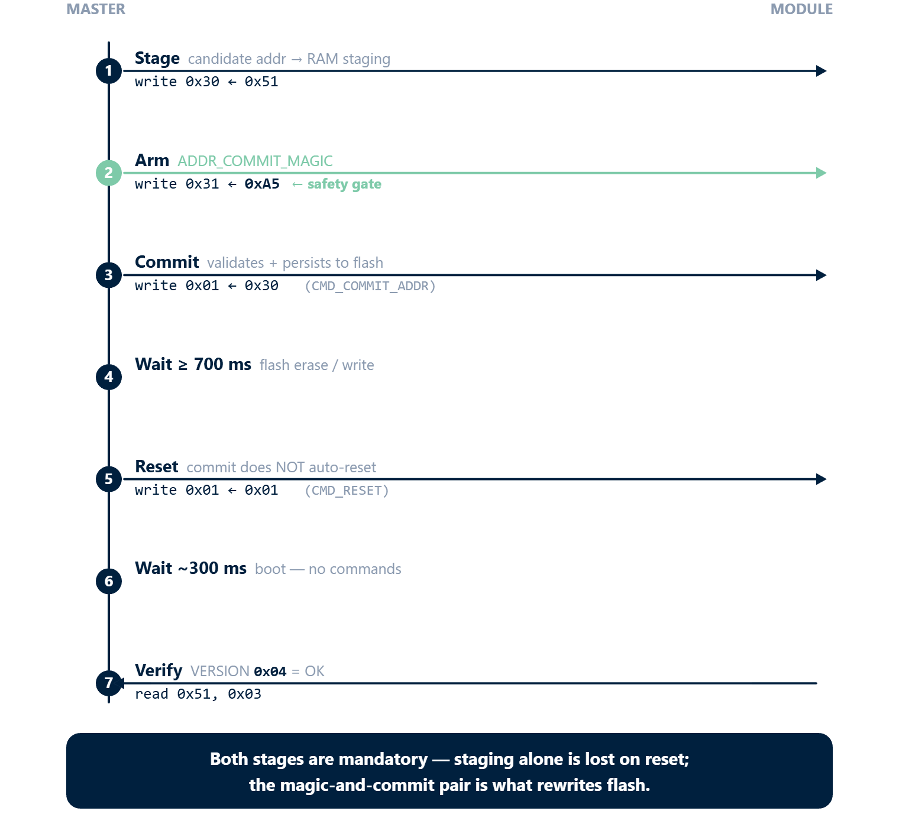
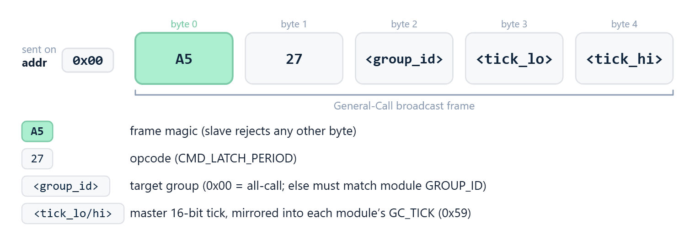

# 02 · Initialization and Start-up

rbAmp starts measuring **immediately** after power-on. The master only needs to:

1. Bring up its I2C bus (standard `Wire` / HAL initialization).
2. Wait ~250 ms, or poll `DATA_VALID = 1` at register `0xCE`.
3. Optionally read the firmware version from `0x03` as a sanity check.
4. Read data — ready.

No start command, no register-level configuration on the chip is required. Factory calibration is loaded automatically on boot, so the module emits correct physical-unit values from the first reading.

> **Important for modules with an external (plug-in) CT**: after first installation, you must **write the sensor model** to the model register once. The module needs the model to apply the correct mV-per-ampere coefficient. The value is stored in flash and persists across reboots — there is no need to repeat the write on every boot. Details are in the section [Setting the external sensor model](#setting-the-external-sensor-model) below.

## Helper functions (platform-neutral C)

All examples below use three small helpers that are easy to implement on any platform:

```c
// Read one byte from a slave register.
uint8_t rb_read_u8(uint8_t addr, uint8_t reg);

// Read a little-endian float32 (4 bytes from reg, reg+1, reg+2, reg+3).
// rbAmp supports READ auto-increment — both per-byte access and a single
// 4-byte burst-read are valid. The helpers below show per-byte for clarity;
// production code often uses burst-read for atomicity guarantees (see ch 11).
float rb_read_float_le(uint8_t addr, uint8_t reg);

// Write one byte to a slave register.
void rb_write_u8(uint8_t addr, uint8_t reg, uint8_t val);
```

## Bring-up on Arduino (`Wire.h`)

### Helpers

```cpp
#include <Wire.h>

uint8_t rb_read_u8(uint8_t addr, uint8_t reg) {
  Wire.beginTransmission(addr);
  Wire.write(reg);
  Wire.endTransmission(false);   // repeated start, do not release bus
  Wire.requestFrom(addr, (uint8_t)1);
  return Wire.read();
}

float rb_read_float_le(uint8_t addr, uint8_t reg) {
  uint8_t buf[4];
  for (int i = 0; i < 4; i++) {
    buf[i] = rb_read_u8(addr, reg + i);
  }
  float f;
  memcpy(&f, buf, 4);            // little-endian host (AVR, ESP32, ARM)
  return f;
}

void rb_write_u8(uint8_t addr, uint8_t reg, uint8_t val) {
  Wire.beginTransmission(addr);
  Wire.write(reg);
  Wire.write(val);
  Wire.endTransmission();
}
```

### Smoke test (single module)

```cpp
#include <Wire.h>
#define RB_ADDR 0x50

void setup() {
  Serial.begin(115200);
  Wire.begin();
  Wire.setClock(50000);
  delay(300);                           // wait for module boot

  // Wait DATA_VALID bit
  while ((rb_read_u8(RB_ADDR, 0xCE) & 0x01) == 0) {
    Serial.println("waiting for DATA_VALID...");
    delay(50);
  }

  uint8_t ver = rb_read_u8(RB_ADDR, 0x03);
  Serial.printf("rbAmp ready, version 0x%02X\n", ver);
}

void loop() {
  float u_rms = rb_read_float_le(RB_ADDR, 0x86);
  float i_rms = rb_read_float_le(RB_ADDR, 0x8E);
  float p     = rb_read_float_le(RB_ADDR, 0xA6);
  float pf    = rb_read_float_le(RB_ADDR, 0xB2);

  Serial.printf("U=%.1f V  I=%.3f A  P=%.1f W  PF=%.3f\n",
                u_rms, i_rms, p, pf);
  delay(1000);
}
```

Expected output (a 60 W incandescent lamp on 230 V):

```
rbAmp ready, version 0x04
U=229.8 V  I=0.262 A  P=60.2 W  PF=0.998
U=230.1 V  I=0.262 A  P=60.3 W  PF=0.998
...
```

## Bring-up on STM32 HAL (C)

```c
#include "stm32f1xx_hal.h"
extern I2C_HandleTypeDef hi2c1;

#define RB_ADDR_8BIT (0x50 << 1)        // HAL expects 8-bit address format

uint8_t rb_read_u8(uint8_t reg) {
  uint8_t v;
  HAL_I2C_Mem_Read(&hi2c1, RB_ADDR_8BIT, reg, I2C_MEMADD_SIZE_8BIT, &v, 1, 100);
  return v;
}

float rb_read_float_le(uint8_t reg) {
  uint8_t buf[4];
  for (int i = 0; i < 4; i++) {
    HAL_I2C_Mem_Read(&hi2c1, RB_ADDR_8BIT, reg + i, I2C_MEMADD_SIZE_8BIT,
                     &buf[i], 1, 100);
  }
  float f;
  memcpy(&f, buf, 4);
  return f;
}

void main_app(void) {
  while ((rb_read_u8(0xCE) & 0x01) == 0) HAL_Delay(50);

  uint8_t ver = rb_read_u8(0x03);
  printf("rbAmp version: 0x%02X\n", ver);

  while (1) {
    float u = rb_read_float_le(0x86);
    float i = rb_read_float_le(0x8E);
    float p = rb_read_float_le(0xA6);
    printf("U=%.1f V  I=%.3f A  P=%.1f W\n", u, i, p);
    HAL_Delay(1000);
  }
}
```

## Setting the sensor class and CT model

> Required **only** for SKUs with a plug-in CT (3.5 mm jack). Modules with built-in sensors are already configured at the factory — skip this section.

Two registers describe the external sensor: `SENSOR_CLASS` (the family — SCT-013, WiredCT, BuiltinCT) and `CT_MODEL` (the specific model code within that family). On v1.3 the model is written using a **pure-staging** scheme — writing `CT_MODEL` does **not** apply it on its own; a dedicated per-channel command commits the staged value.

### Registers

| Name | Address | Type | Notes |
|---|---|---|---|
| `SENSOR_CLASS` | `0x25` | u8 RW | `0 = Unset`, `1 = SCT_013`, `2 = WiredCT` (reserved), `3 = BuiltinCT` (reserved). Changing the class resets `CT_MODEL` to `0`. |
| `CT_MODEL` | `0x05` | u8 RW | CT model code — **staging register only**. Pure write does not apply. |

CT model codes (SCT-013 family, `SENSOR_CLASS = 1`):

| Code | Sensor | Rated current |
|:---:|---|:---:|
| `0x00` | not set (default on factory-fresh plug-in-CT SKUs) | — |
| `0x01` | SCT-013-005 | 5 A |
| `0x02` | SCT-013-010 | 10 A |
| `0x03` | SCT-013-030 | 30 A |
| `0x04` | SCT-013-050 | 50 A |
| `0x05` | SCT-013-100 | 100 A |
| `0x06` | SCT-013-020 | 20 A |
| `0x07` | SCT-013-060 | 60 A |

> Codes `0x06` and `0x07` are non-monotonic by rating — they were added after the original `0x01..0x05` set. Always pick by the rating you need, not by code order.

### Commands

| Name | Opcode | Effect | Wait |
|---|---|---|---|
| `CMD_SET_CT_MODEL_CH0` | `0x28` | Bind the staged `CT_MODEL` value to channel 0 | ~5 ms |
| `CMD_SET_CT_MODEL_CH1` | `0x29` | Bind to channel 1 (UI2/UI3/I2/I3) | ~5 ms |
| `CMD_SET_CT_MODEL_CH2` | `0x2A` | Bind to channel 2 (UI3/I3) | ~5 ms |
| `CMD_SAVE_USER_CONFIG` | `0x32` | Persist user-config block (sensor class, CT model, address, label) to flash | ~700 ms |

### Procedure



1. Plug the CT clamp(s) into the module's jack(s) (arrow toward the load — see [01_hardware.md](hardware-connection.md)).
2. **Set the sensor class** (once, if not already set):
   ```cpp
   rb_write_u8(0x50, 0x25, 0x01);    // SCT_013
   ```
3. For **each channel** the module exposes:
   - Stage the CT model code to `CT_MODEL`:
     ```cpp
     rb_write_u8(0x50, 0x05, 0x03);    // example: SCT-013-030
     ```
   - Bind it to the channel with the corresponding `CMD_SET_CT_MODEL_CHn`:
     ```cpp
     rb_write_u8(0x50, 0x01, 0x28);    // CMD_SET_CT_MODEL_CH0
     delay(5);
     ```
   - Repeat for ch1 / ch2 if the variant has them (channels are independent — you can mix model codes per channel).
4. **Persist** to flash with `CMD_SAVE_USER_CONFIG`:
   ```cpp
   rb_write_u8(0x50, 0x01, 0x32);
   delay(700);                          // flash erase/write
   ```
5. Done. The configuration survives reboots; subsequent power-ons do not require this step.

> **Channel-order independence**: on v1.3 you can call `CMD_SET_CT_MODEL_CH0/1/2` in any order. There is no descending-order workaround required (that was an internal artifact of earlier firmware).

### Verification

After binding, the **applied** CT model on each channel is mirrored at `0x51..0x53` (read-only verify mirrors). These are NOT the staging register `0x05`:

```cpp
uint8_t ch0 = rb_read_u8(0x50, 0x51);  // applied on ch0
uint8_t ch1 = rb_read_u8(0x50, 0x52);  // applied on ch1
uint8_t ch2 = rb_read_u8(0x50, 0x53);  // applied on ch2
Serial.printf("Applied: ch0=0x%02X ch1=0x%02X ch2=0x%02X\n", ch0, ch1, ch2);
```

> ⚠ **Readback ≠ persistence.** A successful read of `0x51..0x53` confirms the value is **live in RAM**, not that it survived to flash. To verify persistence, issue `CMD_RESET` (or power-cycle) and re-read after the boot window. The full pattern is in [04_period_metering.md](period-metering.md).

> When commissioning a new module, perform a sanity check with a known resistive load (for example a 100 W incandescent lamp): `I_rms ≈ 100 W / U_rms ≈ 0.43 A` and `P_real ≈ 100 W`. If readings are off by a large factor, the model code is probably wrong.

## Single-module workflow

1. Wire the module according to [01_hardware.md](hardware-connection.md).
2. For SKUs with a plug-in CT, write the sensor model once (previous section).
3. Flash the master with the smoke-test sketch.
4. Open the serial monitor — you should see U/I/P every second.
5. If readings look wrong, see [05_troubleshooting.md](troubleshooting.md).

## Multi-module setup

Scenario: three rbAmp modules on a single bus to monitor different sections of a house (main feed, water heater, air conditioner).

### Step 1 — Addresses

Out of the box all three modules carry address `0x50`. They must be readdressed one at a time. **Connect only one module to the bus until readdressing is complete.**

### Step 2 — Smoke test with one module

Use the section above. Confirm one module works correctly.

### Step 3 — Readdress (and, if needed, set the CT model)

Use the address-change procedure below. If the modules have different plug-in CTs, set the CT model on each one before readdressing.

### Step 4 — Multi-module polling loop

```cpp
#include <Wire.h>

const uint8_t modules[] = {0x50, 0x51, 0x52};   // main, boiler, AC
const char* labels[]    = {"MAIN", "BOIL", "AC  "};
const int N = sizeof(modules) / sizeof(modules[0]);

void setup() {
  Serial.begin(115200);
  Wire.begin();
  Wire.setClock(50000);
  delay(300);

  for (int i = 0; i < N; i++) {
    Wire.beginTransmission(modules[i]);
    uint8_t rc = Wire.endTransmission();
    Serial.printf("Module %s (0x%02X): %s\n",
                  labels[i], modules[i], rc == 0 ? "OK" : "MISSING");
  }
}

void loop() {
  for (int i = 0; i < N; i++) {
    float u = rb_read_float_le(modules[i], 0x86);
    float p = rb_read_float_le(modules[i], 0xA6);
    Serial.printf("[%s] U=%.1f  P=%.1f W\n", labels[i], u, p);
  }
  Serial.println();
  delay(1000);
}
```

Expected output:

```
Module MAIN (0x50): OK
Module BOIL (0x51): OK
Module AC   (0x52): OK
[MAIN] U=229.8  P=850.3 W
[BOIL] U=229.7  P=1850.0 W
[AC  ] U=229.9  P=0.0 W
...
```

## Address change

The factory address `0x50` is stored in the user-config block in flash. v1.3 uses a **two-phase commit** sequence to make accidental address changes hard: a candidate address goes into a RAM staging register first, has to be armed with a magic byte, and only then is committed to flash by an explicit command. A reset re-enumerates the module at the new address.

### Registers and commands

| Name | Address / opcode | Type | Purpose |
|---|---|---|---|
| `REG_I2C_ADDRESS` | `0x30` | u8 RW | **Staging** for the candidate address (`0x08..0x77`). Reads back the active address on boot. |
| `ADDR_COMMIT_MAGIC` | `0x31` | u8 W | Arm the commit with `0xA5`. Consumed (cleared) on the commit attempt. |
| `CMD_COMMIT_ADDR` | opcode `0x30` written to `REG_COMMAND` (`0x01`) | command | Validates the staged address against the magic, persists to flash. |
| `CMD_RESET` | opcode `0x01` written to `REG_COMMAND` (`0x01`) | command | Soft reset. Module re-enumerates at the new address after ~300 ms. |

### Procedure

1. **Connect only one module** (still on `0x50`) to the bus.
2. Stage the new address:
   ```cpp
   rb_write_u8(0x50, 0x30, 0x51);    // candidate address → RAM staging
   ```
3. Arm the commit:
   ```cpp
   rb_write_u8(0x50, 0x31, 0xA5);    // ADDR_COMMIT_MAGIC
   ```
4. Issue `CMD_COMMIT_ADDR` (opcode `0x30`):
   ```cpp
   rb_write_u8(0x50, 0x01, 0x30);
   ```
5. Wait **≥ 700 ms** for the flash erase/write:
   ```cpp
   delay(700);
   ```
6. Issue `CMD_RESET` (opcode `0x01`) — `CMD_COMMIT_ADDR` does **not** auto-reset:
   ```cpp
   rb_write_u8(0x50, 0x01, 0x01);
   ```
7. Wait ~300 ms for the boot window. Do not issue commands during this window.
8. Verify the module ACKs at the new address:
   ```cpp
   uint8_t ver = rb_read_u8(0x51, 0x03);    // VERSION should be 0x04 on v1.3
   if (ver == 0x04) Serial.println("Address change OK");
   ```
9. Mark the PCB with the new address using a wax pencil or label so you can identify the module physically.

### Important notes

- **Both stages are mandatory.** Writing the candidate to `0x30` alone does nothing persistent — it only lands in RAM and is lost on the next reset. The magic-and-commit pair is what actually rewrites flash.
- The staged address must lie in the range `0x08..0x77` (valid 7-bit I²C). Out-of-range writes are rejected with `ERR_PARAM`; the module keeps its current address.
- Reserved I²C addresses: `0x00` (general-call, see below), `0x01..0x07` (CBus reserved), `0x78..0x7F` (10-bit reserved). Do not use these.
- `REG_I2C_ADDRESS` reads back the **active** (running) address, not the staged candidate. To check what is queued for the next reset, you can re-read `0x30` immediately after staging — it returns the staged value until the next reset.

### Full address-change example

```cpp
#include <Wire.h>

bool change_address(uint8_t old_addr, uint8_t new_addr) {
  if (new_addr < 0x08 || new_addr > 0x77) {
    Serial.println("ERROR: invalid address");
    return false;
  }

  Serial.printf("Changing 0x%02X -> 0x%02X\n", old_addr, new_addr);

  rb_write_u8(old_addr, 0x30, new_addr);   // 1. stage candidate
  rb_write_u8(old_addr, 0x31, 0xA5);       // 2. arm magic
  rb_write_u8(old_addr, 0x01, 0x30);       // 3. CMD_COMMIT_ADDR
  delay(700);                              // 4. flash erase/write
  rb_write_u8(old_addr, 0x01, 0x01);       // 5. CMD_RESET (mandatory)
  delay(300);                              // 6. boot window

  Wire.beginTransmission(new_addr);
  if (Wire.endTransmission() == 0) {
    Serial.printf("OK, module now at 0x%02X\n", new_addr);
    return true;
  }
  Serial.printf("FAIL: module not found at 0x%02X\n", new_addr);
  return false;
}

void setup() {
  Serial.begin(115200);
  Wire.begin();
  delay(300);
  change_address(0x50, 0x51);
}
```

## General Call (broadcast at address 0x00)

The I²C protocol reserves address **`0x00` (general call)** — frames sent to this address are received by all slaves on the bus simultaneously. rbAmp can latch its per-period snapshot on a general-call frame, but only **after the feature has been explicitly enabled** on the module.

### Opt-in enable (default OFF)

GC latch reception is disabled by default — a fresh module will **NACK** the general-call frame, which the master detects as a hard error and falls back to per-module sequential latch automatically. To enable GC on a module:

1. Set bit 0 of `FLEET_CONFIG`:
   ```cpp
   rb_write_u8(0x50, 0x27, 0x01);    // bit0 = GC_ENABLE
   ```

   > Note on the value `0x27`: this is the **register address** of `FLEET_CONFIG`. The same byte value `0x27` also happens to be the **command opcode** for `CMD_LATCH_PERIOD` (a separate namespace — opcodes go into `REG_COMMAND` at `0x01`). The collision is purely cosmetic; the address and opcode are never confused at the wire level.
2. (Optional) set `GROUP_ID` for fleet partitioning — `0x00` accepts all-call:
   ```cpp
   rb_write_u8(0x50, 0x28, 0x00);    // all-call
   ```
3. Persist:
   ```cpp
   rb_write_u8(0x50, 0x01, 0x32);    // CMD_SAVE_USER_CONFIG
   delay(700);
   ```
4. Reset and verify the bit landed:
   ```cpp
   rb_write_u8(0x50, 0x01, 0x01);    // CMD_RESET
   delay(300);
   uint8_t cfg = rb_read_u8(0x50, 0x27);
   if (cfg & 0x01) Serial.println("GC enabled");
   ```

### GC frame format



GC latch frames have a fixed magic-and-opcode layout:

```
addr 0x00 | A5 27 <group_id> <tick_lo> <tick_hi>
```

- `A5` — frame magic (the slave rejects any other byte).
- `27` — opcode (`CMD_LATCH_PERIOD`).
- `<group_id>` — target group (`0x00` = all-call; otherwise must match the module's `GROUP_ID`).
- `<tick_lo/hi>` — master-side 16-bit tick counter, mirrored into each module's `GC_TICK (0x59)` register for missed-frame detection.

By design GC frames carry **only latch** — destructive opcodes (`SAVE_*`, `COMMIT_ADDR`, `FACTORY_RESET`) are not honoured over general-call.

### Broadcast LATCH example (after enable)

```cpp
// All modules with GC enabled latch their snapshot at once.
Wire.beginTransmission(0x00);
Wire.write(0xA5);                       // frame magic
Wire.write(0x27);                       // CMD_LATCH_PERIOD opcode
Wire.write(0x00);                       // group_id = all-call
Wire.write(tick & 0xFF);                // tick_lo
Wire.write((tick >> 8) & 0xFF);         // tick_hi
uint8_t rc = Wire.endTransmission();
if (rc != 0) {
  // NACK at GC level → no module on the bus has GC enabled.
  // Fall back to per-module sequential LATCH.
}
```

After the broadcast, each module updates its snapshot independently. The master then reads each module by its individual address. **Witness check** (recommended): after `~50 ms` settle, read `V03_PERIOD_VALID (0x07)` on each expected module — `1` confirms the latch landed; `0` falls back to per-module latch on that module only.

Application: precise period synchronisation for multi-module energy balancing (e.g. `mains_input − solar_output`), where the latch instant must be identical across modules.

## Recommended multi-module deployment workflow

```
Step 1: Unbox all modules — every module is on address 0x50.

Step 2: For each module, one at a time:
   a) Connect only this module to the bus.
   b) If the SKU has a plug-in CT: set SENSOR_CLASS (0x25), stage CT_MODEL (0x05),
      issue CMD_SET_CT_MODEL_CHn for each channel, then CMD_SAVE_USER_CONFIG.
   c) Run change_address(0x50, <new_address>).
   d) Verify the module responds at the new address.
   e) Physically mark the module (label with 0x51, 0x52, ...).
   f) Disconnect and move to the next module.

Step 3: After readdressing all modules, connect them in parallel.
        If more than one module is on the bus, cut the built-in pull-up
        jumpers on all but one (see 01_hardware.md → I2C pull-ups).

Step 4: At master boot, run a scan loop and verify every readdressed
        module responds at its expected address.
```

## Module variant auto-detection

> ⚠ Do **not** detect the variant by probing for a NACK on register reads. The firmware never NACKs on register reads — unmapped addresses return `0x00` (see chapter 11 §5.2). A NACK-based check always reports "channel present".

Use the canonical pair `HW_VARIANT (0x55)` + `CAPABILITY (0x57/0x58)`:

```cpp
struct VariantInfo {
  uint8_t hw_variant;     // 1=UI1, 2=UI2, 3=UI3, 4=I1, 5=I2, 6=I3
  uint8_t n_current;      // 1..3
  bool    has_voltage;    // true on UI*, false on I*
};

VariantInfo detect_variant(uint8_t addr) {
  VariantInfo v = {0, 0, false};
  uint8_t product = rb_read_u8(addr, 0x54);             // PRODUCT_ID
  if (product != 0x01) return v;                         // not an rbAmp sensor
  v.hw_variant = rb_read_u8(addr, 0x55);                 // HW_VARIANT
  uint8_t hw = v.hw_variant;
  v.n_current = (hw == 1 || hw == 4) ? 1
              : (hw == 2 || hw == 5) ? 2
              : (hw == 3 || hw == 6) ? 3 : 0;
  uint8_t cap_hi = rb_read_u8(addr, 0x58);               // CAPABILITY high byte
  v.has_voltage = (cap_hi & 0x01) != 0;                  // bit 8 of u16 = voltage-HW
  return v;
}
```

`HW_VARIANT` 1..3 are UI-variants (`has_voltage == true`); 4..6 are I-only variants (`has_voltage == false`). Mismatch between `HW_VARIANT` family and `CAPABILITY.bit8` indicates a broken / mis-flashed module.

`AC_FREQ (0x20)` works on **all** variants — the zero-cross signal comes from a dedicated mains-ZC pin independent of the voltage front-end.

## Next

- [03_realtime_polling.md](realtime-polling.md) — real-time polling in depth (200 ms window, DRDY)
- [04_period_metering.md](period-metering.md) — tariff energy accumulation
