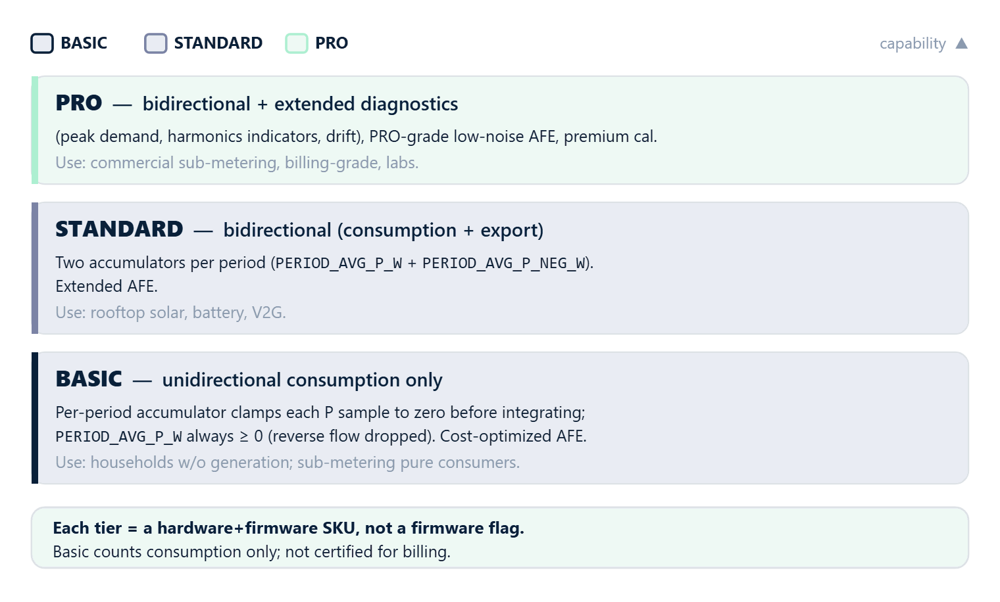

# 00 · Overview

## What is rbAmp

**rbAmp** is a compact hardware module for precision measurement of AC mains parameters over an I2C interface. It is built around a Cortex-M0+ microcontroller with an integrated isolated sensor front-end and factory-stored calibration.

From the integrator's point of view, rbAmp behaves like a standard I2C slave: apply power, read registers — receive ready-to-use physical-unit values (volts, amperes, watts). No signal processing is required on the master side.

## What it measures

| Quantity | Register (I0) | Type | Range | Accuracy |
|---|:---:|---|---|---|
| RMS voltage, U_rms | `0x86` | float32, V | 0…300 V | ±0.5% |
| Peak voltage, U_peak | `0x8A` | float32, V | 0…450 V | ±1% |
| RMS current, I_rms | `0x8E` | float32, A | 0…100 A (SKU-dependent) | ±0.5%…±1% |
| Peak current, I_peak | `0x9A` | float32, A | 0…140 A | ±1% |
| Active power, P | `0xA6` | float32, W (±) | ±23 kW | ±1% |
| Power factor, PF | `0xB2` | float32 (±) | −1…+1 | ±0.01 |
| Reactive power, Q | `0xD0` | float32, VAR (±) | same as P | ±2% |
| Line frequency | `0x20` | u8, Hz | 45…65 Hz | ±0.5 Hz |
| Time-averaged P over period | `0xDC` | float32, W | same as P | ±1% |

The full register map is detailed in [03_realtime_polling.md](realtime-polling.md) and [04_period_metering.md](period-metering.md).

## Applications

- **Tariff metering** — energy billing in 1-min, 15-min, 1-hour, daily, monthly, or yearly intervals
- **Smart home** — whole-house consumption monitoring, per-load sub-metering, generation tracking
- **Load control** — feedback signal for power-regulating devices (water heaters, resistive loads, inverters)
- **Energy balancing** — separate accounting of consumption and generation in homes with solar
- **Grid quality monitoring** — both on the consumer side and on the utility side

## Module variants

| Variant | U | I channels | P | Status | When to choose |
|---|:---:|:---:|:---:|---|---|
| **UI1** | yes | 1 | yes | shipping | single accounting point — whole-house meter, boiler, single inverter |
| **UI2** | yes | 2 | yes | shipping | two sub-meters on one phase (lights + outlets, generation + consumption) |
| **UI3** | yes | 3 | yes | **roadmap** (not buildable on current MCU package) | three flows on one phase |
| **UI5 / UI7** | yes | 5 / 7 | yes | **roadmap** | high-channel-count phase monitoring (large panels, lab benches) |
| **I1** | no | 1 | no | shipping | current-only monitor (master computes P with its own U source) |
| **I2** | no | 2 | no | shipping | two-channel current monitor |
| **I3** | no | 3 | no | shipping | three-channel current monitor |
| **I6 / I8** | no | 6 / 8 | no | **roadmap** | multi-channel current monitor |

> On I-only variants, active power is not computed (`P_real = 0`), and `PERIOD_AVG_P_W` returns 0. The master must either provide its own voltage source for power calculation, or use the current data alone.

## Product tiers

rbAmp is offered in three product tiers. Each tier is a complete combination of **hardware revision and firmware** — not a firmware-only flag. Moving between tiers requires a physical SKU change, not a firmware update.

### BASIC — entry-level product line

- **Hardware**: cost-optimized analog front-end suitable for typical residential loads.
- **Firmware**: unidirectional consumption metering. The per-period accumulator clamps each per-window active-power sample to zero before integrating: only positive (consumed) energy is counted, mirroring a classical mechanical disc meter that only spins forward.
- **`PERIOD_AVG_P_W` is always ≥ 0**; reverse-flow events are dropped from the period accumulator.
- **Use cases**: households without on-site generation; sub-metering of pure consumers (heaters, motors, appliances).

### STANDARD — bidirectional product line

- **Hardware**: extended analog stack supporting accurate measurement of both consumption and reverse flow.
- **Firmware**: bidirectional metering. Two separate accumulators per period — one for consumption, one for export — exposed as two register groups (`PERIOD_AVG_P_W` and `PERIOD_AVG_P_NEG_W`).
- **Use cases**: homes with rooftop solar, wind generators, battery storage, regenerative loads, V2G EV chargers.

### PRO — premium product line

- **Hardware**: PRO-grade analog front-end (lower noise, tighter linearity), premium factory calibration, optional extended channel sets.
- **Firmware**: bidirectional metering plus extended diagnostics (peak demand windows, harmonics indicators, drift monitoring registers).
- **Use cases**: sub-metering for commercial tenants, billing-grade installations, instrumentation labs, energy-intensive industrial loads.

### Where the tier shows up in this documentation

Throughout the chapters, features that depend on the tier are explicitly marked, for example:

> **STANDARD / PRO only** — on a BASIC module this register is not available.

The base register block at `0x00..0xCF` is identical across all tiers; the additional STANDARD and PRO registers reside above `0xCF`.

## Key features

- **I²C slave**: recommended 50 kHz; workable at 100 kHz with application-level retry. 400 kHz is **not** validated for v1.3.
- **Address**: 7-bit `0x50` by default, reprovisionable to the `0x08..0x77` range via two-phase commit (see [02_initialization.md](initialization.md)).
- **DATA_READY (DRDY)**: optional open-drain pin, ~10 µs LOW pulse every ~200 ms, marks the moment when RT registers are coherent.
- **Atomic period latch**: command `0x27` freezes the per-period averaged power; *one write closes and opens* — no dropped or duplicated samples at the boundary.
- **General-Call broadcast latch**: address `0x00` reserved for simultaneous LATCH on all modules sharing a bus. **Opt-in per module** via `FLEET_CONFIG.bit0` (default OFF). When OFF, GC frame NACKs at the bus level — masters detect this and fall back to per-module sequential latch (skew on 50 kHz bus is ~1 ms × N, ≪ 0.03% of 60 s period). See [04_period_metering.md](period-metering.md) for enable sequence and frame format.
- **Master-side wall-clock**: energy is computed master-side as `avg_P × dt_master`; the chip-side period timestamp register (`0xEC`) is **diagnostic-only** (can undercount up to ~30% under load — by design). Eliminates per-module crystal drift in multi-module systems.
- **Calibration in flash**: factory calibration (gains, noise floor, phase compensation) is stored on-chip; **no user calibration is required** — the master only writes `SENSOR_CLASS` and `CT_MODEL` per channel.
- **Auto-configuration**: the module starts measuring immediately after power-on (~250 ms to the first valid result, ~700 ms additional for first persistence write).

## Roadmap

Planned future SKUs (mentioned here for forward-compatible system design):

| Model | Mains type | Channels | Status |
|---|---|:---:|---|
| **rbAmp-U2I2** | US split-phase 2×120 V | 2U + 2I | planned |
| **rbAmp-U3I3** | True three-phase 380/400 V | 3U + 3I | planned |

The current documentation covers single-phase models only. The multi-phase API will be an extension of the existing register map — registers `0x86..0xEF` of single-phase modules remain forward-compatible (extension, not replacement).

## What rbAmp does not do

- Does not integrate energy (Wh) internally — energy accumulation is the master's responsibility (see [04_period_metering.md](period-metering.md))
- Does not drive loads, contain automation logic, or run programmable rules
- Has no built-in display

## Next

- [01_hardware.md](hardware-connection.md) — connection, power, wiring
- [02_initialization.md](initialization.md) — first power-on
