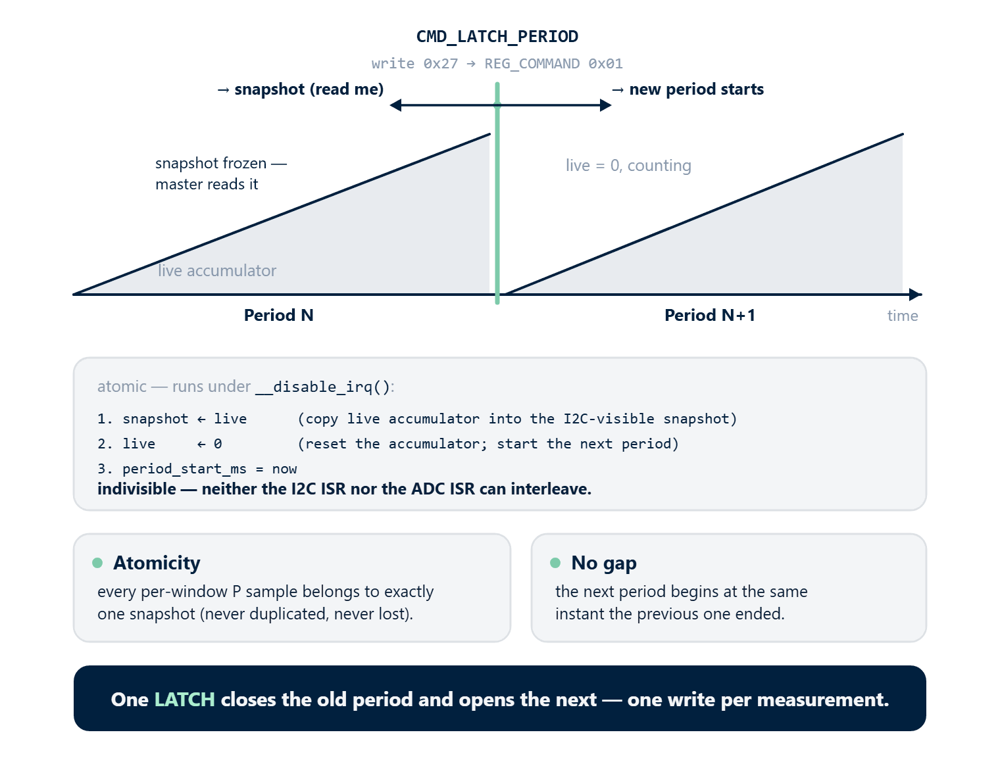
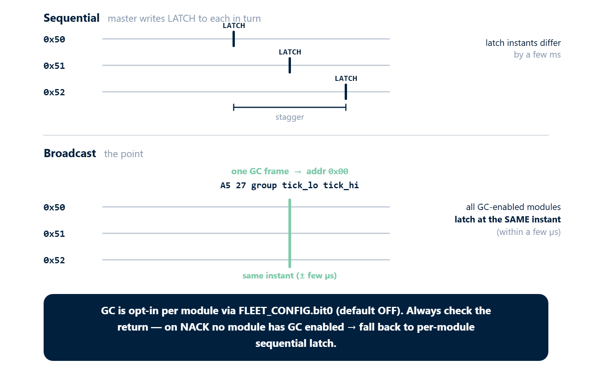

# 04 · Period Metering and Tariff Accounting

For tariff energy accounting (Wh per 1 min / 15 min / 1 hour / day / month / year) rbAmp provides an **atomic period latch** mechanism: a single I2C command freezes the time-averaged power over a period, and the master multiplies it by its own wall-clock dt to get Wh.

This is the **production-grade** way to extract energy data. The alternative — integrating RT `P_real` on the master side every 200 ms — yields the same result on BASIC, but keeps the master continuously active.

## Why period latch is needed

### A single time base, owned by the master

In a multi-module system the time base must live on the master. The chip therefore **does not integrate Wh internally**. Instead:

- The chip exposes a **time-independent statistic** — the average P over the period.
- The master multiplies it by its **own** wall-clock dt.
- All modules share the **same** time reference → no drift accumulates in the system-wide energy total.

### The formula

```
E_Wh = avg_P_W × master_dt_seconds / 3600
```

Where:

- `avg_P_W` — the value of `PERIOD_AVG_P_W`, read after `CMD_LATCH_PERIOD`.
- `master_dt_seconds` — the seconds elapsed between two successive latches, measured by the master.

## Atomic period latch — concept



### What the command does

Writing `0x27` to `REG_COMMAND = 0x01` triggers an **atomic** sequence inside the firmware (executed under `__disable_irq()`):

```
1. snapshot ← live      (copy the live accumulator into the I2C-visible snapshot)
2. live     ← 0         (reset the accumulator; start the next period)
3. period_start_ms = now
```

These three steps are indivisible — neither the I2C ISR nor the ADC ISR can interleave between them. This guarantees:

- **Atomicity**: every per-window P sample belongs to **exactly one** snapshot — either the previous one or the next one — never duplicated, never lost.
- **No gap**: the new period begins at the same instant the previous one ended — there is no blind interval.

### Where the snapshot lives

After a latch, the period-snapshot registers (`0xBE..0xCD`, plus `0xDC..0xDF` for ch0 `avg_p`, plus `0xE0..0xE3` for `MAX_P`, plus `0xEC..0xEF` for the diagnostic `PERIOD_LATCH_MS`) return the just-closed period. Note that this range is not contiguous — `0xD0..0xDB` holds the Q block (live RT, not period snapshot) and `0xE4..0xEB` is reserved/factory. See chapter 11 §4.11–4.13 for the exact layout. The live accumulator already starts counting the next period; those snapshot registers update only on the next latch.

### One write — closes and opens

This is the defining property of the rbAmp latch. **A single LATCH command simultaneously**:

- Closes the period that just ended (its data → snapshot)
- Opens the next period (live ← 0)

The master needs **one write per measurement**, not two (as in a naive "start → stop → read" implementation).

## Continuous polling cycle (recommended)

```
master                          chip
------                          ----
                                accumulator running since boot...

write CMD_LATCH (0x27)   ────►  snapshot ← live (since-boot — DISCARD)
                                live ← 0, period_start = T0
t0 = master.clock()      ◄──── first latch — primer (discard)

  [wait 60 seconds]

write CMD_LATCH          ────►  snapshot ← live (over [T0..T1] — KEEP)
                                live ← 0, period_start = T1
t1 = master.clock()
read avg_p_W @ 0xDC      ────►  float32 LE
E1_Wh = avg_p × (t1 − t0) / 3600

  [wait 60 seconds]

write CMD_LATCH          ────►  snapshot ← live (over [T1..T2] — KEEP)
                                live ← 0, period_start = T2
t2 = master.clock()
read avg_p_W
E2_Wh = avg_p × (t2 − t1) / 3600

...and so on. t1 is both the end of period 1 and the start of period 2.
```

### The first latch is a primer (discard)

The first latch after boot captures whatever the accumulator collected from power-on until the master's first call — an undefined-length window unsuitable for billing. **Discard its result**. From the second latch onward, data is clean and usable.

## Period snapshot registers

| Address | Name | Type | When to read | Description |
|---:|---|---|---|---|
| `0x07` | `PERIOD_VALID` | u8 | **read first** | bit0 = 1 if snapshot is fresh and valid, 0 if stale (race or premature latch) |
| `0xDC..0xDF` | **`PERIOD_AVG_P_W[0]`** | float32 LE | primary | **PRODUCTION** — mean P_real of channel I0 over the period (W) |
| `0xC2..0xC5` | `PERIOD_AVG_P_W[1]` | float32 LE | UI2/UI3 | Mean P_real of channel I1 |
| `0xC6..0xC9` | `PERIOD_AVG_P_W[2]` | float32 LE | UI3 | Mean P_real of channel I2 |
| `0xE0..0xE3` | `PERIOD_MAX_P_W` | float32 LE | optional | Peak P_real during the period (for demand tariffs) |
| `0xEC..0xEF` | `PERIOD_LATCH_MS` | u32 LE | diagnostic | Chip's view of dt between latches (compare with master dt) |
| `0xBE..0xC1` | `PERIOD_COMMIT_COUNT` | u32 LE | diagnostic | Number of RT windows that landed in this period |

### STANDARD / PRO additions for bidirectional accounting

| Address | Name | Type | Description |
|---:|---|---|---|
| `PERIOD_AVG_P_NEG_W[0]` | float32 LE | Mean **export** power for channel I0 over the period (W, ≥ 0 in magnitude) — STANDARD/PRO only |
| `PERIOD_AVG_P_NEG_W[1..2]` | float32 LE | Same for channels I1, I2 — STANDARD/PRO only |

> The numeric addresses of `PERIOD_AVG_P_NEG_W[0..2]` are documented in the SKU datasheet of the STANDARD/PRO product (no canonical placeholder is used in this chapter — the addresses are tier-specific). On BASIC modules these registers do not exist; reads from an unmapped address return `0x00` (firmware never NACKs on reads — see chapter 11 §5.2). Master code that targets all tiers should detect "no bidirectional support" by reading `STATUS` / `PRODUCT_ID` / `FW_TIER` and fall back to RT-based accounting (see [10_arduino_examples.md → Example 5](arduino-examples.md)).

## Master-side algorithm

### Basic cycle (one module, 60-second period)

```cpp
#include <Wire.h>

#define RB_ADDR 0x50

void setup() {
  Serial.begin(115200);
  Wire.begin();
  delay(300);

  // 1. Primer latch (discard result)
  rb_write_u8(RB_ADDR, 0x01, 0x27);
}

void loop() {
  static uint32_t t_prev = millis();
  delay(60000);                                    // wait 60 seconds

  // 2. Final latch — closes [t_prev, now]
  rb_write_u8(RB_ADDR, 0x01, 0x27);
  uint32_t t_now = millis();
  delay(50);                                       // firmware finishes in ~5 ms; allow margin

  // 3. Check PERIOD_VALID
  uint8_t valid = rb_read_u8(RB_ADDR, 0x07);
  if ((valid & 0x01) == 0) {
    // Race or premature latch — retry
    delay(250);
    rb_write_u8(RB_ADDR, 0x01, 0x27);
    t_now = millis();
    delay(50);
    valid = rb_read_u8(RB_ADDR, 0x07);
    if ((valid & 0x01) == 0) {
      Serial.println("WARN: two stale latches in a row");
      t_prev = millis();
      return;
    }
  }

  // 4. Read the snapshot
  float avg_p = rb_read_float_le(RB_ADDR, 0xDC);
  float max_p = rb_read_float_le(RB_ADDR, 0xE0);

  // 5. Compute energy on master clock
  float dt_s = (t_now - t_prev) / 1000.0f;
  float e_wh = avg_p * dt_s / 3600.0f;

  Serial.printf("[+%5.1fs] E=%.3f Wh  avg_P=%.1f W  max_P=%.1f W\n",
                dt_s, e_wh, avg_p, max_p);

  t_prev = t_now;
}
```

### What is essential in this code

1. **First latch is a primer** — its result is discarded.
2. **`PERIOD_VALID` is read BEFORE using the snapshot** — otherwise stale data can leak through on a race.
3. **dt is measured on the master**, not derived from `PERIOD_LATCH_MS` — the chip register is only for drift diagnostics.
4. **`t_prev` updates to the t_now of a successful latch**, not to the original period start — this keeps the chain seamless without gaps.

## Bidirectional accounting (STANDARD / PRO)

> This section applies to **STANDARD and PRO product tiers** only. On a BASIC module the `PERIOD_AVG_P_NEG_W` registers are not allocated (reads return `0x00`), and `PERIOD_AVG_P_W` is always ≥ 0 (negative samples are dropped from the accumulator).

### What bidirectional accounting means

The chip integrates two separate accumulators per period:

- **Consumption**: integral of `max(P, 0) × dt` — positive power only.
- **Export**: integral of `max(−P, 0) × dt` — negative power only, by magnitude.

The sum of both gives the total energy that passed through the meter in absolute terms; the difference is the net consumption (what a mechanical disc meter would show).

### Applications

- Homes with solar panels: consumption and export are billed under different tariffs (feed-in tariff)
- Systems with battery storage: tracking charge/discharge cycles
- Wind turbines, regenerative loads, V2G EV chargers

### Registers (STANDARD / PRO)

| Address | Name | Description |
|---|---|---|
| `0xDC` | `PERIOD_AVG_P_W[0]` | Mean **consumption** P (≥ 0), as on BASIC |
| (SKU-specific) | `PERIOD_AVG_P_NEG_W[0]` | Mean **export** P (≥ 0 in magnitude) |

### Algorithm for STANDARD / PRO

```cpp
// Bidirectional accounting, 60-second period
#define REG_PERIOD_AVG_P_NEG 0xFE   // placeholder sentinel — replace with the actual address from your SKU datasheet. DO NOT use 0xD0 — that address is allocated to the Q (reactive power) register block on production firmware.

void loop() {
  static uint32_t t_prev = millis();
  delay(60000);

  rb_write_u8(RB_ADDR, 0x01, 0x27);
  uint32_t t_now = millis();
  delay(50);

  if ((rb_read_u8(RB_ADDR, 0x07) & 0x01) == 0) {
    t_prev = millis();
    return;
  }

  float avg_p_consume = rb_read_float_le(RB_ADDR, 0xDC);                  // ≥ 0
  float avg_p_export  = rb_read_float_le(RB_ADDR, REG_PERIOD_AVG_P_NEG);  // ≥ 0

  float dt_s = (t_now - t_prev) / 1000.0f;
  float e_consume_wh = avg_p_consume * dt_s / 3600.0f;
  float e_export_wh  = avg_p_export  * dt_s / 3600.0f;
  float e_net_wh     = e_consume_wh - e_export_wh;

  Serial.printf("[%.1fs] consume=%.3f Wh  export=%.3f Wh  net=%+.3f Wh\n",
                dt_s, e_consume_wh, e_export_wh, e_net_wh);

  t_prev = t_now;
}
```

### What is not available on BASIC

If you own a BASIC-tier module and need bidirectional accounting, you have two options:

1. **Master-side integration** — read RT `P_real` (`0xA6`) every ~200 ms and integrate positive and negative samples separately on the master side. See Example 5 in [10_arduino_examples.md](arduino-examples.md). Accuracy is slightly lower (due to sampling discretisation), but works on any firmware.
2. **Upgrade the hardware** to a STANDARD or PRO product tier. Contact your supplier — bidirectional support is a hardware + firmware combination, not a firmware-only flag.

## I-only variants — period metering returns zero

On I1/I2/I3 (and higher I*-only variants) without a voltage sensor:

- `PERIOD_AVG_P_W[*]` is **always 0.0f** — no U means there is nothing to integrate.
- `PERIOD_VALID` still reports 1 (the snapshot is valid, just zero).
- `PERIOD_MAX_P_W` is also 0.

For I-only variants the on-chip period metering **does not deliver an energy reading**. The master must either:

- Use its own voltage sensor and integrate `I_rms × U_master × cos(φ)_master` (more complex; requires phase synchronisation), or
- Use the I-only module only for current-presence monitoring, and pair it with a UI* module or an external meter for energy.

## Event-driven vs periodic polling

### Periodic (cron-style)

The master reads every N seconds on a timer:

```cpp
// Once per hour
setInterval(60 * 60 * 1000, [](){
  rb_write_u8(0x50, 0x01, 0x27);
  // ... read snapshot, accumulate Wh
});
```

Suitable for classical billing (1-min, 15-min, 1-hour).

### Event-driven

The master issues a latch when an external event occurs:

- A pulse from the utility's electronic meter (cross-check)
- A tariff change (peak / off-peak)
- A user query ("how much have I used so far?")

```cpp
void on_tariff_change() {
  rb_write_u8(0x50, 0x01, 0x27);    // close the period under the old tariff
  delay(50);
  if (rb_read_u8(0x50, 0x07) & 0x01) {
    float avg_p = rb_read_float_le(0x50, 0xDC);
    save_period_to_tariff_a_bucket(avg_p, current_dt_s);
  }
  // the next period accumulates into bucket B
}
```

## Restarting the period

To discard the live accumulator and start fresh, issue an extra latch and ignore its result:

```cpp
void restart_period() {
  rb_write_u8(0x50, 0x01, 0x27);    // close current + start new
  // do not read the snapshot — discard
}
```

After this, resume a normal latch cycle from scratch.

## Multi-module — simultaneous latch

If the master wants **synchronous** snapshots from all modules (for an instantaneous house energy balance), there are two approaches.

### Approach 1 — sequential latch (simple)

The master latches each module in turn:

```cpp
const uint8_t modules[] = {0x50, 0x51, 0x52};
uint32_t t_prev[] = {0, 0, 0};

void setup() {
  Wire.begin();
  // Primer
  for (int i = 0; i < 3; i++) {
    rb_write_u8(modules[i], 0x01, 0x27);
    t_prev[i] = millis();
  }
}

void loop() {
  delay(60000);
  for (int i = 0; i < 3; i++) {
    rb_write_u8(modules[i], 0x01, 0x27);
    uint32_t t_now = millis();
    delay(50);
    if (rb_read_u8(modules[i], 0x07) & 0x01) {
      float avg_p = rb_read_float_le(modules[i], 0xDC);
      float dt_s = (t_now - t_prev[i]) / 1000.0f;
      float e_wh = avg_p * dt_s / 3600.0f;
      Serial.printf("[0x%02X] E=%.3f Wh\n", modules[i], e_wh);
      t_prev[i] = t_now;
    }
  }
}
```

**Downside**: latch instants differ by a few milliseconds. For a 60-second period this yields < 0.1 % error — negligible.

### Approach 2 — broadcast latch via general call (precise, opt-in)



The I²C **general-call address `0x00`** is a packet that all slaves receive simultaneously. rbAmp accepts a canonical 5-byte frame on the general-call address that triggers `CMD_LATCH_PERIOD` on every module that has GC reception **enabled**. GC is **opt-in per module** via `FLEET_CONFIG.bit0` (default OFF) — see [02_initialization.md](initialization.md) for the enable sequence and frame format.

```cpp
// Canonical 5-byte GC frame: A5 27 group tick_lo tick_hi.
// Returns true on ACK, false on bus-level NACK (no module has GC enabled).
bool broadcast_latch(uint16_t tick16, uint8_t group = 0) {
  Wire.beginTransmission(0x00);                // general call
  Wire.write(0xA5);                            // frame magic
  Wire.write(0x27);                            // CMD_LATCH_PERIOD opcode
  Wire.write(group);                           // group_id (0 = all-call)
  Wire.write((uint8_t)(tick16 & 0xFF));        // tick_lo
  Wire.write((uint8_t)((tick16 >> 8) & 0xFF)); // tick_hi
  return Wire.endTransmission() == 0;
}
```

The master keeps a 16-bit `tick` counter that increments on every broadcast. Each module mirrors the last accepted tick at `GC_TICK (0x59)`, so the master can detect a missed broadcast on a specific module.

After the broadcast latch the master reads each module's snapshot by its individual address. **Always check the return value** — on NACK the GC frame did not land (no module has GC enabled), and the master must fall back to per-module sequential latch:

```cpp
const uint8_t modules[] = {0x50, 0x51, 0x52};
uint32_t t_prev;
uint16_t gc_tick = 0;

void setup() {
  Wire.begin();
  if (!broadcast_latch(gc_tick++)) {
    // Fall back: per-module sequential latch.
    for (uint8_t m : modules) rb_write_u8(m, 0x01, 0x27);
  }
  t_prev = millis();
}

void loop() {
  delay(60000);
  if (!broadcast_latch(gc_tick++)) {
    for (uint8_t m : modules) rb_write_u8(m, 0x01, 0x27);
  }
  uint32_t t_now = millis();
  delay(50);

  float dt_s = (t_now - t_prev) / 1000.0f;
  for (int i = 0; i < 3; i++) {
    if (rb_read_u8(modules[i], 0x07) & 0x01) {
      float avg_p = rb_read_float_le(modules[i], 0xDC);
      float e_wh = avg_p * dt_s / 3600.0f;
      Serial.printf("[0x%02X] E=%.3f Wh  P_avg=%.1f W\n",
                    modules[i], e_wh, avg_p);
    }
  }
  t_prev = t_now;
}
```

**Advantage**: precise synchronisation — snapshots are taken at the same instant across all GC-enabled modules, within a few microseconds.

**Use case**: critical for instantaneous balancing (for example `house_consume − solar_export` at one moment in time).

> **Broadcast latch is opt-in** per module via `FLEET_CONFIG.bit0` (default OFF on a fresh module). When OFF, the slave NACKs the general-call frame and the master falls back to per-module sequential latch automatically. See [02_initialization.md](initialization.md) — *General Call (broadcast at address 0x00)* — for the enable sequence and frame format.

## Choosing the period length

| Application | Recommended dt |
|---|---|
| Live UI dashboard | 1 s (or read RT P_real directly) |
| Trend chart, 1-minute resolution | 60 s |
| 15-minute peak-demand metering | 900 s |
| Hourly billing | 3600 s |
| Daily totals | Accumulate hourly latches on the master; do not let a single period exceed 1 hour |

> Periods longer than 1 hour are allowed, but for very long periods the per-window accumulator can in principle overflow under extreme worst-case loads. For domestic loads ≤ 15 kW and periods ≤ 1 hour there is no overflow risk; for larger loads, prefer shorter periods.

## `PERIOD_MAX_P_W` — peak demand

Register `0xE0` reports the **maximum power** observed in any RT window inside the period. Uses:

- **Peak-demand tariffs**: utilities bill the highest 15-minute demand of the month for capacity charges.
- **Inrush detection**: motor starts produce a 5–10× nominal spike — `max_P >> avg_P` flags the event.
- **Sanity check**: if `max_P` greatly exceeds `avg_P`, the load is bursty — normal for many household scenarios, but a flag worth investigating if the load is expected to be steady.

## Atomicity is guaranteed

`CMD_LATCH_PERIOD` runs with interrupts disabled during the snapshot copy (a few microseconds). The master can never read a half-updated snapshot — even if the master reads bytes immediately after the write, the firmware finishes updating the block before the next I2C transaction completes (at least 10+ µs elapse between write and read).

The same atomicity ties **the accumulator reset to the snapshot copy** — every P sample is in exactly one snapshot (either the previous period or the next one), never both, never neither.

## What the master must NOT do

- ❌ **Do not compute `U_rms × I_rms × dt`** — that is apparent energy (VAh), not Wh. Apparent power includes reactive content and overcharges any inductive load. Use `PERIOD_AVG_P_W`.
- ❌ **Do not infer direction from `I_rms`** — RMS is always ≥ 0. Direction lives in the sign of `P_real`.
- ❌ **Do not use `PERIOD_LATCH_MS` for Wh** — that register is diagnostic and may drift with the chip clock. `master_dt` is authoritative.
- ❌ **Do not latch faster than the RT-commit cycle.** The chip needs at least one mains period (~20 ms at 50 Hz) of accumulation plus settling — minimum **50 ms** between `CMD_LATCH_PERIOD` issues. Latching faster yields an empty snapshot (`PERIOD_VALID = 0`). 200 ms is a safe practical floor for steady-state polling; see chapter 11 §6.0 / §6.4.

## Clock-drift diagnostics

`PERIOD_LATCH_MS` is a **diagnostic-only** register — it reports dt as accumulated by the chip's SysTick, which is starved when interrupts and DMA are heavy. The cross-check should use a wide envelope:

```cpp
uint32_t chip_dt = rb_read_u32(0x50, 0xEC);
uint32_t master_dt = t_now - t_prev;
float ratio = (float)chip_dt / (float)master_dt;
if (ratio < 0.70f || ratio > 1.05f) {
  Serial.printf("WARN: chip drift outside ±30%% envelope, ratio=%.3f\n", ratio);
}
```

**Acceptance: up to 30 % undercount under load is normal** (ratio as low as ~0.70). This is by design — see [05_troubleshooting.md](troubleshooting.md) §13. Do not use a tight 3 %–5 % threshold; it will mass-reject healthy modules.

This drift **does not** affect Wh accuracy (Wh uses the master clock); `PERIOD_LATCH_MS` is for surfacing severe chip-side anomalies only.

## Next

- [05_troubleshooting.md](troubleshooting.md) — what to do when values look wrong
- [10_arduino_examples.md](arduino-examples.md) — Example 5 (master-side bidirectional on BASIC firmware)
