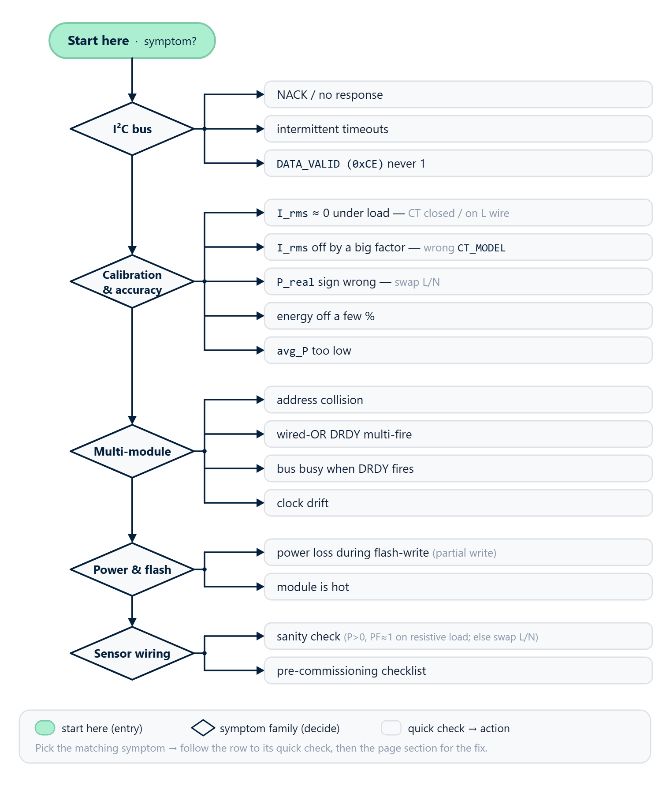

# 05 · Troubleshooting

This chapter is a quick reference for common problems and their solutions. Each entry follows the structure:

- **Symptom** — what the user observes
- **Causes** — why it can happen
- **What to check / do** — concrete actions

## I2C bus



### 1. NACK / no response from the module

**Symptom**: `Wire.endTransmission()` returns non-zero; `i2cdetect` does not show the address on Linux; `rb_read_u8()` returns `0xFF`.

**Causes and checks**:

- ❌ **Module power is missing or unstable** — measure VCC with a multimeter; it must be 5 V ±5%.
- ❌ **No common ground** — the single most frequent mistake. Master GND and module GND **must** be tied together.
- ❌ **SDA and SCL swapped** — verify against the wiring diagram in [01_hardware.md](hardware-connection.md).
- ❌ **No pull-ups on the bus** — if the built-in pull-ups have been cut on a module and no external ones are installed, the bus is dead. With everything unpowered, measure SDA↔VCC: it must read 1.5–4.7 kΩ.
- ❌ **Too many pull-ups in parallel** — built-in pull-ups still active on every module, plus master pull-ups, dropping the equivalent below ~1 kΩ. The master cannot pull the bus to LOW. Cut the built-in pull-ups on all but one module.
- ❌ **Long cable without twisted pair or buffer** — past ~0.3 m, parallel wires couple capacitively and edges round off. Use UTP cat-5 (up to 1 m) or a PCA9515 buffer (up to 3 m). See [01_hardware.md → Bus length](hardware-connection.md).
- ❌ **Wrong slave address** — the module may have been readdressed. Run an I2C scan:

```cpp
void i2c_scan() {
  for (uint8_t addr = 0x08; addr < 0x78; addr++) {
    Wire.beginTransmission(addr);
    if (Wire.endTransmission() == 0) {
      Serial.printf("Found device at 0x%02X\n", addr);
    }
  }
}
```

- ❌ **I2C speed too high for the cable length**. Drop to 50 kHz: `Wire.setClock(50000);`.

### 2. Intermittent read/write timeouts

**Symptom**: transactions succeed sometimes, fail other times — especially in electrically noisy environments or near inductive loads.

**Causes**:

- ❌ Long cable without twisted pair
- ❌ Cable routed parallel to mains wiring → 50 Hz / 100 Hz coupling
- ❌ Noisy ground on the master side (e.g. a separate regulator without bulk capacitance)
- ❌ Stray capacitance between SDA and GND > 100 pF (e.g. a splice with long stubs)

**Solutions**:

- Use twisted pair (SDA + GND in one pair, SCL + GND in the other)
- Avoid routing I2C parallel to power wiring in the same conduit
- Reduce speed to 50 kHz / add 100 nF between VCC and GND of the module near the connector
- For long runs outside an enclosure, add ESD protection (TVS diodes on SDA and SCL)

### 3. `DATA_VALID` (`0xCE`) never becomes 1

**Symptom**: master reads `0xCE` and always gets `0x00`. Other registers may also stay at zero.

**Causes**:

- ❌ The module has not finished booting (normal for the first ~250 ms after power-on)
- ❌ Firmware initialisation error — read `REG_ERROR` (`0x02`):
  - `0xFB` (`ERR_FLASH_PARAMS_BAD`) — flash parameter block is corrupted; the module runs on defaults. Recalibrate / reprovision.
  - `0xFA` (`ERR_LUT_BAD`) — ADC LUT calibration is broken. Not fatal — measurements still work, but accuracy is slightly degraded.
- ❌ MCU clock failure (rare) — power-cycle the module

**Solutions**:

- Wait 300 ms after power-on before polling `0xCE`.
- If `DATA_VALID = 1` is not seen after > 1 s — power-cycle.
- If the problem persists after a power-cycle — check power (ripple, brown-out).

## Calibration and accuracy

### 4. `I_rms` close to 0 while a load is running

**Symptom**: the lamp is lit, the heater is warm, but `I_rms` shows 0.001 A or jitters between 0 and a few mA.

**Causes** (in decreasing order of frequency):

- ❌ **CT clamp not on the wire** — the conductor goes past the clamp instead of through it.
- ❌ **CT clamp on both L and N at the same time** — fluxes from line and neutral cancel, the sensor reads near zero. See [01_hardware.md → Current sensor](hardware-connection.md). The clamp must be on **one** conductor (line/L).
- ❌ **Clamp not fully closed** — a gap > 0.1 mm between the core halves dramatically increases magnetic reluctance, so the sensor output drops well below normal. Unclip and re-clip until it clicks shut. Dirt or oxide in the gap is a common culprit — wipe the mating surfaces.
- ❌ **Loose 3.5 mm jack** — remove and reinsert the plug.
- ❌ **`REG_CT_MODEL` not set** — the module does not know the sensor's sensitivity. See [02_initialization.md → Setting the external sensor model](initialization.md). Register `0x05` must contain the correct model code.
- ❌ **Wrong model code written** — for example, an SCT-013-030 sensor with the SCT-013-100 code → current shown will be **3.3× lower** than reality. Verify the sensor's case marking against the model code.
- ❌ **Current below the noise floor** — for very small loads (< ~10 mA on a 30 A clamp) the sensor output is close to ADC noise. The firmware applies quadrature noise subtraction: `I_corrected = √(I_raw² − NF²)`. If `I_raw ≤ NF`, the result is clamped to 0. This is intended behaviour.

### 5. `I_rms` off by a large factor

**Symptom**: real load is ~10 A (per reference meter), the module shows 3 A or 30 A.

**Causes**:

- ❌ **Wrong CT model code** — most common case. See #4.
- ❌ **Wrong CT model installed** — somebody fitted a 100 A clamp where the configuration calls for a 30 A clamp (or vice versa).
- ❌ **Clamp not fully closed** (see #4) — typically reads 5–20 % low.
- ❌ **Suspected factory calibration drift** — if all of the above are ruled out and the disagreement persists on a known reference load, contact your module supplier; recalibration is a factory operation.

### 6. Sign of `P_real` is wrong (consumption shows as export)

**Symptom**: the load is clearly consuming (warm heater, lit lamp), but `P_real < 0`.

**Causes and solutions**:

- ❌ **L and N swapped on the voltage terminals** — the most common cause. See [01_hardware.md → Voltage sensor](hardware-connection.md). Swap L and N on the PCB.
- ❌ **CT clamp installed backwards** — the arrow on the clamp must point **in the direction of current** toward the load (panel → load). If it points the other way, unclip and reverse the clamp.
- ❌ **Physical reversal is impractical** — compensate in master code:

```cpp
float p_corrected = -p_raw;
```

  but the physical fix is preferable — otherwise every piece of code must remember the inversion.

### 7. Energy total disagrees with a reference meter by a few percent

**Symptom**: `E_Wh` over one hour differs from the utility meter by 2–10 %.

**Likely causes** (in decreasing order):

- ❌ **Clamp not fully closed** (gap) — typically −5 to −20 % low. The single most common cause. Unclip, clean the mating surfaces, clip again until fully shut.
- ❌ **Clamp installed on a "secondary" wire** — inside the breaker panel, on a short pigtail past a breaker. Stray fields from neighbouring breakers introduce errors. Move the clamp onto the main feed or onto an isolated section of conductor.
- ❌ **Close to strong reactive loads** — near transformers, asynchronous motors, UPSes. Magnetic fields from neighbouring inductors create a stray signal. Move the clamp ≥ 10 cm away from any ferromagnetic component.
- ❌ **Low PF** (≤ 0.5) — large reactive loads require precise phase compensation. Factory calibration is tuned for typical residential mix; deeply reactive loads can introduce 1–3 % error. If accuracy on a specific PF profile is critical, contact your module supplier for guidance.
- ❌ **Distorted mains voltage** (micro-sags, high-order harmonics) — RMS and mean computation are more robust than peak detection, but distortions can still introduce 1–3 % error.
- ❌ **Damaged CT cable or loose jack** — open-circuit or cold-solder inside the plug. Check with a multimeter (the CT clamp is a step-down transformer; the secondary winding should read 50–200 Ω depending on model).

### 8. `avg_P_W` is much lower than expected

**Symptom**: a 1000 W heater is on, RT `P_real ≈ 1000 W`, but `PERIOD_AVG_P_W` reads ~200 W over a one-minute period.

**Causes**:

- ❌ The load is actually intermittent (cycling thermostat, pulsing element) — `avg_P_W` correctly reports the time average. Cross-check with `PERIOD_MAX_P_W` (`0xE0`) to see the peak inside any 200 ms window.
- ❌ If the load is steady and RT `P_real ≈ avg_P_W` does not hold:
  - On **BASIC tier**: check the RT sign of `P_real`. If `P` is occasionally negative (a solar inverter is feeding back, for example), negative samples are excluded from `PERIOD_AVG_P_W`, dragging the average down. See [04_period_metering.md → BASIC tier](period-metering.md).
  - On **STANDARD / PRO**: compute `total_avg = avg_P_consume + avg_P_export` (export taken as magnitude) to see the channel's true activity.

### 9. `PERIOD_VALID = 0` after a latch

**Symptom**: the master issues `CMD_LATCH_PERIOD`, reads `0x07`, gets 0. Snapshot is not fresh.

**Causes**:

- ❌ **Latches too close together** — no RT window (200 ms) completed between two latches. The accumulator is empty, the snapshot is discarded.
- ❌ **Race with an RT commit** — rare: the master wrote the command at the exact instant the firmware was committing the live accumulator. Possible on very fast masters.

**Solution** — the retry pattern (see [04_period_metering.md → Basic cycle](period-metering.md)):

```cpp
if ((rb_read_u8(0x50, 0x07) & 0x01) == 0) {
  delay(250);   // let at least one RT window complete
  rb_write_u8(0x50, 0x01, 0x27);
  delay(50);
  // retry read of PERIOD_VALID
}
```

## Multi-module issues

### 10. Address collision

**Symptom**: several modules added to the bus — some "vanish" or return garbage. The same address answers with different values.

**Cause**: two or more modules share the same address → I2C arbitration / collision. Frequent right after unboxing, when every module is on the factory default `0x50`.

**Solution**:

1. Disconnect every module.
2. Reconnect one at a time; readdress each to a unique address.
3. After readdressing all modules, reconnect them in parallel.

See [02_initialization.md → Recommended workflow](initialization.md).

### 11. Wired-OR DRDY fires several times in quick succession

**Symptom**: with [wired-OR DRDY](realtime-polling.md), the master EXTI fires every 1–5 ms a few times in a row.

**Cause**: the modules are not perfectly synchronised — each has its own crystal, and RT window periods differ slightly (199.8 ms vs 200.1 ms). Over the ~200 ms span, the modules pull the line at slightly different instants.

**This is normal.** Solutions:

- Ignore "double" triggers: after the first trigger, read all modules; suppress further triggers within ~10 ms.
- Use broadcast latch (see [04_period_metering.md → Approach 2](period-metering.md)) for precise synchronisation — but only for period snapshots, not for RT.
- Move to DRDY-per-module — each module on its own GPIO.

### 12. I2C bus busy when DRDY fires

**Symptom**: DRDY fires while the master is already in a transaction with another module. The EXTI handler is delayed.

**This is normal.** The RT registers remain valid until the next commit (200 ms later). The master:

- Finishes the current transaction.
- Services the delayed EXTI and reads the next module.
- Latency: 1–10 ms typically — not critical.

### 13. Multi-module clock drift in long tests

**Symptom**: cumulative energy diverges between modules by fractions of a percent over a week.

**Cause**: each rbAmp has its own crystal with ±50 ppm drift (1–5 s/day).

**Solution** — built into the architecture: the master uses its **own** clock to multiply by dt. All modules share the same time reference, so the system-wide Wh total does not diverge.

To measure chip drift for QA, compare `PERIOD_LATCH_MS` (`0xEC`) with master dt:

```cpp
uint32_t chip_dt = rb_read_u32(0x50, 0xEC);
float ratio = (float)chip_dt / (float)master_dt;
printf("Chip drift: %.3f (1.000 = perfect)\n", ratio);
```

**Acceptance threshold for `PERIOD_LATCH_MS`: up to 30 % undercount is normal under load** (ratio as low as ~0.70). The chip-side timestamp is incremented on SysTick, which is starved when interrupts and DMA traffic are heavy — by design. The 30 % envelope is a property of the firmware timebase, not a fault. Apply this threshold uniformly across all SKUs and tiers.

The legacy 3 % threshold from earlier documentation is **wrong** for v1.3 and will mass-reject healthy modules; do not use it.

This drift only affects the chip-side diagnostic register; **energy accuracy is unaffected** because Wh is computed master-side as `avg_P × master_dt` (see [04_period_metering.md](period-metering.md)). If `master_dt` itself wanders (master MCU clock drifts), apply the master's own NTP/SNTP correction — `PERIOD_LATCH_MS` is not the right reference.

## Power and flash

### 14. Power loss during a flash-write command → partial flash write

**Symptom**: after a power interruption during a write-to-flash command (`CMD_SAVE_USER_CONFIG`, `CMD_COMMIT_ADDR`), the module boots with `REG_ERROR = 0xFB` (`ERR_FLASH_PARAMS_BAD`) and `EVENT_FLAGS.bit3` set.

**What happened**: the firmware detected a CRC failure in the user-config flash block, loaded factory defaults, and rewrote them.

**Solution**:

- Factory defaults are restored — the module works, but its custom address / sensor configuration is gone.
- Re-apply the configuration: set `SENSOR_CLASS` + bind `CT_MODEL` per channel + issue `CMD_SAVE_USER_CONFIG` (and re-do address change if needed).
- To avoid this in the future: do not cut power for at least **1 second** after any flash-write command. The flash erase + write window itself is ~700 ms; allow margin.

### 15. Module is hot

**Symptom**: the enclosure feels noticeably warm.

**Normal**: at mains current up to nominal (SKU-dependent), light warming of the LV side (LDO regulator) up to ~40 °C is expected.

**Not normal**: hot enclosure (≥ 60 °C), burning smell, plastic discoloration.

**Causes**:

- ❌ Overvoltage on the LV side (VCC > 5.5 V) — check the supply.
- ❌ Internal damage on the mains side (short in the divider or CT circuit).
- ❌ External CT overloaded (current beyond the sensor range).

**Action**: disconnect power immediately, isolate the module, contact the supplier.

## Sensor wiring — critical errors

### 16. Sanity check — what "correctly wired" means

After installing or reinstalling a module, run a smoke test with a **known purely-resistive load** (incandescent bulb, electric kettle, heating element) — for example, a 100 W bulb on 230 V.

**Expected**:

- `U_rms ≈ 220..240` (depends on local mains)
- `I_rms ≈ 100 W / 230 V ≈ 0.43 A`
- `P_real ≈ +100 W` (positive, consumption)
- `PF ≈ 0.998..1.000` (resistive load)
- `Q ≈ 0` (no reactive content)

**If `P_real` is negative**: see #6 — L/N swapped or CT installed backwards.
**If `|I_rms − expected|` > 10 %**: see #5 — wrong CT model or clamp not closed.
**If `|P_real − U × I|` > 5 %** at PF = 1: phase compensation may be off — contact the supplier.

### 17. Pre-commissioning checklist

Before powering up a module in a production system:

- [ ] L wired to the L terminal of the PCB (not swapped with N)
- [ ] CT clamp on the **L conductor** (not on N, not on both at once)
- [ ] Arrow on the CT clamp **pointing toward the load**
- [ ] CT clamp fully closed (no gap, no slack — clip until it clicks)
- [ ] CT cable intact, jack fully seated in the socket
- [ ] Power VCC = 5 V ±5 %, clean ground
- [ ] I2C pull-ups verified (see [01_hardware.md → I2C pull-ups](hardware-connection.md))
- [ ] For modules with a plug-in CT: `REG_CT_MODEL` written and saved to match the installed sensor
- [ ] Smoke test with a resistive load completed — all five values (U, I, P, PF, Q) within the expected ranges

If any item is unchecked, expect strange readings. The most common causes of metering errors are sensor installation issues, not firmware or electronics faults.

## Error codes (`REG_ERROR` = `0x02`)

| Code | Name | Meaning | Action |
|:---:|---|---|---|
| `0x00` | `ERR_OK` | Normal — last write succeeded | — |
| `0xF9` | `ERR_CLONE` | Anti-clone sentinel — module identity check failed (firmware refuses to operate on a non-genuine unit) | Contact the supplier. |
| `0xFA` | `ERR_LUT_BAD` | ADC LUT calibration CRC failed; the module runs on linear approximation | Not fatal. ADC accuracy may be off by 1–5 %. Have the supplier recalibrate. |
| `0xFB` | `ERR_FLASH_PARAMS_BAD` | Flash parameter block corrupted; defaults restored | Reconfigure address / `SENSOR_CLASS` / `CT_MODEL` and issue `CMD_SAVE_USER_CONFIG` (`0x32`). **Normal on a virgin module** (see chapter 11 §6.5) — do not abort first-time provisioning on `0xFB`. |
| `0xFC` | `ERR_NOT_READY` | First RT window has not yet completed after boot | Wait 300 ms. |
| `0xFD` | `ERR_SENSOR_OVERFLOW` | Signal clipping on the ADC rails (full-scale exceeded) | Reduce current or use a larger CT. |
| `0xFE` | `ERR_PARAM` | Invalid command code or out-of-range value | Check command and value range. |
| `0xFF` | `ERR_UNHANDLED` | HardFault or unhandled condition | Power-cycle. If it recurs, contact the supplier. |

### Semantics — `REG_ERROR` is NOT sticky (v1.3)

`REG_ERROR` holds the outcome of the **last write transaction**. Every subsequent write — successful or not — overwrites it. There is no need to clear `REG_ERROR` between attempts; in fact, **reading it later than immediately after the failing write may show a fresher result from a subsequent operation**.

If you need a **durable** error signal that survives later writes, use `EVENT_FLAGS.bit3` (`ERROR_OCCURRED`) — it latches W1C and clears only when the master writes `1` to the bit. See chapter 11 §5.3 for the full error model.

Explicit clear (rarely needed): `CMD_CLEAR_ERROR` (opcode `0x31`) zeros `REG_ERROR`.

## When to contact the supplier

Symptoms that warrant service:

- The module does not exit `DATA_VALID = 0` after three power-cycles
- `ERR_UNHANDLED` (`0xFF`) recurs
- Suspected calibration drift — disagreement > 5 % with a reference meter on a known resistive load persists after the diagnostic checklist in #17 is satisfied
- The enclosure is hot or smells of burnt material
- Disagreement with a reference meter > 5 % despite the checklist in #17 being satisfied
- A new module boots with `ERR_LUT_BAD` (`0xFA`) on first power-on

## Next

- [10_arduino_examples.md](arduino-examples.md) — examples with error handling
- For smart-home integrations, see chapters 06–09 (ESPHome, Tasmota, MicroPython, Python on SBC)
